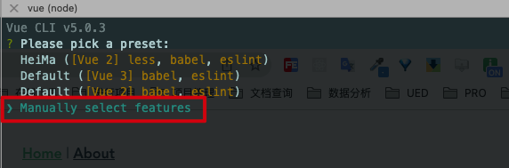
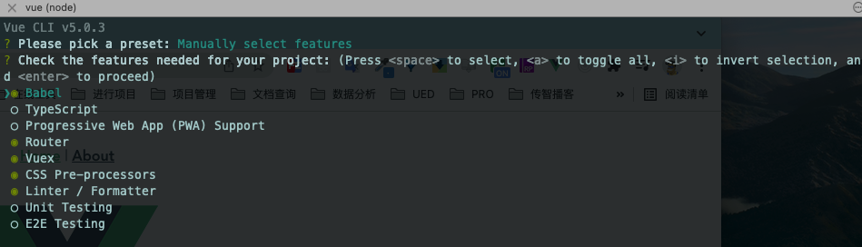
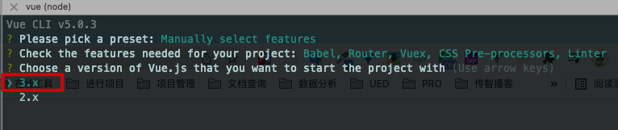
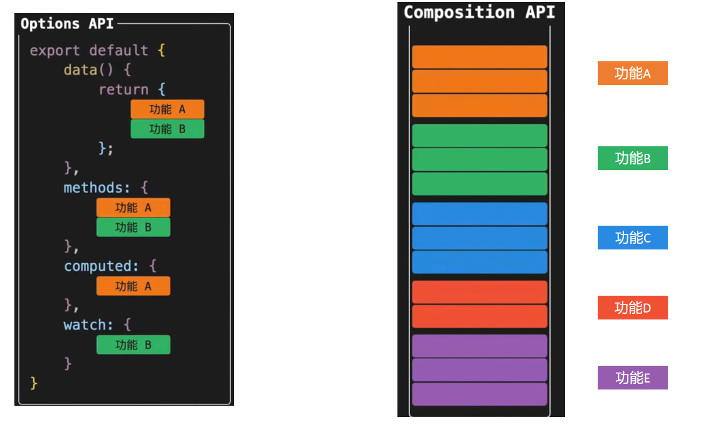
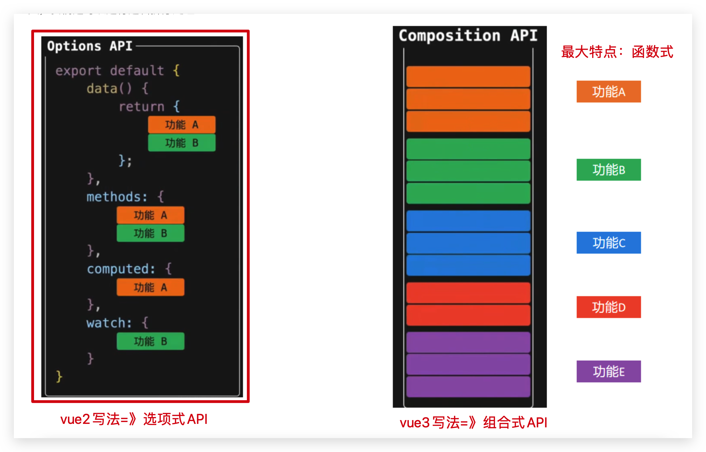
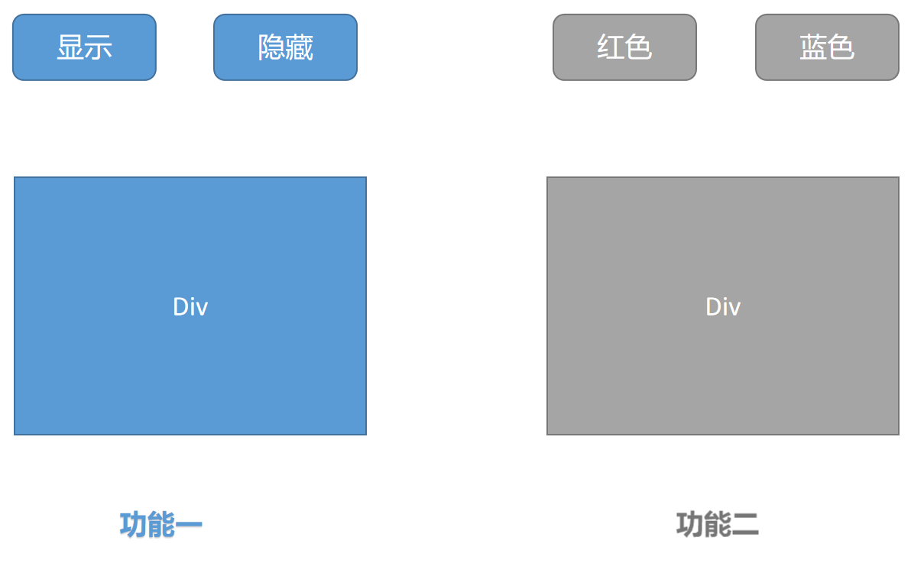
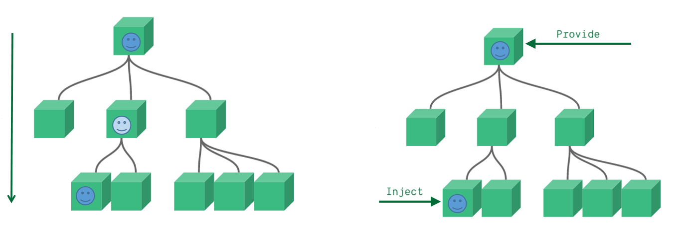
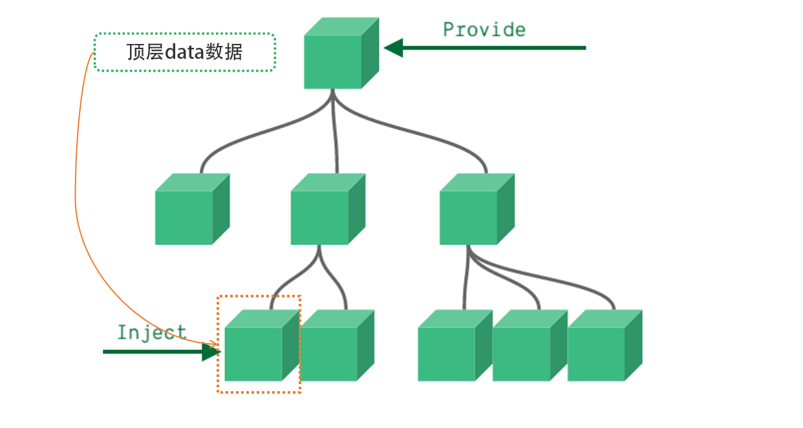
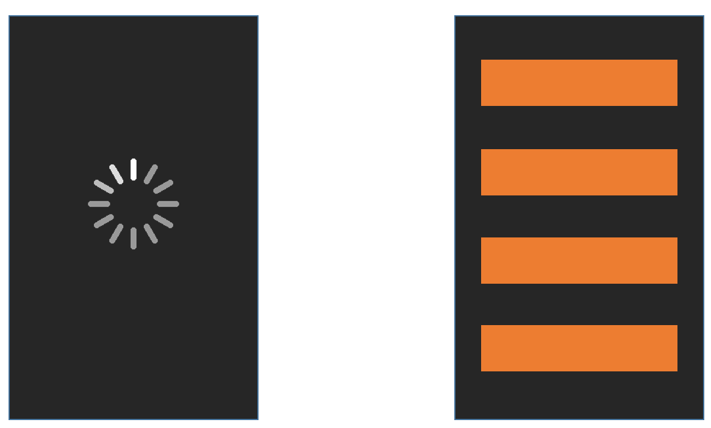

# Vue3 基础介绍

> Released on 18 Sep 2020 


## 1. 为什么要学习 Vue 3

1. Vue 是目前国内开发最火的前端框架之一
2. vue3.0 正式版已发布，社区生态已经逐步完善

目前已支持 vue3 的UI组件库

- **ant-design-vue**   

  https://antdv.com/docs/vue/introduce-cn/

  ant-design-vue 是 Ant Design 的 Vue 实现，组件的风格与 Ant Design 保持同步

  目前支持 Vue 3.0 的 2.0.0 测试版 已发布

- **element-plus**

  https://element-plus.gitee.io/#/zh-CN 

   Element Plus，一套为开发者、设计师和产品经理准备的基于 Vue 3.0 的桌面端组件库

- **vant**                            

  https://vant-contrib.gitee.io/vant/v3/#/zh-CN

  轻量、可靠的移动端 Vue 组件库

  Vant 是有赞前端团队开源的移动端组件库，于 2016 年开源，已持续维护 4 年时间

  目前 Vant 已完成了对 Vue 3.0 的适配工作，并发布了 Vant 3.0 版本

- **VueUse**

  https://vueuse.org/

  基于composition组合api的常用集合，小兔仙项目会部分使用

##  2. Vue3带来的新变化

1. 性能提升

  - 首次渲染更快
  - diff算法更快
  - 内存占用更少
  - 打包体积变小

2. 更好的Typescript支持

3. Composition API **（重点）**

  在使用vue2.x版本开发较复杂的组件时，逻辑难以复用，组合式api的出现可以解决此类问题

相关阅读：

1. Vue3 中文文档  https://vue3js.cn/docs/zh/

2. Vue3 设计理念  https://vue3js.cn/vue-composition/   

## 3. 破坏性语法更新

vue3.0对于2.0版本的大部分语法都是可以兼容的，但是也有一些破坏性的语法更新，这个大家要格外注意

1. 实例方法$on移除   （eventBus现有实现模式不再支持 可以使用三方插件替代）
2. 过滤器filter移除 （插值表达式里不能再使用过滤器 可以使用methods替代）
3. .sync语法移除  （和v-model语法合并）

更多阅读：https://v3.cn.vuejs.org/guide/migration/introduction.html

# Vue3开发环境搭建

> 接下来我们会学习vue3的一些新语法，首先我们先搭建一个基础环境，还是使用大家熟悉的vue-cli快速生成一个集成了vue3的环境

`本节目标:`  掌握如何使用vue-cli搭建一个基于vue3.0的开发环境

1. 选择自定义配置



2. 勾选如下选项



3. 选择3.x版本



以上步骤回车之后，vue-cli会帮助我们跑起来一个内置了vue3版本的vue项目

> 然后打开`main.js` 入口文件，发现Vue的实例化发生了一些变化，由先前的new关键词实例化，转变为createApp方法的调用形式 （更多详情：https://www.bilibili.com/read/cv10133036）

vue2.x

```js
new Vue({
  el: '#app',
  render: h => h(App)
})
```

vue3.x

```js
import { createApp } from 'vue'
import App from './App.vue'
createApp(App).mount('#app')
```

最后我们打开一个单文件组件发现，vue3.0的单文件组件中不再强制要求必须有唯一根元素

```html
<template>
  
  <HelloWorld msg="Welcome to Your Vue.js App"/>
</template>
```

以上就我们当前阶段需要关注的所有的东西，接下来我们就可以基于当前环境学习vue3的全新composition API

# 组合式API

> 组合式api（Composition API）算是vue3对我们开发者来说非常有价值的一个api更新，我们先不关注具体语法，先对它有一个大的感知

## composition vs options对比

`本节目标:`  对组合式api（composition api）有一个大概的理解

* options API开发出来的vue应用如左图所示，它的特点是理解容易，因为各个选项都有固定的书写位置，比如响应式数据就写到data选择中，操作方法就写到methods配置项中等，应用大了之后，相信大家都遇到过来回上下找代码的困境

* composition API开发的vue应用如右图所示，它的特点是特定功能相关的所有东西都放到一起维护，比如功能A相关的响应式数据，操作数据的方法等放到一起，这样不管应用多大，都可以快读定位到某个功能的所有相关代码，维护方便，设置如果功能复杂，代码量大，我们还可以进行逻辑拆分处理



​	



**特别注意：**

1. 选项式api和组合式api俩种风格是并存的关系 并不是非此即彼

2. 需要大量的逻辑组合的场景，可以使用compition API进行增强

## 案例对比

> 我们通过图示简单了解了一下vue3带来的全新的api形式，这一小节，我们通过一个具体的小案例更加深入的体会一下俩种api下的开发模式对比，大家暂时忽略语法细节，只关注代码编写形式

`本节目标:`  通过俩种Api形式实现同一个需求，理解`compition api` 带来的好处

### 1. 理解需求



俩个独立的功能：

1. 通过点击按钮来控制div的显示和隐藏
2. 通过点击按钮控制div内字体颜色的变化

### 2. vue2.x option Api版本

```html
<template>
  <div>
    <!-- 功能一模板 -->
    <button @click="show">显示</button>
    <button @click="hide">隐藏</button>
    <div v-if="showDiv">一个被控制显隐的div</div>
  </div>
  <div>
    <!-- 功能二模板 -->
    <button @click="changeRed">红色</button>
    <button @click="changeBlue">蓝色</button>
    <div :style="`color:${fontColor}`">一个被控制字体颜色的的div</div>
  </div>
</template>

<script>
export default {
  name: 'App',
  data() {
    return {
      showDiv: true, // 功能一数据
      fontColor: '' // 功能二数据
    }
  },
  methods: {
    // 功能一方法
    show() {
      this.showDiv = true
    },
    hide() {
      this.showDiv = false
    },
    // 功能二方法
    changeRed() {
      this.fontColor = 'red'
    },
    changeBlue() {
      this.fontColor = 'blue'
    }
  }
}
</script>
```

### 3. vue3.0 composition api版本

```html
<template>
  <div>
    <!-- 功能一模板 -->
    <button @click="show">显示</button>
    <button @click="hide">隐藏</button>
    <div v-if="showDivFlag">一个被控制显隐的div</div>
  </div>
  <div>
    <!-- 功能二模板 -->
    <button @click="changeRed">红色</button>
    <button @click="changeBlue">蓝色</button>
    <div :style="`color:${fontColor}`">一个被控制字体颜色的的div</div>
  </div>
</template>

<script>
import { ref } from 'vue'
export default {
  name: 'App',
  setup() {
    // 功能一
    const showDivFlag = ref(true)
    function show() {
      showDivFlag.value = true
    }
    function hide() {
      showDivFlag.value = false
    }
    // 功能二

    const fontColor = ref('')
    function changeRed() {
      fontColor.value = 'red'
    }
    function changeBlue() {
      fontColor.value = 'blue'
    }
    return { showDivFlag, show, hide, fontColor, changeRed, changeBlue }
  }
}
</script>
```

### 4. composition api版本优化

> 大家可能会有疑惑，那我们现在是把功能相关的所有数据和行为放到一起维护了，如果应用很大功能很多的情况下，setup函数不会变得很大吗？岂不是又会变得比较难维护，接下来我们就来拆解一下庞大的setup函数

```html
<script>
import { ref } from 'vue'
function useShow() {
  const showDivFlag = ref(true)
  function show() {
    showDivFlag.value = true
  }
  function hide() {
    showDivFlag.value = false
  }
  return { showDivFlag, show, hide }
}

function useColor() {
  const fontColor = ref('')
  function changeRed() {
    fontColor.value = 'red'
  }
  function changeBlue() {
    fontColor.value = 'blue'
  }
  return { fontColor, changeRed, changeBlue }
}
export default {
  name: 'App',
  setup() {
    // 功能一
    const { showDivFlag, show, hide } = useShow()
    // 功能二
    const { fontColor, changeRed, changeBlue } = useColor()
    return { showDivFlag, show, hide, fontColor, changeRed, changeBlue }
  }
}
</script>

```

以上，我们通过定义功能函数，把俩个功能相关的代码各自抽离到一个独立的小函数中，然后通过在setUp函数中再把俩个小功能函数组合起来，这样一来，我们既可以把setup函数变得清爽，又可以方便维护快速定位功能位置

nice~  到此我们没有关注api细节，只是体会组合式api给到我们的好处，接下来我们就要深入到api细节，看看全新的api都该如何使用

## setup入口函数

`本节目标:`  了解setup函数的作用和调用时机

1. setup 函数是一个新的组件选项，作为组件中组合式API 的起点（入口）
3. **setup 中不能使用 this， this 指向 undefined**
3. setup函数只会在组件初始化的时候执行一次
4. setup函数在beforeCreate生命周期钩子执行之前执行

```jsx
export default {
  setup () {
    console.log('setup执行了')
    console.log(this)
  },
  beforeCreate() {
    console.log('beforeCreate执行了')
    console.log(this)
  }
}
```

## 响应式系统API

### reactive 函数

`本节目标:`  了解reactive函数的语法使用

> 作用：reactive是一个函数，接收一个普通的对象传入，把`对象数据`转化为响应式对象并返回

**使用步骤**

1. 从vue框架中导入`reactive`函数
2. 在setup函数中调用reactive函数并将对象数据传入
3. 在setup函数中把reactive函数调用完毕之后的返回值以对象的形式返回出去

**代码落地**

```vue
<template>
  <div>{{ state.name }}</div>
  <div>{{ state.age }}</div>
  <button @click="state.name = 'pink'">改值</button>
</template>

<script>
import { reactive } from 'vue'
export default {
  setup () {
    const state = reactive({
      name: 'cp',
      age: 18
    })
    return {
      state
    }
  }
}
</script>
```

注意⚠️：

1. reactive函数不能传入简单类型
2. 不能=号赋值修改

### ref 函数

`本节目标:`  了解ref函数的语法使用

> 作用：ref是一个函数，接受一个简单类型或者复杂类型的传入并返回一个响应式且可变的 ref 对象

**使用步骤**

1. 从vue框架中导出`ref`函数
2. 在setup函数中调用`ref`函数并传入数据（简单类型或者复杂类型）
3. 在setup函数中把ref函数调用完毕的返回值以对象的形式返回出去
4. **注意⚠️：**在setup函数中使用ref结果，需要通过`.value`  访问，模板中使用不需要加.value；而且可以重新=号赋值

```vue
<template>
  <div>{{ money }}</div>
  <button @click="changeMondy">改值</button>
</template>

<script>
import { ref } from 'vue'
export default {
  setup() {
    let money = ref(100)
    console.log(money.value)
    return {
      money
    }
  }
}
</script>
```

总结说明：

1. ref 函数可以接收一个简单类型的值，返回一个可改变的 ref 响应式对象，从而弥补reactive函数不支持简单类型的问题
2. reactive和ref函数都可以提供响应式数据的转换，具体什么时候需要使用哪个API社区还没有最佳实践，大家暂时可以使用自己熟练的API进行转换
3. 推荐一种写法：如果要求数据是不可变使用reactive，否则就一律使用ref，从而降低在语法选择上的心智负担

### toRefs 函数

`本节目标:`  使用toRefs函数简化响应式对象的使用

> 场景: 经过reactive函数处理之后返回的对象，如果给这个对象解构或者展开，会让数据丢失响应式的能力，为了解决这个问题需要引入toRefs函数，使用 toRefs函数 可以保证该对象展开的每个属性都是响应式的

#### 1. 问题复现

还是之前的案例，如果我们想在模板中省略到state，直接书写name和age，你可能会想到，那我在return出去的时候把state中的属性解构出来不就好了

修改前=> 正常修改

```vue
<template>
  <div>{{ state.name }}</div>
  <div>{{ state.age }}</div>
  <button @click="state.name = 'pink'">改值</button>
</template>

<script>
import { reactive } from 'vue'
export default {
  setup() {
    const state = reactive({
      name: 'cp',
      age: 18
    })
    return {
      state
    }
  }
}
</script>
```

解构修改后=》⚠️修改失败

```html
<template>
  <div>{{ name }}</div>
  <div>{{ age }}</div>
  <button @click="name = 'pink'">改值</button>
</template>
<script>
import { reactive } from 'vue'
export default {
  setup() {
    const state = reactive({
      name: 'cp',
      age: 18
    })
    return {
      ...state
    }
  }
}
</script>
```

点击改值按钮，发现视图已经不发生变化了，这就是我们所说的，**如果解构reactive的返回值，将破坏调用响应式特性**，就需要我们使用toRefs方法进行处理了

#### 2. toRefs包裹处理

```html
<template>
  <div>{{ name }}</div>
  <div>{{ age }}</div>
  <button @click="name = 'pink'">改值</button>
</template>

<script>
import { reactive,toRefs } from 'vue'
export default {
  setup() {
    const state = reactive({
      name: 'cp',
      age: 18
    })
    return {
      ...toRefs(state)
    }
  }
}
</script>
```

### computed函数

`本节目标:`  掌握在setup函数中使用计算属性函数

> 作用：根据现有响应式数据经过一定的计算得到全新的数据

**使用步骤**

1. 从vue框架中导入`computed` 函数
2. 在setup函数中执行computed函数，并传入一个函数，在函数中定义计算公式
3. 把computed函数调用完的执行结果放到setup的return值对象中

**代码落地**

```html
<template>
  {{ list }}
  {{ filterList }}
  <button @click="changeList">change list</button>
</template>

<script>
import { computed, ref } from 'vue'
export default {
  setup() {
    const list = ref([1, 2, 3, 4, 5])
    // 计算大于3的数字
    const filterList = computed(() => {
      return list.value.filter(item => item > 3)
    })
    // 修改list的函数
    function changeList() {
      list.value.push(6, 7, 8)
    }
    return {
      list,
      filterList,
      changeList
    }
  }
}
</script> 
```

### watch 函数

`本节目标:`  掌握在setup函数中监听属性的使用

> 作用：基于响应式数据的变化执行回调逻辑，和vue2中的watch的功能完全一致
>
> 1. 普通监听
> 2. 立即执行
> 3. 深度监听

**使用步骤**

1. 从vue框架中导入`watch`函数
2. 在setup函数中执行watch函数开启对响应式数据的监听
3. watch函数接收三个常规参数
   1. 第一个参数为函数，返回你要监听变化的响应式数据
   2. 第二个参数为响应式数据变化之后要执行的回调函数
   3. 第三个参数为一个对象，在里面配置是否开启立刻执行或者深度监听

**代码落地**

1）普通监听

```html
<template>
  {{ age }}
  <button @click="age++">change age</button>
</template>

<script>
import { ref, watch } from 'vue'
export default {
  setup() {
    const age = ref(18)
    watch(() => {
      // 返回你想要监听的响应式属性(ref产生的对象必须加.value)
      return age.value
    }, () => {
      // 数据变化之后的回调函数
      console.log('age发生了变化')
    })
    return {
      age
    }
  }
}
</script> 
```

2）开启立刻执行

> watch的效果默认状态下，只有监听的数据发生变化才会执行回调，如果你需要在一上来的时候就立刻执行一次，需要配置一下`immediate`属性

```html
<template>
  {{ age }}
  <button @click="age++">change age</button>
</template>
<script>
import { ref, watch } from 'vue'
export default {
  setup() {
    const age = ref(18)
    watch(() => {
      // 返回你想要监听的响应式属性(ref产生的对象必须加.value)
      return age.value
    }, () => {
      // 数据变化之后的回调函数
      console.log('age发生了变化')
    },{ immediate: true})
    return {
      age
    }
  }
}
</script> 
```

3）开启深度监听

> 当我们监听的数据是一个对象的时候，默认状态下，对象内部的属性发生变化是不会引起回调函数执行的，如果想让对象下面所有属性都能得到监听，需要开启`deep`配置

```html
<template>
  {{ name }}
  {{ info.age }}
  <button @click="name = 'pink'">change name</button>
  <button @click="info.age++">change age</button>
</template>

<script>
import { reactive, toRefs, watch } from 'vue'
export default {
  setup() {
    const state = reactive({
      name: 'cp',
      info: {
        age: 18
      }
    })
    watch(() => {
      return state
    }, () => {
      // 数据变化之后的回调函数
      console.log('age发生了变化')
    }, {
      deep: true
    })
    return {
      ...toRefs(state)
    }
  }
}
</script> 
```

4）更好的做法

> 使用watch的时候，尽量详细的表明你到底要监听哪个属性，避免使用deep引起的性能问题，比如我**仅仅只是想在state对象的age属性变化的时候执行回调**，可以这么写

```html
<template>
  {{ name }}
  {{ info.age }}
  <button @click="name = 'pink'">change name</button>
  <button @click="info.age++">change age</button>
</template>

<script>
import { reactive, toRefs, watch } from 'vue'
export default {
  setup() {
    const state = reactive({
      name: 'cp',
      info: {
        age: 18
      }
    })
    watch(() => {
      // 详细的告知你要监听谁
      return state.info.age
    }, () => {
      // 数据变化之后的回调函数
      console.log('age发生了变化')
    })
    return {
      ...toRefs(state)
    }
  }
}
</script> 
```

## 生命周期函数

`本节目标:` 掌握组合式API中的生命周期钩子函数的使用方式

**使用步骤**

1. 先从vue中导入以`on打头`的生命周期钩子函数
2. 在setup函数中调用生命周期函数并传入回调函数
3. 生命周期钩子函数可以调用多次

**代码落地**

```html
<template>
  <div>生命周期函数</div>
</template>

<script>
import { onMounted } from 'vue'
export default {
  setup() {
    // 时机成熟 回调函数自动执行
    onMounted(() => {
      console.log('mouted生命周期执行了')
    })
     onMounted(() => {
      console.log('mouted生命周期函数又执行了')
    })
  }
}
</script> 
```

| 选项式API         | 组合式API         |
| ----------------- | ----------------- |
| `beforeCreate`    | --                |
| `created`         | --                |
| `beforeMount`     | `onBeforeMount`   |
| `mounted`         | `onMounted`       |
| `beforeUpdate`    | `onBeforeUpdate`  |
| `updated`         | `onUpdated`       |
| `beforeDestroyed` | `onBeforeUnmount` |
| `destroyed`       | `onUnmounted`     |

注意⚠️：

1. 只能在当前组件setup中使用这些on开头的钩子函数
2. 用法vue2的钩子函数几乎无异，使用时记得导入
3. 可以和vue2钩子函数并用，**先执行on开头的钩子函数**

## 组件通信

### 父子通信

`本节目标:` 掌握在组合式API下的父子通信

> 在vue3的组合式API中，父传子的基础套路完全一样，基础思想依旧为：父传子是通过prop进行传入，子传父通过调用自定义事件完成

**实现步骤**

1. setup函数提供俩个参数，第一个参数为props，第二个参数为一个对象context
2. props为一个对象，内部包含了父组件传递过来的所有prop数据，context对象包含了attrs，slots， emit属性，其中的emit可以触发自定义事件的执行从而完成子传父

**代码落地**

`app.vue`

```html
<template>
  <son :name="name" @get-msg="getMsg"></son>
</template>

<script>
import { ref } from 'vue'
import Son from './components/son'
export default {
  components: {
    Son
  },
  setup() {
    const name = ref('cp')
    function getMsg(msg) {
      console.log(msg)
    }
    return {
      name,
      getMsg
    }
  }
}
</script>
```

`components/son.vue`

```html
<template>
  <div>
    {{name}}
    <button @click="setMsgToSon">set</button>
  </div>
</template>

<script>
export default {
  // 接收父组件数据（必须）
  props: {
    name: {
      type: String
    }
  },
  emits: ['get-msg'], // 声明当前组件触发的自定义事件（必须）
  setup(props,{emit}) {
    console.log(props.name)
    function setMsgToSon(){
      emit('get-msg','这是一条来自子组件的msg信息')
    }
    return {
      setMsgToSon
    }
  }
}
</script>
```

注意⚠️：vue3遵循单向数据流，表现和vue2类似

### 跨多级组件通信

> 通常我们使用props进行父子之间的数据传递，但是如果组件嵌套层级较深，一层一层往下传递将会变的非常繁琐，有没有一种手段可以把这个过程简化一下呢，有的，就是我们马上要学习的provide 和 inject，它们配合起来可以方便的完成跨层传递数据



#### 1. 基础使用

`本节目标:` 掌握在setup函数中使用provide和inject的基础用法

**来个需求:** 爷组件中有一份数据 传递给孙组件直接使用



**实现步骤：**

1. 顶层组件在setup方法中使用`provide函数`提供数据
2. **任何底层组件**在setup方法中使用`inject函数`获取数据

**代码落地**

`爷爷组件 - app.vue`

```html
<template>
  <father></father>
</template>

<script>
import Father from '@/components/Father'
import { provide } from 'vue'
export default {
  components: {
    Father
  },
  setup() {
    let name = '顶层数据'
    // 使用provide配置项注入数据 key - value
    provide('name', name)
  }
}
</script> 
```

`孙组件 - components/Son.vue`

```html
<template>
  我是子组件
  {{ name }}
</template>

<script>
import { inject } from 'vue'
export default {
  setup() {
    const name = inject('name')
    return {
      name
    }
  }
}
</script>
```

事实上，只要是后代组件，都可以方便的获取顶层组件提供的数据

#### 2. 传递响应式数据

> provide默认情况下传递的数据不是响应式的，也就是如果对provide提供的数据进行修改，并不能响应式的影响到底层组件使用数据的地方，如果想要传递响应数据也非常简单，只需要将传递的数据使用ref或者reactive生成即可

`本节目标:` 掌握如何通过provide/inject传递响应式数据

`app.vue`

```html
<template>
  <father></father>
  <button @click="changeName">change name</button>
</template>

<script>
import Father from '@/components/Father'
import { provide, ref } from 'vue'
export default {
  components: {
    Father
  },
  setup() {
    // 使用ref转换成响应式再传递
    let name = ref('顶层数据')
    function changeName(){
      name.value = 'meng'
    }
    provide('name', name)
    return {
      changeName
    }
  }
}
</script> 
```

注意⚠️：子孙组件可以修改`provide`提供的数据

## 模板中ref的使用

> 在模板中使用ref，我们都很清楚，它一般有两种使用场景
>
> 1. ref + 普通dom标签  获取真实dom对象
> 2. ref + 组件标签  获取组件实例对象

`本节目标:` 掌握在setup函数中使用ref获取真实dom获取组件实例的方法

**实现步骤**

1. 使用ref函数传入null创建 ref对象 =>  `const 常量名称 = ref(null)`
2. 模板中通过定义ref属性等于1中创建的ref对象常量名称建立关联  =>  `<h1 ref="常量名称"></h1>`
3. setup函数中**必须返回**：`return {常量名称}`
4. 使用 => `常量名称.value`

**代码落地**

`components/RefComponent.vue`

```html
<template>
  我是一个普通的组件
</template>
```

`app.vue`

```vue
<template>
  <h1 ref="h1Ref">我是普通dom标签</h1>
  <ref-comoonent ref="comRef"></ref-comoonent>
</template>

<script>
import { onMounted, ref } from 'vue'
import RefComoonent from '@/components/RefComponent'
export default {
  components: {
    RefComoonent
  },
  setup() {
    const h1Ref = ref(null)
    const comRef = ref(null)
    onMounted(() => {
      console.log(h1Ref.value)
      console.log(comRef.value)
    })
    // 必须return
    return {
      h1Ref,
      comRef
    }
  }
}
</script> 
```

# 综合案例 - Todos

`本节目标:`  巩固vue3.0中组合式API的使用

**案例演示**

> 运行todos案例项目，查看案例效果

**核心功能**

1. 渲染列表数据 `v-for`
2. 点击删除当前列表  `splice + index`
3. 回车添加新任务 ` @keyup.enter="addTodo"`   `list.unshift`
4. 任务是否完成选择状态切换   `v-model`
5. 多选和取消多选   `计算属性computed的set和get完整写法`
6. 未完成任务数量统计 `computed函数写法`

**静态模板**

```html
<template>
  <section class="todoapp">
    <!-- 头部输入框区域 -->
    <header class="header">
      <h1>todos</h1>
      <input class="new-todo" placeholder="请输入要完成的任务" autofocus />
    </header>
    <section class="main">
      <!-- 全选切换input -->
      <input id="toggle-all" class="toggle-all" type="checkbox" />
      <label for="toggle-all">标记所有已经完成</label>
      <ul class="todo-list">
        <!-- 任务列表 -->
        <li>
          <div class="view">
            <input class="toggle" type="checkbox" checked />
            <label>写代码</label>
            <button class="destroy"></button>
          </div>
        </li>
        <li>
          <div class="view">
            <input class="toggle" type="checkbox" />
            <label>打豆豆</label>
            <button class="destroy"></button>
          </div>
        </li>
      </ul>
    </section>
    <footer class="footer">
      <span class="todo-count"> 还未完成的任务有:<strong>3</strong>项 </span>
    </footer>
  </section>
</template>
<style>
html,
body {
  margin: 0;
  padding: 0;
}

button {
  margin: 0;
  padding: 0;
  border: 0;
  background: none;
  font-size: 100%;
  vertical-align: baseline;
  font-family: inherit;
  font-weight: inherit;
  color: inherit;
  -webkit-appearance: none;
  appearance: none;
  -webkit-font-smoothing: antialiased;
  -moz-osx-font-smoothing: grayscale;
}

body {
  font: 14px "Helvetica Neue", Helvetica, Arial, sans-serif;
  line-height: 1.4em;
  background: #f5f5f5;
  color: #111111;
  min-width: 230px;
  max-width: 550px;
  margin: 0 auto;
  -webkit-font-smoothing: antialiased;
  -moz-osx-font-smoothing: grayscale;
  font-weight: 300;
}

:focus {
  outline: 0;
}

.hidden {
  display: none;
}
.todoapp {
  background: #fff;
  margin: 130px 0 40px 0;
  position: relative;
  box-shadow: 0 2px 4px 0 rgba(0, 0, 0, 0.2), 0 25px 50px 0 rgba(0, 0, 0, 0.1);
}

.todoapp input::-webkit-input-placeholder {
  font-style: italic;
  font-weight: 300;
  color: rgba(0, 0, 0, 0.4);
}

.todoapp input::-moz-placeholder {
  font-style: italic;
  font-weight: 300;
  color: rgba(0, 0, 0, 0.4);
}

.todoapp input::input-placeholder {
  font-style: italic;
  font-weight: 300;
  color: rgba(0, 0, 0, 0.4);
}

.todoapp h1 {
  position: absolute;
  top: -140px;
  width: 100%;
  font-size: 80px;
  font-weight: 200;
  text-align: center;
  color: #b83f45;
  -webkit-text-rendering: optimizeLegibility;
  -moz-text-rendering: optimizeLegibility;
  text-rendering: optimizeLegibility;
}

.new-todo,
.edit {
  position: relative;
  margin: 0;
  width: 100%;
  font-size: 24px;
  font-family: inherit;
  font-weight: inherit;
  line-height: 1.4em;
  color: inherit;
  padding: 6px;
  border: 1px solid #999;
  box-shadow: inset 0 -1px 5px 0 rgba(0, 0, 0, 0.2);
  box-sizing: border-box;
  -webkit-font-smoothing: antialiased;
  -moz-osx-font-smoothing: grayscale;
}

.new-todo {
  padding: 16px 16px 16px 60px;
  border: none;
  background: rgba(0, 0, 0, 0.003);
  box-shadow: inset 0 -2px 1px rgba(0, 0, 0, 0.03);
}

.main {
  position: relative;
  z-index: 2;
  border-top: 1px solid #e6e6e6;
}

.toggle-all {
  width: 1px;
  height: 1px;
  border: none; /* Mobile Safari */
  opacity: 0;
  position: absolute;
  right: 100%;
  bottom: 100%;
}

.toggle-all + label {
  width: 60px;
  height: 34px;
  font-size: 0;
  position: absolute;
  top: -52px;
  left: -13px;
  -webkit-transform: rotate(90deg);
  transform: rotate(90deg);
}

.toggle-all + label:before {
  content: "❯";
  font-size: 22px;
  color: #e6e6e6;
  padding: 10px 27px 10px 27px;
}

.toggle-all:checked + label:before {
  color: #737373;
}

.todo-list {
  margin: 0;
  padding: 0;
  list-style: none;
}

.todo-list li {
  position: relative;
  font-size: 24px;
  border-bottom: 1px solid #ededed;
}

.todo-list li:last-child {
  border-bottom: none;
}

.todo-list li.editing {
  border-bottom: none;
  padding: 0;
}

.todo-list li.editing .edit {
  display: block;
  width: calc(100% - 43px);
  padding: 12px 16px;
  margin: 0 0 0 43px;
}

.todo-list li.editing .view {
  display: none;
}

.todo-list li .toggle {
  text-align: center;
  width: 40px;
  /* auto, since non-WebKit browsers doesn't support input styling */
  height: auto;
  position: absolute;
  top: 0;
  bottom: 0;
  margin: auto 0;
  border: none; /* Mobile Safari */
  -webkit-appearance: none;
  appearance: none;
}

.todo-list li .toggle {
  opacity: 0;
}

.todo-list li .toggle + label {
  background-image: url("data:image/svg+xml;utf8,%3Csvg%20xmlns%3D%22http%3A//www.w3.org/2000/svg%22%20width%3D%2240%22%20height%3D%2240%22%20viewBox%3D%22-10%20-18%20100%20135%22%3E%3Ccircle%20cx%3D%2250%22%20cy%3D%2250%22%20r%3D%2250%22%20fill%3D%22none%22%20stroke%3D%22%23ededed%22%20stroke-width%3D%223%22/%3E%3C/svg%3E");
  background-repeat: no-repeat;
  background-position: center left;
}

.todo-list li .toggle:checked + label {
  background-image: url("data:image/svg+xml;utf8,%3Csvg%20xmlns%3D%22http%3A//www.w3.org/2000/svg%22%20width%3D%2240%22%20height%3D%2240%22%20viewBox%3D%22-10%20-18%20100%20135%22%3E%3Ccircle%20cx%3D%2250%22%20cy%3D%2250%22%20r%3D%2250%22%20fill%3D%22none%22%20stroke%3D%22%23bddad5%22%20stroke-width%3D%223%22/%3E%3Cpath%20fill%3D%22%235dc2af%22%20d%3D%22M72%2025L42%2071%2027%2056l-4%204%2020%2020%2034-52z%22/%3E%3C/svg%3E");
}

.todo-list li label {
  word-break: break-all;
  padding: 15px 15px 15px 60px;
  display: block;
  line-height: 1.2;
  transition: color 0.4s;
  font-weight: 400;
  color: #4d4d4d;
}

.todo-list li.completed label {
  color: #cdcdcd;
  text-decoration: line-through;
}

.todo-list li .destroy {
  display: none;
  position: absolute;
  top: 0;
  right: 10px;
  bottom: 0;
  width: 40px;
  height: 40px;
  margin: auto 0;
  font-size: 30px;
  color: #cc9a9a;
  margin-bottom: 11px;
  transition: color 0.2s ease-out;
}

.todo-list li .destroy:hover {
  color: #af5b5e;
}

.todo-list li .destroy:after {
  content: "×";
}

.todo-list li:hover .destroy {
  display: block;
}

.todo-list li .edit {
  display: none;
}

.todo-list li.editing:last-child {
  margin-bottom: -1px;
}

.footer {
  padding: 10px 15px;
  height: 20px;
  text-align: center;
  font-size: 15px;
  border-top: 1px solid #e6e6e6;
}

.footer:before {
  content: "";
  position: absolute;
  right: 0;
  bottom: 0;
  left: 0;
  height: 50px;
  overflow: hidden;
  box-shadow: 0 1px 1px rgba(0, 0, 0, 0.2), 0 8px 0 -3px #f6f6f6,
    0 9px 1px -3px rgba(0, 0, 0, 0.2), 0 16px 0 -6px #f6f6f6,
    0 17px 2px -6px rgba(0, 0, 0, 0.2);
}

.todo-count {
  float: left;
  text-align: left;
}

.todo-count strong {
  font-weight: 300;
}

.filters {
  margin: 0;
  padding: 0;
  list-style: none;
  position: absolute;
  right: 0;
  left: 0;
}

.filters li {
  display: inline;
}

.filters li a {
  color: inherit;
  margin: 3px;
  padding: 3px 7px;
  text-decoration: none;
  border: 1px solid transparent;
  border-radius: 3px;
}

.filters li a:hover {
  border-color: rgba(175, 47, 47, 0.1);
}

.filters li a.selected {
  border-color: rgba(175, 47, 47, 0.2);
}

.clear-completed,
html .clear-completed:active {
  float: right;
  position: relative;
  line-height: 20px;
  text-decoration: none;
  cursor: pointer;
}

.clear-completed:hover {
  text-decoration: underline;
}

.info {
  margin: 65px auto 0;
  color: #4d4d4d;
  font-size: 11px;
  text-shadow: 0 1px 0 rgba(255, 255, 255, 0.5);
  text-align: center;
}

.info p {
  line-height: 1;
}

.info a {
  color: inherit;
  text-decoration: none;
  font-weight: 400;
}

.info a:hover {
  text-decoration: underline;
}

/*
Hack to remove background from Mobile Safari.
Can't use it globally since it destroys checkboxes in Firefox
*/
@media screen and (-webkit-min-device-pixel-ratio: 0) {
  .toggle-all,
  .todo-list li .toggle {
    background: none;
  }

  .todo-list li .toggle {
    height: 40px;
  }
}

@media (max-width: 430px) {
  .footer {
    height: 50px;
  }

  .filters {
    bottom: 10px;
  }
}
</style>

```

**完成代码**

```html
<template>
  <section class="todoapp">
    <!-- 头部输入框区域 -->
    <header class="header">
      <h1>todos</h1>
      <input
        v-model="todoName"
        @keyup.enter="addTodo"
        class="new-todo"
        placeholder="请输入要完成的任务"
        autofocus
      />
    </header>

    <section class="main">
      <input
        v-model="isAll"
        id="toggle-all"
        class="toggle-all"
        type="checkbox"
      />
      <label for="toggle-all">标记所有已经完成</label>
      <ul class="todo-list">
        <!-- 任务列表 -->
        <li
          v-for="item in list"
          :key="item.id"
          :class="{ completed: item.flag }"
        >
          <div class="view">
            <input class="toggle" type="checkbox" v-model="item.flag" />
            <label>{{ item.name }}</label>
            <button @click="delTodo(item.id)" class="destroy"></button>
          </div>
        </li>
      </ul>
    </section>

    <footer class="footer" v-if="list.length > 0">
      <span class="todo-count">
        还未完成的任务有:<strong>{{ leftCounts }}</strong>项
      </span>
    </footer>
  </section>
</template>

<script>
import { reactive, computed, toRefs, watch } from 'vue'
export default {
  setup() {
    const state = reactive({
      list: [
        { id: 1, name: '吃饭', flag: true },
        { id: 2, name: '睡觉', flag: false },
        { id: 3, name: '打豆豆', flag: true }
      ],
      todoName: '' // 当前任务框输入内容
    })

    // 删除功能
    const delTodo = (id) => {
      state.list = state.list.filter(item => item.id !== id)
    }

    // 添加功能
    const addTodo = () => {
      if (state.todoName.trim() === '') return
      state.list.unshift({
        id: +new Date(),
        name: state.todoName,
        flag: false
      })
      state.todoName = ''
    }

    // 剩余任务数计算
    const leftCounts = computed(() => {
      return state.list.filter(item => item.flag === false).length
    })

    // 全选和取消全选
    const isAll = computed({
      get() {
        // 所有的都选中, 才选中
        return state.list.every(item => item.flag === true)
      },
      set(val) {
        // 一旦全选反选被改了, 所有下面的都要同步
        state.list.forEach(item => item.flag = val)
      }
    })

    return {
      ...toRefs(state),
      delTodo,
      addTodo,
      leftCounts,
      isAll
    }
  }
}
</script>
```

# 扩展-初探逻辑复用

`本节目标:`   了解逻辑复用的基础概念

> 我们之前听说过模块复用，也听说过组件复用，现在我们来一个新的复用形式，叫做`逻辑复用`，逻辑复用是一个比较难理解的概念，我们先看下面的案例，在很多场景下在正式内容显示之前，为了用户体验，我们先展示一个loading图，数据返回之后，我们再让loading图隐藏



**代码落地**

1）基础功能实现

```html
<template>
  <div v-if="loadingRef">loading...</div>
  <div v-else>list</div>
</template>

<script>
import { onMounted, ref } from 'vue'
export default {
  setup() {
    let loadingRef = ref(false)
    function toggleLoading(flag) {
      loadingRef.value = flag
    }
    onMounted(() => {
      // 显示loading
      toggleLoading(true)
      setTimeout(() => {
        // 数据成功返回隐藏loading
        toggleLoading(false)
      }, 3000)
    })

    return {
      loadingRef, toggleLoading
    }
  }
}
</script> 
```

大家思考一个问题，如果其他组件也需要一样的功能，按照我们之前的写法，是不是每一个组件里都需要定义一个用来控制loading显示的响应式数据以及书写一个控制响应式数据的方法method，很明显，这是一个可以复用的逻辑，观察这段代码，有没有发现这个逻辑其实是重复的 - `修改一个响应式的状态或者true或者为false`

```javascript
let loadingRef = ref(false)
function toggleLoading(flag) {
  loadingRef.value = flag
}
```

2）抽取可服用逻辑代码

`src/hooks/toggle.js`

```js
import { ref } from 'vue'
export function useToggle() {
  let loadingRef = ref(false)
  function toggleLoading(flag) {
    loadingRef.value = flag
  }
  return { loadingRef, toggleLoading }
}
```

`app.vue`

```html
<template>
  <div v-if="loadingRef">loading...</div>
  <div v-else>list</div>
</template>

<script>
import { onMounted } from 'vue'
import { useToggle } from '@/hooks/toggle'
export default {
  setup() {
    const { loadingRef, toggleLoading } = useToggle()
    onMounted(() => {
      // 显示loading
      toggleLoading(true)
      setTimeout(() => {
        // 数据成功返回隐藏loading
        toggleLoading(false)
      }, 3000)
    })

    return {
      loadingRef, toggleLoading
    }
  }
}
</script> 
```

好了，我们用一个非常简单的案例演示了一个基础的逻辑复用，其实所谓的逻辑复用，下一个简单的定义的话，就是**可以被重复利用的数据以及操作数据行为的整块逻辑集合。**


# 第一天重点总结


