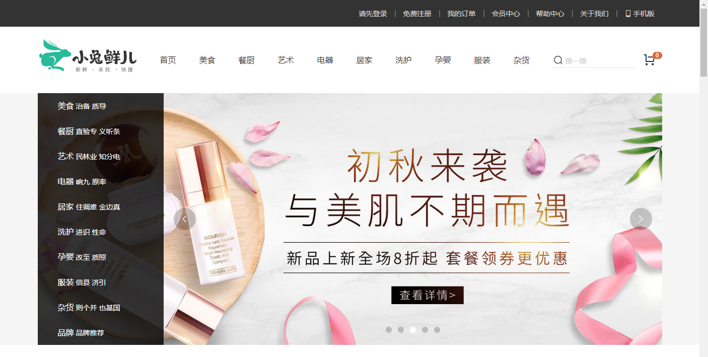

## 项目介绍

目标功能：

- 首页模块：顶部通栏，吸顶导航，左侧分类，轮播图，新鲜好物，商品楼层
- 商品详情：商品图片展示，基本信息展示，配送城市选择，SKU选择，商品详情展示，加入购物车
- 购物车
  - 头部购物车：展示商品数量和列表，删除商品，跳转购物车页面
  - 购物车页面：购物车商品展示，选择商品，修改数量，修改商品规格，价格计算，跳转下单
- 登录模块：账户密码登录
- 填写订单：订单商品展示，生成订单
- 进行支付：订单信息展示，跳转支付网关，提示正在支付，等待支付结果，跳转支付成功页面

## 配套资源

企业开发配套

- 设计图： https://app.mockplus.cn/app/MLUPlO1_G/design 
- 原型稿： https://app.mockplus.cn/run/prototype/QO7BCWlUKB/IWlj1dabSw/c-f4gj1smb0?ha=1&ps=1
- 接口文档： https://mock.boxuegu.com/project/1175/interface/api 

我们学习配套

- 接口文档   [API文档](../02-其它资源/api.html)

- 参照案例 http://class-projects.gitee.io/rabbit-137 vue3.0

## 使用技术

项目基于vue技术来实现，大概会使用以下技术：

- vue3.0  （大部分业务都使用**组合API**的方式来开发）
- vue-cli  （项目脚手架）
- Axios （请求接口）
- vue-router （单页路由）
- vuex （状态管理）
- vuex-persistedstate （vuex数据持久化）
- normalize.css（初始化样式）
- @vueuse/core (组合API常用工具库）
- rabbit-ui-core 小兔子组件库

**重点：**电商常见业务和解决方案，掌握基于vue3.0的组合API开发模式

## 课程重点

1. 采用vuex来管理购物车和用户数据，vuex的使用会继续强化

2. 绝大部分业务使用基于setup函数的组合式API写法

3. 重点难点有商品详情，购物车，支付结算

