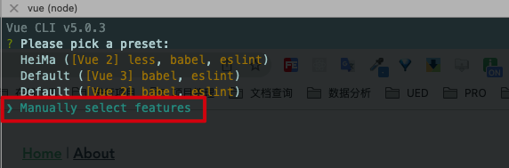
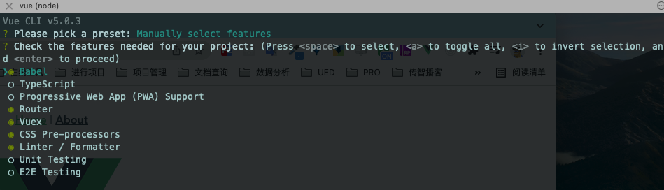
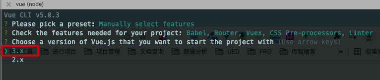

# 项目初始化

`本节目标:`  使用vue-cli初始化小兔仙项目

1. 选择自定义配置



2. 勾选如下选项



3. 选择3.x版本




# 目录调整

`本节目标:`   熟悉变化文件并对项目功能模块进行初始拆分处理

## 文件变化说明

`router/index.js`

```js
import { createRouter, createWebHashHistory } from 'vue-router'
const routes = []
// 创建路由实例
const router = createRouter({
  // 使用hash方式实现路由
  history: createWebHashHistory(),
  // 配置路由规则，写法和之前一样
  routes
})

export default router

```

vue3.0中createRouter来创建路由实例，createWebHashHistory代表使用hash模式的路由

2）`store/index.js`

```js
import { createStore } from 'vuex'

// 创建vuex仓库并导出
export default createStore({
  state: {
    // 数据
  },
  mutations: {
    // 改数据函数
  },
  actions: {
    // 请求数据函数
  },
  modules: {
    // 分模块
  },
  getters: {
    // vuex的计算属性
  }
})
```

vue3.0中createStore来创建vuex实例

3）`main.js`

```js
import { createApp } from 'vue'
import App from './App.vue'
import router from './router'
import store from './store'

// 创建一个vue应用实例
createApp(App).use(store).use(router).mount('#app')
```

## 目录初始化


批量创建页面目录命令：

```bash
mkdir Cart Goods Home Layout Login Member
```


# 小兔鲜儿组件库

`本节目标:`  使用插件让在vuex中管理的状态数据自动同时存储在本地免去自己存储的环节

**实现步骤**

1. 安装`npm i rabbit-ui-core`

2. 图标：`public/index.html`
   

   ```html
   <link rel="stylesheet" href="https://at.alicdn.com/t/font_2143783_iq6z4ey5vu.css">
   ```

3. 根据[文档](https://www.npmjs.com/package/rabbit-ui-core)了解用法

4. 注册

```js
import RabbitUi from 'rabbit-ui-core'
import 'rabbit-ui-core/dist/rabbit-ui.css'

createApp(App).use(RabbitUi).mount('#app')
```

5. 测试

```vue
<XtxButton type="primary">msg</XtxButton>
```


# Vuex-持久化

> 在开发的过程中，像用户信息（名字，头像，token）需要vuex中存储且需要本地存储，再例如，购物车如果需要未登录状态下也支持，如果管理在vuex中页需要存储在本地

> 持久化：1. 数据存到vuex（内存）2. 数据同时存到本地（硬盘localStorage）

`本节目标:`  使用插件让在vuex中管理的状态数据自动同时存储在本地免去自己存储的环节

## 基本使用

**实现步骤**

1. 安装`vuex-persistedstate` 插件
2. vuex中准备`user模块`和`cart模块`
3. 将插件配置到vuex的`plugins`选项中，配置user模块和cart模块进行状态持久化
4. 修改state数据就会触发自动同步机制，修改一下数据检测是否同步成功

**代码落地**

1）安装一个vuex的插件`vuex-persistedstate`来支持vuex的状态持久化

```bash
npm i vuex-persistedstate
```

2）在`src/store` 文件夹下新建 `modules` 文件，在 `modules` 下新建 `user.js`  和 `cart.js` 

`src/store/modules/user.js`     

```js
// 用户状态
export default {
  namespaced: true,
  state: () => ({
      profile: {
        id: '',
        avatar: '',
        nickname: '',
        account: '',
        mobile: '',
        token: ''
      }
  })
}
```

`src/store/modules/cart.js  `    

```js
// 购物车状态
export default {
  namespaced: true,
  state: () => ({
      list:[]
  })
}
```

3）在 `src/store/index.js` 中导入 user 和 cart 模块

```js
import { createStore } from 'vuex'

import user from './modules/user'
import cart from './modules/cart'

export default createStore({
  modules: {
    user,
    cart
  }
})
```

4）使用vuex-persistedstate插件来进行持久化

```js
import { createStore } from 'vuex'
import createPersistedstate from 'vuex-persistedstate'

import user from './modules/user'
import cart from './modules/cart'

export default createStore({
  modules: {
    user,
    cart
  },
  plugins: [
    createPersistedstate({
      key: 'erabbit-client-pc-store',
      paths: ['user', 'cart']
    })
  ]
})
```

**[插件说明](https://www.npmjs.com/package/vuex-persistedstate)**

1. 默认是存储在`localStorage`中，可以对存储的方法进行自定义

2. key是存储数据的键名

3. paths是存储state中的那些数据，如果是模块下具体的数据需要加上模块名称，如`user.profile.token`=>只存储user模块下token数据到本地

4. 修改state中的数据即可触发同步机制，可以看到本地存储数据的的变化

## 测试效果

> user模块定义一个mutation在main.js去调用下，观察浏览器application的localStorage下是否已经有了数据

`src/store/modules/user.js`

```js
// 测试代码
mutations: {
    setUser (state) {
      state.profile.token = 'hash'
    }
}
```

`src/main.js`

```js
store.commit('user/setUser')
```


# 调试工具配置

`本节目标:`  安装针对于vue3的开发调试环境

## 1. Logger Plugin 集成（可选）

> vuex内置日志插件辅助开发

```diff
+ import { createLogger } from 'vuex'
export default createStore({
  modules: {
    user,
    cart,
    category
  },
  plugins: [
+    createLogger()
  ]
})
```


说明❓：配置好这个log插件之后，我们每次触发mutation函数都可以在控制台打印出当前本地提交的记录详细信息，包括`名称`  `参数`  `修改前后的state数据`


# Axios封装处理

`本节目标:`    基于axios封装一个请求模块，调用接口时使用

1）安装 axios

```bash
npm i axios
```

2）新建 `src/utils/request.js` 模块

```js
import axios from 'axios'
// baseURL 超时时间配置
const instance = axios.create({})

// 全局注入token
instance.interceptors.request.use(config => {
  return config
}, e => Promise.reject(e))

// 处理返回数据 token失效跳回到登录页
instance.interceptors.response.use(
    (response)=>{ 
      return response
    },
    (error) => {
      return Promise.reject(error)
    }
)
```

3）添加基础配置

需求：

* 后台基础地址和超时时间 =》http://pcapi-xiaotuxian-front-devtest.itheima.net
* 请求拦截器：从store实例获取token，中统一添加到header中
* 响应拦截器：直接返回res.data并处理401跳转
* 请求instance二次封装

备用： http://pcapi-xiaotuxian-front.itheima.net

```js
import axios from 'axios'
import store from '@/store'
import router from '@/router'
// baseURL设置/超时时间设置
const instance = axios.create({
  baseURL: 'http://pcapi-xiaotuxian-front-devtest.itheima.net',
  timeout: 5000
})

// 全局注入token
instance.interceptors.request.use(config => {
  // 1. 获取token
  const { token } = store.state.user.profile
  // 2. 请求头设置token
  if (token) config.headers.Authorization = `Bearer ${token}`
  return config
}, e => Promise.reject(e))

// token失效跳回到登录页
instance.interceptors.response.use(
  res => res.data,
  e => {
    if (e.response && e.response.status === 401) {
      // encodeURIComponent 转换uri编码，防止解析地址出问题
      const redirectUrl = encodeURIComponent(router.currentRoute.value.fullPath)
      router.replace('/login?redirectUrl=' + redirectUrl)
    }
    return Promise.reject(e)
  }
)

/**
 * @param {String} - url  请求地址
 * @param {String} - method  请求类型
 * @param {Object} - submitData  对象类型，提交数据
 */
const request = (url, method, submitData) => {
  return instance({
    url,
    method,
    [method.toLowerCase() === 'get' ? 'params' : 'data']: submitData
  })
}

export default request
```

**注意事项：**

1. 最新版本的路由获取完整路径需要加上额外的value - `router.currentRoute.value.fullPath`
2.  URL 传参的时候，如果参数中有空格等特殊字符，浏览器可能只会读取到空格前的内容，导部分致数据丢失，我们使用`encodeURIComponent`方法进行编码，避免参数错误


# 路由设计分析

`本节目标:`  了解项目路由层级的设计


| 路径               | 组件（功能）     | 嵌套级别 |
| ------------------ | ---------------- | -------- |
| /                  | **公共布局容器** | **1级**  |
| /                  | 首页             | 2级      |
| /product/:id       | 商品详情         | 2级      |
| /cart              | 购物车           | 2级      |
| /settlement   | 结算         | 2级      |
| /pay        | 支付         | 2级      |
| /pay/callback | 支付回调结果       | 2级      |
| /order      | 订单管理         | 2级      |
| /login             | **登录**         | **1级**  |

说明❓：除了**公共布局容器组件和登录组件**属于一级路由，其它页面都为公共布局容器组件下的二级路由

