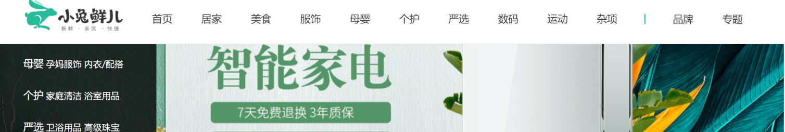

# 路由和组件


`本节目标:`  配置首页路由和组件的嵌套关系

1）根组件下定义一级路由组件出口 

`src/App.vue`

```vue
<template>
  <!-- 一级路由 -->
  <router-view></router-view>
</template>
```

### 公共布局容器组件

2）定义一级路由布局容器组件

`src/views/Layout/index.vue`

```vue
<template>
  <nav>顶部通栏</nav>
  <header>头部</header>
  <main>
    <!-- 二级路由出口 -->
    <router-view></router-view>
  </main>
  <footer>底部</footer>
</template>

<script>
export default {
  name: 'xtx-layout'
}
</script>

<style scoped lang='less'></style>
```

### 首页组件和路由配置

3）二级路由首页组件 

`src/views/Home/index.vue`

```vue
<template>
  <div class='xtx-home-page'>
    首页
  </div>
</template>

<script>
export default {
  name: 'xtx-home-page'
}
</script>

<style scoped lang='less'></style>
```

4）配置路由规则

 `src/router/index.js`

```diff
import { createRouter, createWebHashHistory } from 'vue-router'
+ const Layout = () => import('@/views/Layout')
+ const Home = () => import('@/views/Home')
const routes = [
+  {
+    path: '/',
+    component: Layout,
+    children: [
+     { path: '/', component: Home }
+    ]
+  }
]
const router = createRouter({
  history: createWebHashHistory(),
  routes
})
export default router
```

# 第二天重点总结


# Less的自动化导入

`本节目标:` 让业务组件自动加入公共样式（全局字体色值）

> 我们开发的应用有些样式是公用的，比如我们常见的配色色值，为了做到统一修改的目的往往需要定义成`less变量`，很多的业务组件都需要使用这些变量，如果我们每一个业务组件都手动引入然后使用的话，开发量巨大，所以为了解决这个问题，我们采取自动导入的方式，方便我们业务组件使用全局less变量

## 1. 手动引入方案

1）准备样式变量文件

 `src/styles/variables.less`

```less
// 主题
@xtxColor:#27BA9B;
// 辅助
@helpColor:#E26237;
// 成功
@sucColor:#1DC779;
// 警告
@warnColor:#FFB302;
// 价格
@priceColor:#CF4444;
```

2）手动引入使用其中的变量

```less
<style scoped lang='less'>
  @import '~@/styles/variables.less';
  .xtx-home-page{
    color: @xtxColor;
  }
</style>
```

## 2. 自动引入方案

> 解决方案：使用vue-cli的style-resoures-loader插件来完成自动注入到每个vue组件中style标签中

1）在当前项目下执行一下命令`vue add style-resources-loader`，添加一个vue-cli的插件

说明：指定预处理器=》Less


2） 安装完毕后会在`vue.config.js`中自动添加配置，如下：

```js
module.exports = defineConfig({
	// ...
  pluginOptions: {
    'style-resources-loader': {
      preProcessor: 'less',
      patterns: []
    }
  }
})
```

3）把需要注入的文件配置一下后，重启服务即可

```diff
+ const path = require('path')
module.exports = defineConfig({
	// ...
  pluginOptions: {
    'style-resources-loader': {
      preProcessor: 'less',
      patterns: [
+       path.join(__dirname, '/src/styles/variables.less')
      ]
    }
  }
})
```

测试一下，我们不再需要在组件中，手动import引入色值文件了，直接使用就可以了，nice~

总结：

`vue add`作用=》1. 安装npm包 2. 自动注入webpack配置文件

# 重置样式与公用样式

`本节目标:` 让业务组件加入公共样式

## 1. 重置样式

执行 `npm i normalize.css` 安装重置样式的包，然后在 `main.js` 导入 `normalize.css` 即可

```diff
import { createApp } from 'vue'
import App from './App.vue'
import router from './router'
import store from './store'
+ import 'normalize.css'
createApp(App).use(store).use(router).mount('#app')
```

## 2.  公用样式

新建文件 `src/styles/common.less` 在该文件写入常用的样式，然后在 `main.js` 导入即可

`src/styles/common.less`

说明❓：拷贝项目images目录（图片资源）到`src/assets`

```less
// 重置样式
* {
  box-sizing: border-box;
 }
 
 html {
   height: 100%;
   font-size: 14px;
 }
 body {
   height: 100%;
   color: #333;
   min-width: 1240px;
   font: 1em/1.4 'Microsoft Yahei', 'PingFang SC', 'Avenir', 'Segoe UI', 'Hiragino Sans GB', 'STHeiti', 'Microsoft Sans Serif', 'WenQuanYi Micro Hei', sans-serif
 }
 
 ul,
 h1,
 h3,
 h4,
 p,
 dl,
 dd {
   padding: 0;
   margin: 0;
 }
 a {
   text-decoration: none;
   color: #333;
   outline: none;
 }
 i {
   font-style: normal;
 }
 input[type="text"],
 input[type="search"],
 input[type="password"], 
 input[type="checkbox"]{
   padding: 0;
   outline: none;
   border: none;
   -webkit-appearance: none;
   &::placeholder{
     color: #ccc;
   }
 }
 img {
   max-width: 100%;
   max-height: 100%;
   vertical-align: middle;
   background: #ebebeb url(../assets/images/200.png) no-repeat center / contain;
 }
 ul {
   list-style: none;
 }
 #app {
   background: #f5f5f5;
   user-select: none;
 }
 
 .container {
   width: 1240px;
   margin: 0 auto;
   position: relative;
 }
 .ellipsis {
   white-space: nowrap;
   text-overflow: ellipsis;
   overflow: hidden;
 }
 
 .ellipsis-2 {
   word-break: break-all;
   text-overflow: ellipsis;
   display: -webkit-box;
   -webkit-box-orient: vertical;
   -webkit-line-clamp: 2;
   overflow: hidden;
 }
 
 .fl {
   float: left;
 }
 
 .fr {
   float: right;
 }
 
 .clearfix:after {
   content: ".";
   display: block;
   visibility: hidden;
   height: 0;
   line-height: 0;
   clear: both;
 }
```

`src/main.js`

```diff
import { createApp } from 'vue'
import App from './App.vue'
import router from './router'
import store from './store'

import 'normalize.css'
+ import '@/styles/common.less'

createApp(App).use(store).use(router).mount('#app')
```

# Layout组件布局


## 1. 顶部通栏布局

`本节目标:`  完成Layou组件的顶部通栏组件布局


### 布局准备

1）在 `public/index.html` 引入字体图标文件

```diff
<link rel="icon" href="<%= BASE_URL %>favicon.ico">
+ <link rel="stylesheet" href="//at.alicdn.com/t/font_2143783_iq6z4ey5vu.css">
<title><%= htmlWebpackPlugin.options.title %></title>
```

2）然后，新建头部导航组件

`Layout/components/topnav.vue`

```vue
<template>
  <nav class="app-topnav">
    <div class="container">
      <ul>
        <li><a href="javascript:;"><i class="iconfont icon-user"></i>周杰伦</a></li>
        <li><a href="javascript:;">退出登录</a></li>
        <li><a href="javascript:;">请先登录</a></li>
        <li><a href="javascript:;">免费注册</a></li>
        <li><a href="javascript:;">我的订单</a></li>
        <li><a href="javascript:;">会员中心</a></li>
        <li><a href="javascript:;">帮助中心</a></li>
        <li><a href="javascript:;">关于我们</a></li>
        <li><a href="javascript:;"><i class="iconfont icon-phone"></i>手机版</a></li>
      </ul>
    </div>
  </nav>
</template>
<script>
export default {
  name: 'AppTopnav'
}
</script>
<style scoped lang="less">
.app-topnav {
  background: #333;
  ul {
    display: flex;
    height: 53px;
    justify-content: flex-end;
    align-items: center;
    li {
      a {
        padding: 0 15px;
        color: #cdcdcd;
        line-height: 1;
        display: inline-block;
        i {
          font-size: 14px;
          margin-right: 2px;
        }
        &:hover {
          color: @xtxColor;
        }
      }
      ~ li {
        a {
          border-left: 2px solid #666;
        }
      }
    }
  }
}
</style>
```

3）在 `src/views/Layout/index.vue` 中导入使用

```html
<template>
  <!-- 顶部通栏 -->
  <AppTopnav/>
  <header>头部</header>
  <main>
    <!-- 二级路由 -->
    <router-view></router-view>
  </main>
  <footer>底部</footer>
</template>

<script>
import TopNav from './components/topnav'
export default {
  name: 'XtxLayout',
  components: { TopNav}
}
</script>
```

### 登录状态

4）根据当前的登录状态显示  用户名和退出登录


```vue
<script>
import { mapState } from 'vuex'
export default {
  name: 'AppTopnav',
  computed: {
    // 使用带命名空间模块数据， 第一个参数：模块名称，第二个是需要映射的数据
    ...mapState('user', ['profile'])
  }
}
</script>
```

```diff
<ul>
+    <template v-if="profile.token">
      <li><a href="javascript:;"><i class="iconfont icon-user"></i>周杰伦</a></li>
      <li><a href="javascript:;">退出登录</a></li>
    </template>
+    <template v-else>
      <li><a href="javascript:;">请先登录</a></li>
      <li><a href="javascript:;">免费注册</a></li>
    </template>
    <li><a href="javascript:;">我的订单</a></li>
    <li><a href="javascript:;">会员中心</a></li>
    <li><a href="javascript:;">帮助中心</a></li>
    <li><a href="javascript:;">关于我们</a></li>
    <li><a href="javascript:;"><i class="iconfont icon-phone"></i>手机版</a></li>
</ul>
```

## 2. 头部布局

`本节目标:`  完成Layou组件的头部布局


1）新建header头部组件

`Layout/components/header.vue`

```vue
<template>
  <header class='app-header'>
    <div class="container">
      <h1 class="logo"><RouterLink to="/">小兔鲜</RouterLink></h1>
      <ul class="navs">
        <li class="home"><RouterLink to="/">首页</RouterLink></li>
        <li><a href="#">美食</a></li>
        <li><a href="#">餐厨</a></li>
        <li><a href="#">艺术</a></li>
        <li><a href="#">电器</a></li>
        <li><a href="#">居家</a></li>
        <li><a href="#">洗护</a></li>
        <li><a href="#">孕婴</a></li>
        <li><a href="#">服装</a></li>
        <li><a href="#">杂货</a></li>
      </ul>
      <div class="search">
        <i class="iconfont icon-search"></i>
        <input type="text" placeholder="搜一搜">
      </div>
      <div class="cart">
        <a class="curr" href="#">
          <i class="iconfont icon-cart"></i><em>2</em>
        </a>
      </div>
    </div>
  </header>
</template>

<script>
export default {
  name: 'AppHeader'
}
</script>

<style scoped lang='less'>
.app-header {
  background: #fff;
  .container {
    display: flex;
    align-items: center;
  }
  .logo {
    width: 200px;
    a {
      display: block;
      height: 132px;
      width: 100%;
      text-indent: -9999px;
      background: url('~@/assets/images/logo.png') no-repeat center 18px / contain;
    }
  }
  .navs {
    width: 820px;
    display: flex;
    justify-content: space-around;
    padding-left: 40px;
    li {
      margin-right: 40px;
      width: 38px;
      text-align: center;
      a {
        font-size: 16px;
        line-height: 32px;
        height: 32px;
        display: inline-block;
      }
      &:hover {
        a {
          color: @xtxColor;
          border-bottom: 1px solid @xtxColor;
        }
      }
    }
  }
  .search {
    width: 170px;
    height: 32px;
    position: relative;
    border-bottom: 1px solid #e7e7e7;
    line-height: 32px;
    .icon-search {
      font-size: 18px;
      margin-left: 5px;
    }
    input {
      width: 140px;
      padding-left: 5px;
      color: #666;
    }
  }
  .cart {
    width: 50px;
    .curr {
      height: 32px;
      line-height: 32px;
      text-align: center;
      position: relative;
      display: block;
      .icon-cart{
        font-size: 22px;
      }
      em {
        font-style: normal;
        position: absolute;
        right: 0;
        top: 0;
        padding: 1px 6px;
        line-height: 1;
        background: @helpColor;
        color: #fff;
        font-size: 12px;
        border-radius: 10px;
        font-family: Arial;
      }
    }
  }
}
</style>
```

2）在 `src/views/Layout.vue` 中导入使用

```html
<template>
  <!-- 顶部通栏 -->
  <Topnav/>
  <!-- 头部组件 -->
  <Header/>
  <main>
    <!-- 二级路由 -->
    <router-view></router-view>
  </main>
  <footer>底部</footer>
</template>

<script>
import TopNav from './components/top-nav'
import Header from './components/header'
export default {
  name: 'XtxLayout',
   components: {
    TopNav,
    Header
  }
}
</script>
```

## 3. 抽离分类导航组件

`本节目标:` 提取头部分类导航组件，提供给头部


### 抽离组件

1)	提取头部导航区域为一个组件

`Layout/components/header-nav.vue` 

```vue
<template>
  <ul class="app-header-nav">
    <li class="home"><RouterLink to="/">首页</RouterLink></li>
    <li><a href="#">美食</a></li>
    <li><a href="#">餐厨</a></li>
    <li><a href="#">艺术</a></li>
    <li><a href="#">电器</a></li>
    <li><a href="#">居家</a></li>
    <li><a href="#">洗护</a></li>
    <li><a href="#">孕婴</a></li>
    <li><a href="#">服装</a></li>
    <li><a href="#">杂货</a></li>
  </ul>
</template>

<script>
export default {
  name: 'AppHeaderNav'
}
</script>

<style scoped lang='less'>
.app-header-nav {
  width: 820px;
  display: flex;
  padding-left: 40px;
  position: relative;
  z-index: 998;
  > li {
    margin-right: 40px;
    width: 38px;
    text-align: center;
    > a {
      font-size: 16px;
      line-height: 32px;
      height: 32px;
      display: inline-block;
    }
    > a.router-link-exact-active {
      color: @xtxColor;
      border-bottom: 1px solid @xtxColor;
    }
    &:hover {
      > a {
        color: @xtxColor;
        border-bottom: 1px solid @xtxColor;
      }
    }
  }
}
</style>

```

2）在 `Layout/components/header.vue` 中使用组件，注意，删除结构和样式

```diff
<template>
  <header class='app-header'>
    <div class="container">
      <h1 class="logo"><RouterLink to="/">小兔鲜</RouterLink></h1>
-      <!-- 头部导航区域 -->
+      <HeaderNav />
      <div class="search">
        <i class="iconfont icon-search"></i>
        <input type="text" placeholder="搜一搜">
      </div>
      <div class="cart">
        <a class="curr" href="#">
          <i class="iconfont icon-cart"></i><em>2</em>
        </a>
      </div>
    </div>
  </header>
</template>

<script>
+ import HeaderNav from './header-nav'
export default {
  name: 'AppHeader',
  components: {
+    HeaderNav
  }
}
</script>
```

### hover效果

3）完善子级分类布局 `Layout/components/header-nav.vue` 

> 一级分类鼠标hover的时候，会展示二级分类列表

```vue
<template>
  <ul class="app-header-nav">
    <li class="home"><RouterLink to="/">首页</RouterLink></li>
    <li>
      <a href="#">美食</a>
      <!-- hover 显示 start -->
      <div class="layer">
        <ul>
          <li v-for="i in 10" :key="i">
            <a href="#">
              
              <p>果干</p>
            </a>
          </li>
        </ul>
      </div>
       <!-- hover 显示 end -->
    </li>
    <li><a href="#">餐厨</a></li>
    <li><a href="#">艺术</a></li>
    <li><a href="#">电器</a></li>
    <li><a href="#">居家</a></li>
    <li><a href="#">洗护</a></li>
    <li><a href="#">孕婴</a></li>
    <li><a href="#">服装</a></li>
    <li><a href="#">杂货</a></li>
  </ul>
</template>

<script>
export default {
  name: 'AppHeaderNav'
}
</script>

<style scoped lang='less'>
.app-header-nav {
  width: 820px;
  display: flex;
  padding-left: 40px;
  position: relative;
  z-index: 998;
  > li {
    margin-right: 40px;
    width: 38px;
    text-align: center;
    > a {
      font-size: 16px;
      line-height: 32px;
      height: 32px;
      display: inline-block;
    }
    &:hover {
     > a {
        color: @xtxColor;
        border-bottom: 1px solid @xtxColor;
      }
    }
    // ++ 初始样式 不显示
    .layer {
      width: 1240px;
      background-color: #fff;
      position: absolute;
      left: -200px;
      top: 56px;
      height: 0;
      overflow: hidden;
      opacity: 0;
      box-shadow: 0 0 5px #ccc;
      transition: all 0.2s 0.1s;
      ul {
        display: flex;
        flex-wrap: wrap;
        padding: 0 70px;
        align-items: center;
        height: 124px;
        li {
          width: 110px;
          text-align: center;
          img {
            width: 60px;
            height: 60px;
          }
          p {
            padding-top: 10px;
          }
          &:hover {
            p {
              color: @xtxColor;
            }
          }
        }
      }
    }
    // hover之后显示出来
    &:hover {
      > a {
        color: @xtxColor;
        border-bottom: 1px solid @xtxColor;
      }
      > .layer {
        height: 120px;
        opacity: 1;
      }
    }
    // ++ end
  }
}
</style>
```

## 4. 底部布局

`本节目标:`  完成Layou组件的顶部footer组件布局


1）新建底部组件

`Layout/components/footer.vue`

```vue
<template>
  <footer class="app_footer">
    <!-- 联系我们 -->
    <div class="contact">
      <div class="container">
        <dl>
          <dt>客户服务</dt>
          <dd><i class="iconfont icon-kefu"></i> 在线客服</dd>
          <dd><i class="iconfont icon-question"></i> 问题反馈</dd>
        </dl>
        <dl>
          <dt>关注我们</dt>
          <dd><i class="iconfont icon-weixin"></i> 公众号</dd>
          <dd><i class="iconfont icon-weibo"></i> 微博</dd>
        </dl>
        <dl>
          <dt>下载APP</dt>
          <dd class="qrcode"></dd>
          <dd class="download">
            <span>扫描二维码</span>
            <span>立马下载APP</span>
            <a href="javascript:;">下载页面</a>
          </dd>
        </dl>
        <dl>
          <dt>服务热线</dt>
          <dd class="hotline">400-0000-000 <small>周一至周日 8:00-18:00</small></dd>
        </dl>
      </div>
    </div>
    <!-- 其它 -->
    <div class="extra">
      <div class="container">
        <div class="slogan">
          <a href="javascript:;">
            <i class="iconfont icon-footer01"></i>
            <span>价格亲民</span>
          </a>
          <a href="javascript:;">
            <i class="iconfont icon-footer02"></i>
            <span>物流快捷</span>
          </a>
          <a href="javascript:;">
            <i class="iconfont icon-footer03"></i>
            <span>品质新鲜</span>
          </a>
        </div>
        <!-- 版权信息 -->
        <div class="copyright">
          <p>
            <a href="javascript:;">关于我们</a>
            <a href="javascript:;">帮助中心</a>
            <a href="javascript:;">售后服务</a>
            <a href="javascript:;">配送与验收</a>
            <a href="javascript:;">商务合作</a>
            <a href="javascript:;">搜索推荐</a>
            <a href="javascript:;">友情链接</a>
          </p>
          <p>CopyRight © 小兔鲜儿</p>
        </div>
      </div>
    </div>
  </footer>
</template>

<script>
export default {
  name: 'AppFooter'
}
</script>

<style scoped lang='less'>
.app_footer {
  overflow: hidden;
  background-color: #f5f5f5;
  padding-top: 20px;
  .contact {
    background: #fff;
    .container {
      padding: 60px 0 40px 25px;
      display: flex;
    }
    dl {
      height: 190px;
      text-align: center;
      padding: 0 72px;
      border-right: 1px solid #f2f2f2;
      color: #999;
      &:first-child {
        padding-left: 0;
      }
      &:last-child {
        border-right: none;
        padding-right: 0;
      }
    }
    dt {
      line-height: 1;
      font-size: 18px;
    }
    dd {
      margin: 36px 12px 0 0;
      float: left;
      width: 92px;
      height: 92px;
      padding-top: 10px;
      border: 1px solid #ededed;
      .iconfont {
        font-size: 36px;
        display: block;
        color: #666;
      }
      &:hover {
        .iconfont {
          color: @xtxColor;
        }
      }
      &:last-child {
        margin-right: 0;
      }
    }
    .qrcode {
      width: 92px;
      height: 92px;
      padding: 7px;
      border: 1px solid #ededed;
    }
    .download {
      padding-top: 5px;
      font-size: 14px;
      width: auto;
      height: auto;
      border: none;
      span {
        display: block;
      }
      a {
        display: block;
        line-height: 1;
        padding: 10px 25px;
        margin-top: 5px;
        color: #fff;
        border-radius: 2px;
        background-color: @xtxColor;
      }
    }
    .hotline {
      padding-top: 20px;
      font-size: 22px;
      color: #666;
      width: auto;
      height: auto;
      border: none;
      small {
        display: block;
        font-size: 15px;
        color: #999;
      }
    }
  }
  .extra {
    background-color: #333;
  }
  .slogan {
    height: 178px;
    line-height: 58px;
    padding: 60px 100px;
    border-bottom: 1px solid #434343;
    display: flex;
    justify-content: space-between;
    a {
      height: 58px;
      line-height: 58px;
      color: #fff;
      font-size: 28px;
      i {
        font-size: 50px;
        vertical-align: middle;
        margin-right: 10px;
        font-weight: 100;
      }
      span {
        vertical-align: middle;
        text-shadow: 0 0 1px #333;
      }
    }
  }
  .copyright {
    height: 170px;
    padding-top: 40px;
    text-align: center;
    color: #999;
    font-size: 15px;
    p {
      line-height: 1;
      margin-bottom: 20px;
    }
    a {
      color: #999;
      line-height: 1;
      padding: 0 10px;
      border-right: 1px solid #999;
      &:last-child {
        border-right: none;
      }
    }
  }
}
</style>

```

2）在 `src/views/Layout.vue` 中导入使用

```diff
<template>
 <!-- 顶部通栏组件 -->
  <TopNav />
  <!-- header区域 -->
  <Header />
  <main>
    <!-- 二级路由出口 -->
    <router-view></router-view>
  </main>
-  <!-- 底部footer -->
+  <Footer/>
</template>

<script>
+ import Footer from './components/footer'
export default {
  name: 'XtxLayout',
+  components: { Footer }
}
</script>
```

## 重点总结

> 组件封装原则

**组件需要抽离的场景**

1. 如果组件功能独立 完全可以独立维护 抽离成一个组件 （可维护性角度）
2. 组件如果是需要被很多组件复用的 抽离成一个组件 （复用性角度）

**组件的命名和使用**

1. 从组件的命名上就体现出组件之间的嵌套关系
2. 组件在模板区域使用的时候 遵守风格 `TopNav` `top-nav`

**组件就近维护原则**

1. 在大模块文件夹的内部新建一个`components`文件夹，就近维护当前大模块下的小模块

# 接口数据渲染分类导航菜单

`本节目标:`  使用真实接口完成一级分类渲染以及二级分类渲染


## 1. 使用vuex管理分类数据

1）定义API函数  `src/api/home.js`

```js
// 定义首页需要的接口函数
import request from '@/utils/request'
/**
 * @description: 获取导航数据
 * @param {*}
 * @return {*}
 */
export const findHeadCategory = () => {
  return request('/home/category/head', 'get')
}
```

2）定义一个vuex的category模块，来存储分类数据，提供修改和获取的函数

`src/store/modules/category.js`

```js
import { findHeadCategory } from '@/api/home'
export default {
  namespaced: true,
  state: () => {
    return {
      list: [] // 分类列表
    }
  },
  // 加载数据成功后需要修改list所以需要mutations函数
  mutations: {
    setCategory (state, headCategory) {
      state.list = headCategory
    }
  },
  // 需要向后台加载数据，所以需要actions函数获取数据
  actions: {
    async asyncSetList (ctx) {
      // 1.调用接口方法
      // 2.成功获取到数据之后触发setList mutation函数
      const res = await findHeadCategory()
      console.log(res.data.result)
      ctx.commit('setList', res.data.result)
    }
  }
}
```

3）把category模块挂载到vuex的实例上 

`src/store/index.js`

```js
import category from './modules/category'
```

```diff
modules: {
    // 分模块
    user,
    cart,
+   category
}
```

## 2. 触发action函数并渲染数据

`src/views/Layout/components/header-nav.vue` 

* vue 2.x实现

```html
<!-- vue 2.x实现 -->
<template>
   <ul class="app-header-nav">
    <li class="home"><RouterLink to="/">首页</RouterLink></li>
    <li v-for="item in list" :key="item.id">
      <RouterLink to="/">{{item.name}}</RouterLink>
      <!--为移入打开弹框做准备-->
      <div class="layer">
        <ul>
          <li v-for="sub in item.children" :key="sub.id">
            <RouterLink to="/">
              
              <p>{{sub.name}}</p>
            </RouterLink>
          </li>
        </ul>
      </div>
    </li>
  </ul>
</template>

<script>
import { mapState } from 'vuex'
export default {
  name: 'AppHeaderNav',
  computed: {
    ...mapState('category', ['list'])
  },
  mounted () {
    this.$store.dispatch('category/asyncSetList')
  }
}
</script>
```

* vue 3.x实现

```vue
<template>
  <ul class="app-header-nav">
    <li class="home"><RouterLink to="/">首页</RouterLink></li>
    <!-- 使用v-for + vuex中的list数据 -->
    <li v-for="item in $store.state.category.list" :key="item.id">
      <a href="#">{{item.name}}</a>
      <!-- 放置鼠标移入显示的二级弹框 -->
      <div class="layer">
        <ul>
          <li v-for="i in item.children" :key="i.id">
            <a href="#">
              
              <p>{{i.name}}</p>
            </a>
          </li>
        </ul>
      </div>
    </li>
  </ul>
</template>

<script>
// 因为需要在这个组件的模板区域使用vuex的分类数据
// 有必要在这个组件中触发action函数 从而获取接口数据
import { onMounted } from 'vue'
// 1.从vuex中导入一个函数 useStore 返回值就是一个store实例对象
import { useStore } from 'vuex'
export default {
  name: 'AppHeaderNav',
  setup () {
    // onMounted
    const store = useStore() // this.$store === store
    onMounted(() => {
      // 触发action函数的执行
      // 如何在setup函数中拿到store实例从而调用它身上的方法
      store.dispatch('category/asyncSetList')
    })
  }
}
</script>
```

## 重点总结

**1. 基于vuex管理数据几个配置项之间的关系**

```js
1. state中定义我们需要管理的数据  响应式的  由业务决定当前到底应该定义成什么类型
2. mutation中定义修改数据的方法  同步函数  只需要完成实参注入对于state中的数据赋值即可
3. 如果有异步 我们就封装一个action函数 1. 发送请求  2.调用mutation函数  (支持异步调用的mutation)
4. 在业务组件里找到一个合适的时机调用action函数

测试:
  1. dev-tools  检测当前的action函数和mutation是否调用成功  传递的参数是否符合预期
  2. Logger插件  检测log区域查看当前的action函数和mutation是否调用成功  传递的参数是否符合预期
```

**2. 在setup函数中如何获取store实例**

```js
import { useStore } from 'vuex'
setup(){
  const store = useStore()  // this.$store === store 方法的执行必须写到setup函数中 不要写到内部函数中
}
```

# 分类导航吸顶组件-选项API实现



`本节目标:`  完成头部组件吸顶效果的实现

> 电商网站的首页内容会比较多，会有很多频，为了能让用户在滚动浏览内容的过程中都能够快速的切换到其它模块，需要导航一直可见，所以需要一个吸顶导航的效果

**交互要求**

1. 滚动距离大于等于78个px的时候，组件固定在视口顶部跟随页面移动
2. 滚动距离小于78个px的时候，组件消失

**实现思路**

1. 准备一个吸顶组件，准备一个类名，控制样式让其固定在顶部
2. 监听页面滚动，判断滚动距离，距离大于78px添加类名

**代码落地**

1）新建吸顶导航组件

 `Layout/components/header-sticky.vue` 

```vue
<template>
  <div class="app-header-sticky">
    <div class="container">
      <RouterLink class="logo" to="/" />
      <HeaderNav />
      <div class="right">
        <RouterLink to="/">品牌</RouterLink>
        <RouterLink to="/">专题</RouterLink>
      </div>
    </div>
  </div>
</template>

<script>
import HeaderNav from './header-nav'
export default {
  name: 'AppHeaderSticky',
  components: { HeaderNav }
}
</script>

<style scoped lang='less'>
.app-header-sticky {
  width: 100%;
  height: 80px;
  position: fixed;
  left: 0;
  top: 0;
  z-index: 999;
  background-color: #fff;
  border-bottom: 1px solid #e4e4e4;
  .container {
    display: flex;
    align-items: center;
  }
  .logo {
    width: 200px;
    height: 80px;
    background: url('~@/assets/images/logo.png') no-repeat  right 2px;
    background-size: 160px auto;
  }
  .right {
    width: 220px;
    display: flex;
    text-align: center;
    padding-left: 40px;
    border-left: 2px solid @xtxColor;
    a {
      width: 38px;
      margin-right: 40px;
      font-size: 16px;
      line-height: 1;
      &:hover {
        color: @xtxColor;
      }
    }
  }
}
</style>
```

2）Layout首页引入吸顶导航组件

```diff
<template>
  <!-- 顶部通栏组件 -->
  <TopNav />
  <!-- header区域 -->
  <Header />
  <!-- 吸顶组件 -->
+  <HeaderSticky/>
  <main>
    <!-- 二级路由出口 -->
    <router-view></router-view>
  </main>
  <!-- 底部footer -->
  <Footer/>
</template>

<script>
import TopNav from './components/topnav'
import Header from './components/header'
import Footer from './components/footer'
+ import HeaderSticky from './components/header-sticky'
export default {
  name: 'XtxLayout',
  components: { Topnav, Header, Footer,
+  HeaderSticky
  }
}
</script>
```

3）在滚动到78px完成显示效果，需要滑出动画

第一步：定义一个类名`show` 当有类名`show`的时候吸顶导航固定且显示，否则不显示

```less
.app-header-sticky {
  width: 100%;
  height: 80px;
  position: fixed;
  left: 0;
  top: 0;
  z-index: 999;
  background-color: #fff;
  border-bottom: 1px solid #e4e4e4;
  // ======== 此处为新增样式！！！！！！======
  // 默认情况下完全把自己移动到上面=> 不显示
  transform: translateY(-100%);
  // 完全透明
  opacity: 0;
  // 显示出来的类名
  &.show {
    transition: all 0.3s linear;
    transform: none;
    opacity: 1;
 }
 // end
```

第二步：组件渲染后，监听滚动距离超过78px加上show类

```jsx
<div class="app-header-sticky" :class="{ show: showFlag }">

data () {
    return {
      showFlag: false
    }
},
mounted () {
    // 监听页面滚动事件
    window.addEventListener('scroll',()=>{
         const scrollTop = document.documentElement.scrollTop
          if( scrollTop >= 78 ) {
            this.showFlag = true 
          } else {
            this.showFlag = false
          }
    })
}
```

# 分类导航吸顶组件-组合API实现

`本节目标:`  使用组合式API实现重构吸顶功能

> vueuse/core : 组合式API常用复用逻辑的集合
>
> https://vueuse.org/core/useWindowScroll/

1）安装@vueuse/core 包，它封装了常见的一些交互逻辑

```bash
npm i @vueuse/core@5.0.3
```

2）在吸顶导航中使用

`Layout/components/header-sticky.vue` 

```diff
<template>
  <div class="app-header-sticky"
+ :class="{show:y >= 78}">
    <div class="container">
      <RouterLink class="logo" to="/" />
      <HeaderNav />
      <div class="left">
        <RouterLink to="/" >品牌</RouterLink>
        <RouterLink to="/" >专题</RouterLink>
      </div>
    </div>
  </div>
</template>

<script>
import HeaderNav from './header-nav'
+ import { useWindowScroll } from '@vueuse/core'
export default {
  name: 'AppHeaderSticky',
  components: { HeaderNav },
  setup () {
-   // y表示具体顶部的滚动距离 会动态更新
+    const { y } = useWindowScroll()
+    return { y }
  }
}
</script>
```

注意⚠️：需要解构响应数据y使用

