# 分类页面

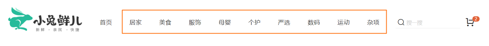

## 路由和组件

`任务目标:` 新增顶级类目组件并绑定路由

**实现步骤**

1. 新建相关组件
2. 把组件和路由绑定在一起
3. 给路由在导航区域添加上跳转链接
4. 点击跳转链接测试是否成功跳转

**代码落地**

1）新建组件

`src/views/Category/index.vue`

```vue
<template>
  <div class='top-category'>
    <div class="container">
      分类
    </div>
  </div>
</template>

<script>
export default {
  name: 'TopCategory'
}
</script>

<style scoped lang="less">
.top-category {
  h3 {
    font-size: 28px;
    color: #666;
    font-weight: normal;
    text-align: center;
    line-height: 100px;
  }
  .sub-list {
    margin-top: 20px;
    background-color: #fff;
    ul {
      display: flex;
      padding: 0 32px;
      flex-wrap: wrap;
      li {
        width: 168px;
        height: 160px;
        a {
          text-align: center;
          display: block;
          font-size: 16px;
          img {
            width: 100px;
            height: 100px;
          }
          p {
            line-height: 40px;
          }
          &:hover {
            color: @xtxColor;
          }
        }
      }
    }
  }
  .ref-goods {
    background-color: #fff;
    margin-top: 20px;
    position: relative;
    .head {
      .xtx-more {
        position: absolute;
        top: 20px;
        right: 20px;
      }
      .tag {
        text-align: center;
        color: #999;
        font-size: 20px;
        position: relative;
        top: -20px;
      }
    }
    .body {
      display: flex;
      justify-content: space-around;
      padding: 0 40px 30px;
    }
    .goods-item {
      display: block;
      width: 220px;
      padding: 20px 30px;
      text-align: center;
      img {
        width: 160px;
        height: 160px;
      }
      p {
        padding-top: 10px;
      }
      .name {
        font-size: 16px;
      }
      .desc {
        color: #999;
        height: 29px;
      }
      .price {
        color: @priceColor;
        font-size: 20px;
      }
    }
  }
}
</style>
```

2）绑定路由

`src/router/index.js`

```diff
const Layout = () => import('@/views/Layout')
const Home = () => import('@/views/Home')
+ const Category = () => import('@/views/Category')
const routes = [
  {
    path: '/',
    component: Layout,
    children: [
      { path: '/', component: Home },
+     { path: '/category/:id', component: Category }
    ]
  }
]
```

3）添加路由跳转链接

`src\views\Layout\components\header-nav.vue`

```diff
<li v-for="item in list" :key="item.id">
+  <RouterLink :to="`/category/${item.id}`">{{item.name}}</RouterLink>
</li>
```


## 全部分类区域实现

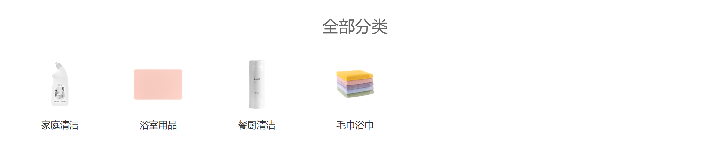

`任务目标:` 完成全部分类模块的数据渲染

**实现步骤**

1. 准备接口API
2. 搭建分类模块需要的结构
3. 调用接口渲染模板

### 接口定义

2）准备接口渲染数据

`src/api/category.js`

```js
import request from '@/utils/request'

/**
 * @description: 获取一级分类下所有二级分类和分类下商品列表数据
 * @param {*} id 一级分类id
 * @return {*}
 */
export const findAllCategory = (id) => {
  return request('/category', 'get', { id })
}

```

### 全部分类结构

**代码落地**

1）搭建结构

`src/views/Category/index.vue`

```html
<div class="sub-list">
    <h3>全部分类</h3>
    <ul>
      <li v-for="i in 8" :key="i">
        <a href="javascript:;">
          
          <p>空调</p>
        </a>
      </li>
    </ul>
</div>
```

### 获取全部分类数据渲染

`src/views/Category/index.vue`

说明❓：全部分类数据使用`res.result.children` 数据进行渲染

```html
<template>
  <div class="top-category">
    <div class="container">
      <!-- 全部分类 -->
      <div class="sub-list">
        <h3>全部分类</h3>
        <ul>
          <li v-for="item in categroyAllList" :key="item.id">
            <a href="javascript:;">
              
              <p>{{ item.name }}</p>
            </a>
          </li>
        </ul>
      </div>
    </div>
  </div>
</template>
<script>
import { findAllCategory } from '@/api/category'
import { ref, onMounted } from 'vue'
import { useRoute } from 'vue-router'
export default {
  name: 'TopCategory',
  setup () {
   // 全部分类逻辑实现
    const categroyAllList = ref([])
    // 获取动态路由参数
    const route = useRoute() // route === this.$route => route.params.id
    async function getCategroyAllList () {
      const res = await findAllCategory(route.params.id)
      categroyAllList.value = res.result.children
    }
    onMounted(() => {
      getCategroyAllList()
    })
    return {
      categroyAllList
    }
  }
}
</script>
```

## 分类商品区域实现

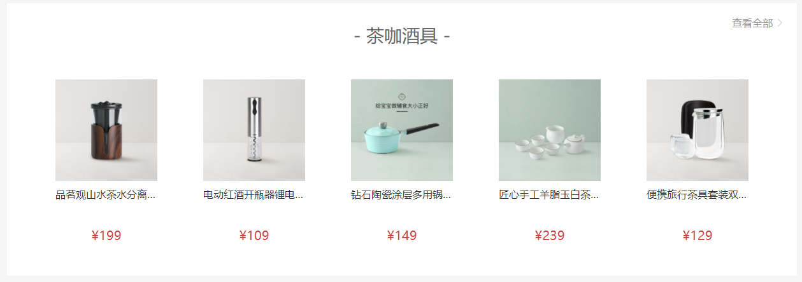

`任务目标:`  完成推荐商品模块的结构搭建和数据渲染

**实现步骤**

1. 准备推荐商品模块的静态结构
2. 使用真实接口数据进行渲染
3. 抽离复用商品模块组件

### 分类商品结构

**代码落地**

1）搭建静态结构

`src/views/category/index.vue`

```html
<!-- 全部分类... -->

<!-- 分类关联商品 -->
<div class="ref-goods" v-for="item in 3" :key="item">
    <div class="head">
      <h3>-  水具杯壶  -</h3>
      <XtxMore to="/" />
    </div>
    <div class="body">
      <RouterLink to="/" class="goods-item" v-for="good in 4" :key="good">
        
        <p class="name ellipsis">红功夫 麻辣小龙虾 19.99/500g 实惠到家</p>
        <p class="desc ellipsis">火锅食材</p>
        <p class="price">&yen;19.99</p>
      </RouterLink>
    </div>
</div>
```

### 分类商品渲染

2）渲染真实数据

> 1. 各分类数据使用上一步已经获取的`res.result.children` 数据进行渲染
> 2. 内部商品内容使用 `goods字段`渲染出来
> 3. `查看全部` 添加路由链接跳转

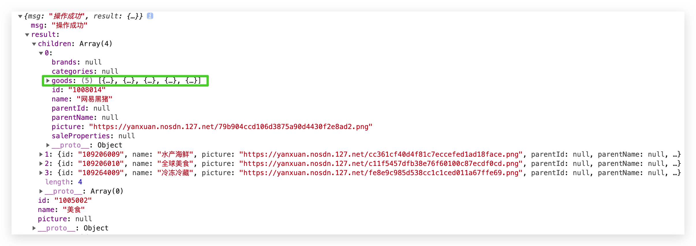

```html
      <!-- 分类关联商品 -->
      <div class="ref-goods" v-for="item in categroyAllList" :key="item.id">
        <div class="head">
          <h3>- {{ item.name }} -</h3>
          <XtxMore to="/" />
        </div>
        <div class="body">
          <RouterLink
            to="/"
            class="goods-item"
            v-for="good in item.goods"
            :good="good"
            :key="good.id"
          >
            
            <p class="name ellipsis">{{ good.name }}</p>
            <p class="desc ellipsis">{{ good.tag }}</p>
            <p class="price">&yen;{{ good.price }}</p>
          </RouterLink>
        </div>
      </div>
```


## 解决路由缓存问题

`任务目标:`  解决路由复用数据不重新获取的问题

> 现存问题：由于路由的组件复用机制，当路由的路径path没有发生变化时，路由对应的组件会被直接复用，也就是生命周期钩子函数不再执行，请求也就不会再次发起
>
> 解决思路：给`router-view` 加上key 值为每次路由切换的完整路径

```html
<router-view :key="$route.fullPath"></router-view>
```

**三种可选方案**

1）给`router-view` 添加key属性 

`Layout/index.vue`

说明❓：组件会被重新创建

```html
<router-view :key="$route.fullPath"/> 
```

2）使用watch监听id变化重新拉取接口

```js
watch(
  ()=>{ return route.params.id },
  ()=>{ loadCategoryList() } // 在id变化的时候重新使用最新的路由id拉取最新数据
)
```

3）使用`onBeforeRouteUpdate` 钩子函数（不会重新创建组件）

```diff
+ import { onBeforeRouteUpdate } from 'vue-router'

async function loadCategoryList (id) {
  const res = await findAllCategory(id)
  categroyAllList.value = res.result
  categroyName.value = res.result.name
}
onMounted(() => {
  loadCategoryList(route.params.id)
})
// 在路由跳转之后更新之前自动执行
// beforeEach((to,from,next)=>{})
+ onBeforeRouteUpdate((to) => {
-  // to指代的是目标路由对象 to拿到最新的路由参数id
-  // 使用最新id获取数据
+  loadCategoryList(to.params.id)
+ })
```

说明❓：根据不一样的场景要求使用不一样的技术方案，如果性能要求很高，第三种方案，如果不涉及性能问题，使用key简单粗暴，**避免提前优化**

# 详情页面

##  基础布局和路由

`任务目标:`   完成商品详情的基础布局和路由配置

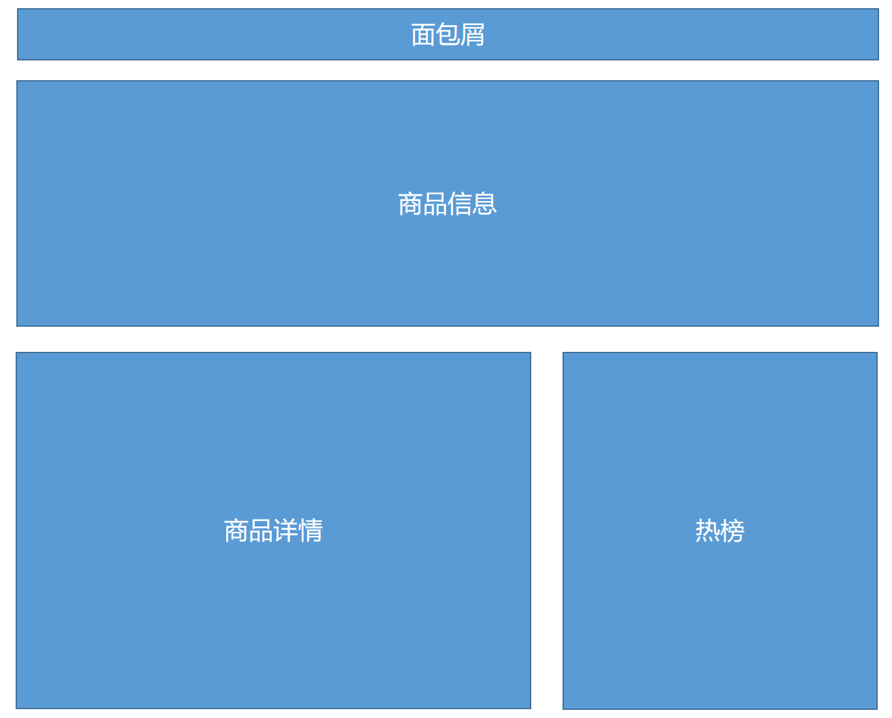

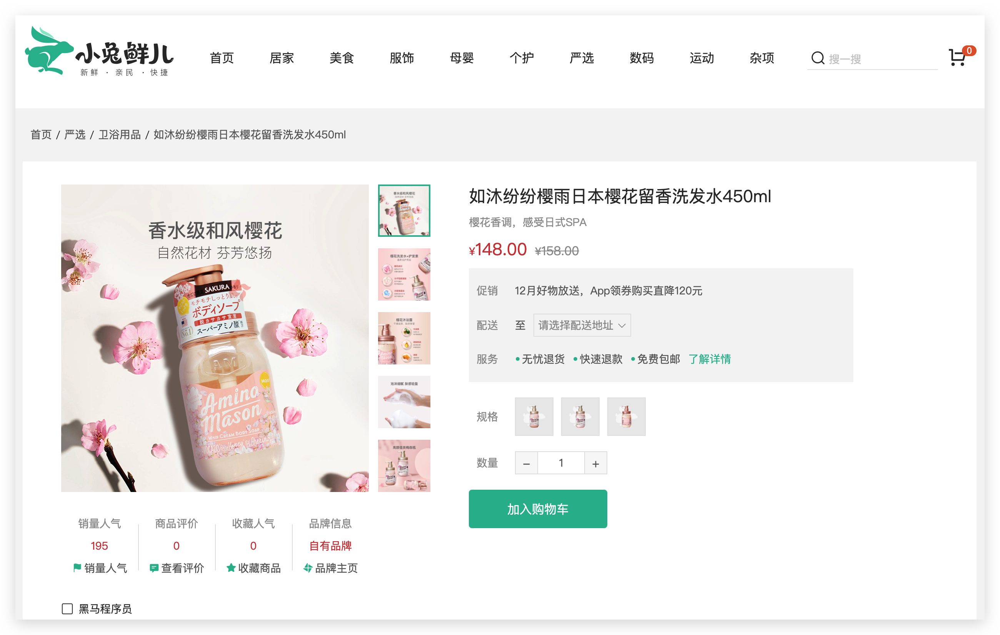

1）新建页面组件

`src/views/Goods/index.vue`

```vue
<template>
  <div class='xtx-goods-page'>
    <div class="container">
      <!-- 面包屑 -->
      <XtxBread separator="/">
        <XtxBreadItem to="/">首页</XtxBreadItem>
        <XtxBreadItem to="/">手机</XtxBreadItem>
        <XtxBreadItem to="/">华为</XtxBreadItem>
        <XtxBreadItem to="/">p30</XtxBreadItem>
      </XtxBread>
      <!-- 商品信息 -->
      <div class="goods-info"></div>
      <!-- 商品详情 -->
      <div class="goods-footer">
        <div class="goods-article">
          <div class="goods-tabs">
            <!-- 详情图片列表 -->
            
          </div>
        </div>
        <div class="goods-aside"></div>
      </div>
    </div>
  </div>
</template>

<script>
export default {
  name: 'XtxGoodsPage'
}
</script>

<style scoped lang='less'>
.goods-info {
  min-height: 600px;
  background: #fff;
  display: flex;
}
.goods-footer {
  display: flex;
  margin-top: 20px;
  .goods-article {
    width: 940px;
    margin-right: 20px;
  }
  .goods-aside {
    width: 280px;
    min-height: 1000px;
    background: #fff;
  }
}
.goods-tabs {
  min-height: 600px;
  background: #fff;
  img {
    width: 100%;
  }
}
.goods-warn {
  min-height: 600px;
  background: #fff;
  margin-top: 20px;
}
</style>
```

2）路由配置

`src/router/index.js`

```diff
+ const Goods = () => import('@/views/Goods/index')

const routes = [
  {
    path: '/',
    component: Layout,
    children: [
      {
        path: '/',
        component: Home
      },
+      {
+        path: '/goods/:id',
+        component: Goods
+      }
    ]
  }
]
```

3）测试路由跳转

> 给新鲜好物模块，新增路由跳转链接

`views/Home/components/home-new.vue`

```html
<RouterLink :to="`/goods/${item.id}`">
  
  <p class="name">{{ item.name }}</p>
  <p class="price">&yen;{{ item.price }}</p>
</RouterLink>
```

## 面包屑导航渲染

`任务目标:`   使用真实数据渲染面包屑导航


**实现步骤**

1. 定义获取商品详情API函数
2. 在组件setup中获取商品详情数据

### 定义接口

**代码落地**

1）封装API函数 

`src/api/goods.js`

```js
import request from '@/utils/request'
/**
 * @description: 获取详情数据
 * @param {*} id
 * @return {*}
 */
export const findGoods = (id) => {
  return request('/goods', 'get', { id })
}
```

### 获取商品详情数据

2）setup函数中书写逻辑  

`src/views/Goods/index.vue`

```js
import { findGoods } from '@/api/goods'
import { ref, onMounted } from 'vue'
import { useRoute } from 'vue-router'

setup () {
    const route = useRoute()
    const goods = ref({})
    async function getGoods () {
      const res = await findGoods(route.params.id)
      goods.value = res.result
    }
    onMounted(()=>{
       getGoods()
    })
    return { goods }
 }
```

### 渲染面包屑

3）渲染面包屑

说明⚠：使用小兔子面包屑组件`XtxBread`

```vue
<!-- 面包屑 -->
  <XtxBread>
    <XtxBreadItem to="/">首页</XtxBreadItem>
    <XtxBreadItem>
      {{goods.categories[1].name}}
    </XtxBreadItem>
    <XtxBreadItem>
      {{goods.categories[0].name}}
    </XtxBreadItem>
    <XtxBreadItem to="/">
      {{goods.name}}
    </XtxBreadItem>
  </XtxBread>
```

4）防止报错，加载完成goods再显示所有内容!!

```vue
<div class="xtx-goods-page" v-if="goods.categories">
   ...
</div>
```


## 商品主要信息区域

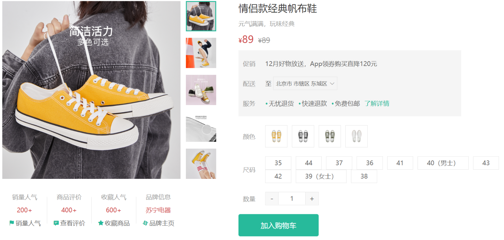

### 整体结构拆分

`src/views/Goods/index.vue`

```html
<!-- 商品信息 -->
<div class="goods-info">
    <!-- 新增结构 -->
    <!-- 图片预览区 -->
    <div class="media"></div>
    <!-- 商品信息区 -->
    <div class="spec"></div>
</div>
<style>
  .goods-info {
      min-height: 600px;
      background: #fff;
      display: flex;
      // 新增样式 
      .media {
        width: 580px;
        height: 600px;
        padding: 30px 50px;
      }
      .spec {
        flex: 1;
        padding: 30px 30px 30px 0;
      }
    }
</style>
```

### 图片预览组件

`任务目标:`  完成商品图片的预览和切换功能

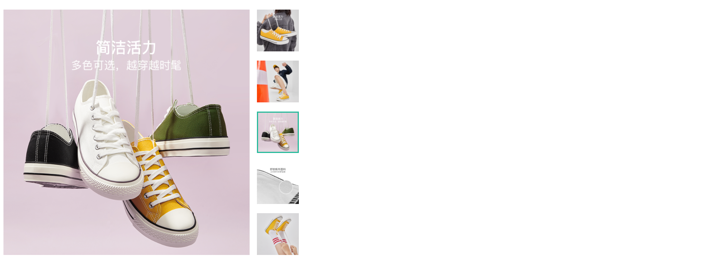

**实现步骤**

1. 搭建组件静态结构
2. 使用接口数据渲染
3. 实现鼠标移入小图大图切换 （控制curIndex）

**代码落地**

#### 创建组件

1）搭建组件基础结构

`views/Goods/components/goods-image.vue`

```vue
<template>
  <div class="goods-image">
    <div class="middle">
      
    </div>
    <ul class="small">
      <li v-for="(img,i) in 5" :key="i">
        
      </li>
    </ul>
  </div>
</template>
<script>
export default {
  name: 'GoodsImage'
}
</script>
<style scoped lang="less">
.goods-image {
  width: 480px;
  height: 400px;
  position: relative;
  display: flex;
  .middle {
    width: 400px;
    height: 400px;
    background: #f5f5f5;
  }
  .small {
    width: 80px;
    li {
      width: 68px;
      height: 68px;
      margin-left: 12px;
      margin-bottom: 15px;
      cursor: pointer;
      &:hover,&.active {
        border: 2px solid @xtxColor;
      }
    }
  }
}
</style>
```

#### 数据渲染

2）使用接口数据渲染

> 数据由父组件传入，通过props接收

`views/Goods/index.vue`

```jsx
<GoodsImage :imageList="goods.mainPictures" />
```

`views/Goods/components/goods-image.vue`

```html
<template>
  <div class="goods-image">
    <div class="middle">
      
    </div>
    <ul class="small">
      <li v-for="img in images" :key="img" >
        
      </li>
    </ul>
  </div>
</template>
<script>
import { ref } from 'vue'
export default {
  name: 'GoodsImage',
  props: {
    images: {
      type: Array,
      default: () => []
    }
  },
  setup(){
    const curIndex = ref(0)
    return { curIndex }
  }
}
</script>
```

#### 激活切换

3）图片切换逻辑

> 鼠标移除哪个，把currIndex设置为哪个的下标值

```diff
<template>
  <div class="goods-image">
    <div class="middle">
      
    </div>
    <ul class="small">
      <li
        v-for="(img, i) in imageList"
        :key="i"
+        :class="{ active: curIndex === i }"
+        @mouseenter="curIndex = i"
      >
        
      </li>
    </ul>
  </div>
</template>
```

### 图片放大镜（难点）

`任务目标:`  完成商品图片的放大镜功能 （在图片预览组件中增强功能）

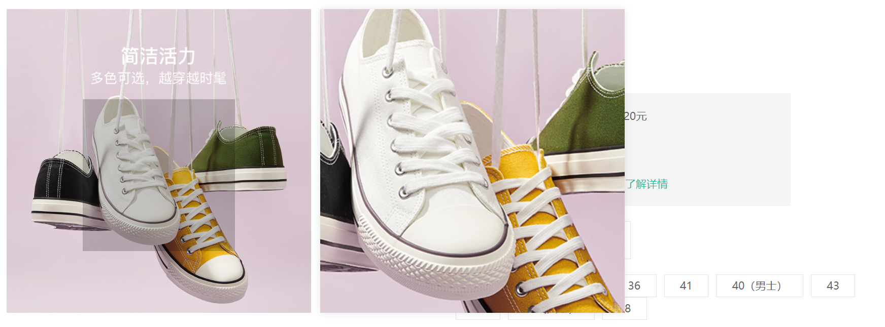

**实现思路**

1. 准备组件结构
2. 控制蒙层移动
3. 控制大图背景随着蒙层的移动而移动

#### 1. 新增蒙层滑块和大图结构

1）准备右侧大图容器

> 默认以第一张图片作为背景图

`views/Goods/components/goods-image.vue`

```diff
<!-- middle之前放置大图盒子 -->
+ <div class="large" :style="[{backgroundImage:`url(${imageList[curIndex]})`}]"></div>
<div class="middle"></div>

+ <!--配套样式 -->
<style>
 .large {
    position: absolute;
    top: 0;
    left: 412px;
    width: 400px;
    height: 400px;
    z-index:500;
    box-shadow: 0 0 10px rgba(0, 0, 0, 0.1);
    background-repeat: no-repeat;
    background-size: 800px 800px;
    background-color: #f8f8f8;
  }
</style>
```

2）准备滑块蒙层容器

```diff
<div class="middle">
  
  <!-- 蒙层容器 -->
+  <div class="layer"></div>
</div>

<style>
+ <!--配套样式 -->
.layer {
  width: 200px;
  height: 200px;
  background: rgba(0, 0, 0, 0.2);
  left: 0;
  top: 0;
  position: absolute;
}
</style>
```

#### 2. 获取鼠标相对坐标值

> 因为整个交互都是随着鼠标的位置变化而变化的，所以我们最需要的就是可以实时的知道鼠标的坐标位置（**图片区域内位置**）
>
> `useMouseInElement`： https://vueuse.org/core/usemouseinelement/#usemouseinelement

```js
<div class="middle" ref="target">

setup () {
    const target = ref(null)
    // elementX 鼠标基于容器左上角X轴偏移
    // elementY 鼠标基于容器左上角Y轴偏移
    // isOutside 鼠标是否在模板容器外
    // 三个参数都是ref对象
    const { elementX, elementY, isOutside } = useMouseInElement(target)
    watch([elementX, elementY], () => {
       // 监听处理
    })

    return { target }
  }
```

#### 3. 控制滑块蒙层移动

1. 最大有效可移动范围
   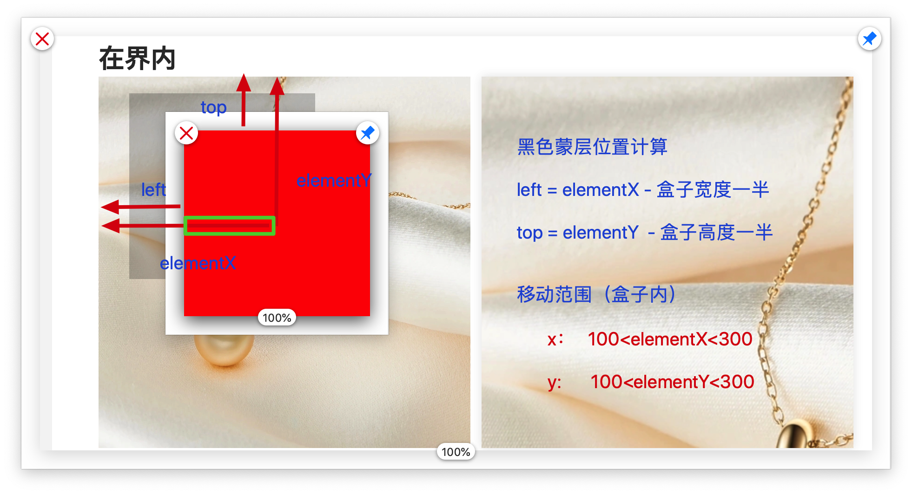

   说明❓：

   > 蒙层中心点开始计算

   * 横向范围X轴：left >100 && left<300
   * 纵向范围Y轴：top >100 && top<300

   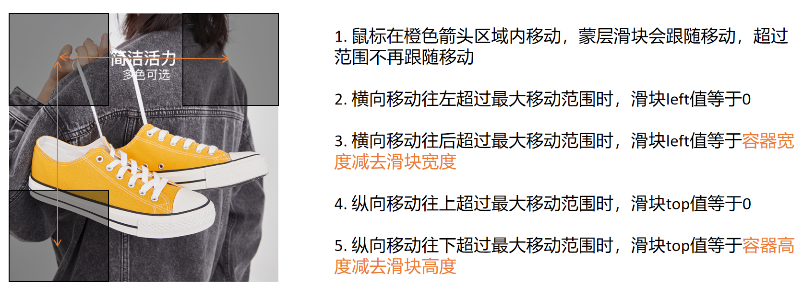

2. 有效移动范围内的换算关系

   说明❓：

   left = 滑块中心点距离左侧距离 - 蒙层滑块宽度一半

   top = 滑块中心点距离顶部距离 - 蒙层滑块宽度一半

   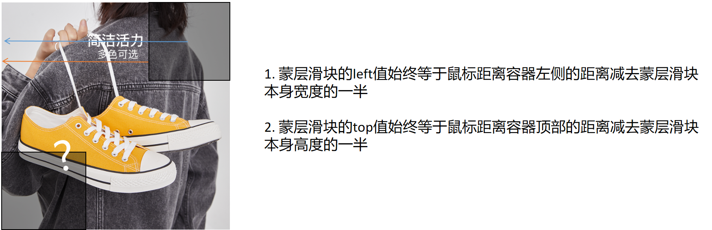


控制蒙层容器横向和纵向移动距离

```js
 setup () {
    const target = ref(null)
    // elementX 鼠标基于容器左上角X轴偏移
    // elementY 鼠标基于容器左上角Y轴偏移
    // isOutside 鼠标是否在模板容器外
    const { elementX, elementY, isOutside } = useMouseInElement(target)
    // 滑块位置数据
    const left = ref(0) // 滑块距离左侧的距离
    const top = ref(0) // 滑块距离顶部的距离
    watch([elementX, elementY, isOutside], () => {
      // console.log(elementX, elementY, isOutside)
      // 横向X
      if (elementX.value < 100) {
        // 左侧边界
        left.value = 0
      } else if (elementX.value > 300) {
        // 右侧边界
        left.value = 200
      } else {
        left.value = elementX.value - 100
      }
      // 纵向Y
      if (elementY.value < 100) {
        // 上侧边界
        top.value = 0
      } else if (elementY.value > 300) {
        // 下侧边界
        top.value = 200
      } else {
        top.value = elementY.value - 100
      }
    })

    return { currIndex, target, top, left }
  }
```

```html
<!-- 蒙层滑块容器 -->
<div class="layer" :style="{ left: left + 'px', top: top + 'px' }"></div>
```


#### 4. 控制大图背景移动

> 思路❓：
>
> 1. 大图和小图比例为2:1 
> 2.  所以计算公式应该为小图的定位距离乘以2，**大图背景的移动始终是跟着滑块的移动走的**

```diff
  setup () {
    const curIndex = ref(0)
    const target = ref(null)

    const { elementX, elementY, isOutside } = useMouseInElement(target)
    // 滑块位置数据
    const left = ref(0) // 滑块距离左侧的距离
    const top = ref(0) // 滑块距离顶部的距离
-    // 大图放大比例数据
+    const bg = reactive({ x: 0, y: 0 })
    watch([elementX, elementY, isOutside], () => {
      // console.log(elementX, elementY, isOutside)
      // 横向X
      if (elementX.value < 100) {
        // 左侧边界
        left.value = 0
      } else if (elementX.value > 300) {
        // 右侧边界
        left.value = 200
      } else {
        left.value = elementX.value - 100
      }
      // 纵向Y
      if (elementY.value < 100) {
        // 上侧边界
        top.value = 0
      } else if (elementY.value > 300) {
        // 下侧边界
        top.value = 200
      } else {
        top.value = elementY.value - 100
      }
-      // 移动放大大图
+      bg.x = -left.value * 2
+      bg.y = -top.value * 2
    })
    return { target, curIndex, left, top,
+    bg }
  }
```

```diff
<div
  class="large"
  :style="[{
    backgroundImage: `url(${imageList[curIndex]})`,
+    backgroundPositionX: `${bg.x}px`,
+    backgroundPositionY: `${bg.y}px`
  }]"

></div>
```


#### 5. 控制蒙层和大图显隐

> 思路：只有鼠标在图片展示容器内时才显示蒙层和大图，否则不显示
>
> 核心逻辑❓：通过判断`isOutside` 的值来判断

```diff
<!-- 大图控制  -->
<div
  class="large"
+  v-show="!isOutside"
></div>

<!-- 蒙层容器 -->
<div
    class="layer"
+    v-show="!isOutside"
></div>

setup () {
    // elementX 鼠标基于容器左上角X轴偏移
    // elementY 鼠标基于容器左上角Y轴偏移
    // isOutside 鼠标是否在模板容器外
    const { elementX, elementY, isOutside } = useMouseInElement(target)
+    return { isOutside }
 }
```


### 基础信息展示

`任务目标:`  实现两块基础内容的信息展示

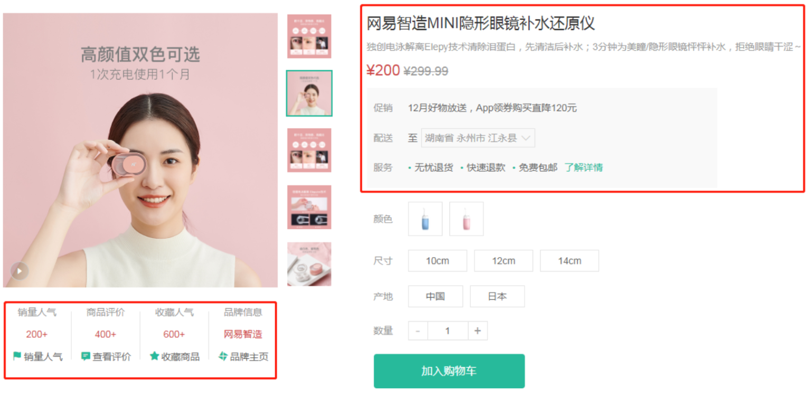

**实现步骤**

1. 定义左侧内容组件
2. 定义右侧内容组件
3. 在详情组件中使用这俩个组件
4. 使用真实数据渲染右侧区域内容

#### 创建组件

**代码落地**

1）定义左侧区域组件

 `src/views/goods/components/goods-sales.vue`

```vue
<template>
  <ul class="goods-sales">
    <li>
      <p>销量人气</p>
      <p>200+</p>
      <p><i class="iconfont icon-task-filling"></i>销量人气</p>
    </li>
    <li>
      <p>商品评价</p>
      <p>400+</p>
      <p><i class="iconfont icon-comment-filling"></i>查看评价</p>
    </li>
    <li>
      <p>收藏人气</p>
      <p>600+</p>
      <p><i class="iconfont icon-favorite-filling"></i>收藏商品</p>
    </li>
    <li>
      <p>品牌信息</p>
      <p>苏宁电器</p>
      <p><i class="iconfont icon-dynamic-filling"></i>品牌主页</p>
    </li>
  </ul>
</template>

<script>
export default {
  name: 'GoodsSales'
}
</script>

<style scoped lang='less'>
.goods-sales {
  display: flex;
  width: 400px;
  align-items: center;
  text-align: center;
  height: 140px;
  li {
    flex: 1;
    position: relative;
    ~ li::after {
      position: absolute;
      top: 10px;
      left: 0;
      height: 60px;
      border-left: 1px solid #e4e4e4;
      content: "";
    }
    p {
      &:first-child {
        color: #999;
      }
      &:nth-child(2) {
        color: @priceColor;
        margin-top: 10px;
      }
      &:last-child {
        color: #666;
        margin-top: 10px;
        i {
          color: @xtxColor;
          font-size: 14px;
          margin-right: 2px;
        }
        &:hover {
          color: @xtxColor;
          cursor: pointer;
        }
      }
    }
  }
}
</style>
```

2）定义右侧区域组件

 `src/views/goods/components/goods-name.vue`

```vue
<template>
  <p class="g-name">2件装 粉釉花瓣心意点缀 点心盘*2 碟子盘子</p>
  <p class="g-desc">花瓣造型干净简约 多功能使用堆叠方便</p>
  <p class="g-price">
    <span>108.00</span>
    <span>199.00</span>
  </p>
  <div class="g-service">
    <dl>
      <dt>促销</dt>
      <dd>12月好物放送，App领券购买直降120元</dd>
    </dl>
    <dl>
      <dt>配送</dt>
      <dd>至 </dd>
      <dd>
         <XtxCity />
      </dd>
    </dl>
    <dl>
      <dt>服务</dt>
      <dd>
        <span>无忧退货</span>
        <span>快速退款</span>
        <span>免费包邮</span>
        <a href="javascript:;">了解详情</a>
      </dd>
    </dl>
  </div>
</template>

<script>
export default {
  name: 'GoodName',
}
</script>

<style lang="less" scoped>
.g-name {
  font-size: 22px
}
.g-desc {
  color: #999;
  margin-top: 10px;
}
.g-price {
  margin-top: 10px;
  span {
    &::before {
      content: "¥";
      font-size: 14px;
    }
    &:first-child {
      color: @priceColor;
      margin-right: 10px;
      font-size: 22px;
    }
    &:last-child {
      color: #999;
      text-decoration: line-through;
      font-size: 16px;
    }
  }
}
.g-service {
  background: #f5f5f5;
  width: 500px;
  padding: 20px 10px 0 10px;
  margin-top: 10px;
  dl {
    padding-bottom: 20px;
    display: flex;
    align-items: center;
    dt {
      width: 50px;
      color: #999;
    }
    dd {
      color: #666;
      &:last-child {
        span {
          margin-right: 10px;
          &::before {
            content: "•";
            color: @xtxColor;
            margin-right: 2px;
          }
        }
        a {
          color: @xtxColor;
        }
      }
    }
  }
}
</style>
```

#### 获取城市级联数据并渲染

 `src/views/goods/components/goods-name.vue`

```diff
    <dl>
      <dt>配送</dt>
      <dd>至 </dd>
      <dd>
         <XtxCity
+         :data="cityList" />
      </dd>
    </dl>
    <dl>
```

```js
setup () {
    const cityList = ref([])
    onMounted(async () => {
      console.log(store)
      // 获取城市列表数据
      const { data } = await axios({ url: 'https://yjy-oss-files.oss-cn-zhangjiakou.aliyuncs.com/tuxian/area.json' })
      cityList.value = data
    })
    return { cityList }
  }
```

#### 引入父组件展示

3）详情组件里使用组件 

 `src/views/Goods/index.vue`

```diff
<template>
    <!-- 商品信息 -->
    <div class="goods-info">
        <div class="media">
          <GoodsImage :imageList="goods.mainPictures" />
          <!-- 销量组件 -->
+          <GoodsSales />
        </div>
        <div class="spec">
          <!-- 信息组件 -->
+          <GoodsName/>
        </div>
    </div>
</template>

<script>
+  import GoodsSales from './components/goods-sales'
+  import GoodsName from './components/goods-name'
  export default {
      components: { GoodsImage,
+      GoodsSales, GoodsName }
  }
</script>
```

#### 传入详情数据渲染

4）渲染区块数据

`src/views/goods/index.vue`

* 传入商品详情数据

```diff
<div class="goods-info">
<div class="media">
  <GoodsImage :imageList="goods.mainPictures" />
  <!-- 销量组件 -->
  <GoodsSale
+  :goods="goods"/>
</div>
<div class="spec">
  <!-- 信息组件 -->
  <GoodsName
+  :goods="goods"/>
</div>
</div>
```

`src/views/goods/components/goods-name.vue`

* 商品基本信息

```html
<p class="g-name">{{ goods.name }}</p>
<p class="g-desc">{{ goods.desc }}</p>
<p class="g-price">
<span>{{ goods.price }}</span>
<span>{{ goods.oldPrice }}</span>
</p>

<script>
export default {
  name: 'GoodName',
  props: {
    goods: {
      type: Object,
      default () {
        return {}
      }
    }
  }
}
</script>
```

`src/views/goods/components/goods-sale.vue`

* 商品销售情况

```html
<template>
  <ul class="goods-sales">
    <li>
      <p>销量人气</p>
      <p>{{goods.salesCount}}</p>
      <p><i class="iconfont icon-task-filling"></i>销量人气</p>
    </li>
    <li>
      <p>商品评价</p>
      <p>{{goods.commentCount}}</p>
      <p><i class="iconfont icon-comment-filling"></i>查看评价</p>
    </li>
    <li>
      <p>收藏人气</p>
      <p>{{goods.collectCount}}</p>
      <p><i class="iconfont icon-favorite-filling"></i>收藏商品</p>
    </li>
    <li>
      <p>品牌信息</p>
      <p>{{goods.brand.name}}</p>
      <p><i class="iconfont icon-dynamic-filling"></i>品牌主页</p>
    </li>
  </ul>
</template>
<script>
export default {
  name: 'GoodName',
  props: {
    goods: {
      type: Object,
      default () {
        return {}
      }
    }
  }
}
</script>
```

## 商品规格选择

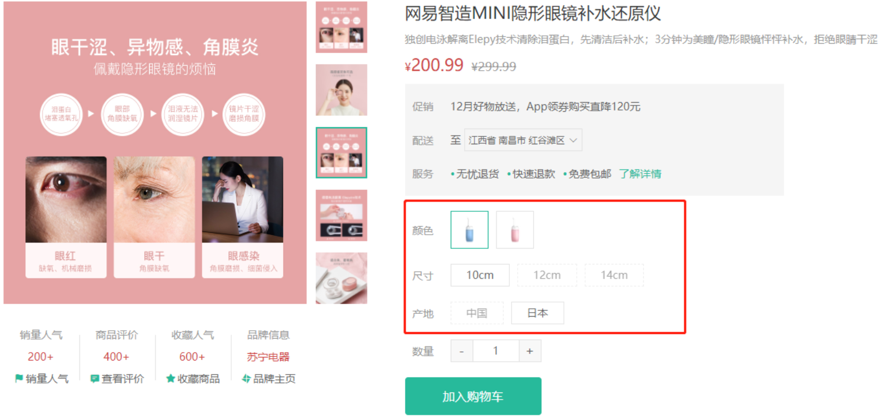

### 理解基础sku概念

**1. 什么是spu属性和sku属性**

spu （商品聚合信息的最小单位）和 **sku**（商品的不可再分的最小单元） 都是属性值的集合，举个栗子 >>

一部 iphone6S，它身上有很多的属性和值. 比如 :

- 毛重：420.00 g
- 容量：16G，64G， 128G
- 颜色： 银，白， 玫瑰金

spu 属性（不会影响到库存和价格的属性, 又叫**关键属性**）

- 毛重： 420.00 g


sku 属性（会影响到库存和价格的属性, 又叫**销售属性**）

- 容量：16G，64G， 128G
- 颜色： 银，白， 玫瑰金

**2. 什么是有效的sku**

每一个商品都是有可选的规格的，只有每一个可选规格都进行选中之后产出的数据才是有效的sku，才可以加入购物车，才可以落入数据库

### sku组件认识

**props**

| 属性名 | 说明                                    | 默认值                  | 作用                     |
| ------ | --------------------------------------- | ----------------------- | ------------------------ |
| goods  | 商品信息对象必须包含specs数组和skus数组 | { specs: []，skus: [] } | 为渲染和交互提供数据支持 |
| skuId  | sku唯一标识id                           | 空字符串                | 回显默认规格数据时使用   |

**事件**

| 名称   | 说明                                                         |
| ------ | ------------------------------------------------------------ |
| change | 产出当前选择的商品规格信息，如果是完整的sku，产出完整的对象信息，如果不完整，则产出空对象 |

### 详情业务使用

> 传入商品信息数据，并绑定自定义事件change，测试组件是否运行正常（后续购物车业务会使用）

```html
<!-- 商品信息区 -->
<div class="spec">
  <!-- 信息组件 -->
  <GoodsName :goods="goods" />
  <!-- 新增 sku -->
  <XtxSku :goods="goods" @change="getSku" />
</div>

<script>
  export default {
     setup(){
        // 获取sku数据
        const getSku = (sku) => {
          console.log('sku:', sku)
          // 修改商品的现价原价库存信息
          if (sku.skuId) {
            goods.value.price = sku.price
            goods.value.oldPrice = sku.oldPrice
            goods.value.inventory = sku.inventory
          }
        }
     }
  }
</script>
```

## 数量组件实现

`任务目标:`  实现商品的数量操作组件的封装


**实现步骤**

1. 搭建组件静态结构并实现增减逻辑
2. 通过props传入控制最大和最小值
3. 实现组件的v-model双向绑定 （难点）

**代码落地**

### 基本组件结构和功能实现

#### 基本结构和注册

1）基础布局代码

`src/components/Numbox/index.vue`

```html
<template>
  <div class="xtx-numbox">
    <div class="label">数量</div>
    <div class="numbox">
      <a href="javascript:;">-</a>
      <input type="text" readonly value="1">
      <a href="javascript:;">+</a>
    </div>
  </div>
</template>
<script>
export default {
  name: 'XtxNumbox'
}
</script>
<style scoped lang="less">
.xtx-numbox {
  display: flex;
  align-items: center;
  .label {
    width: 60px;
    color: #999;
    padding-left: 10px;
  }
  .numbox {
    width: 120px;
    height: 30px;
    border: 1px solid #e4e4e4;
    display: flex;
    > a {
      width: 29px;
      line-height: 28px;
      text-align: center;
      background: #f8f8f8;
      font-size: 16px;
      color: #666;
      &:first-of-type {
        border-right:1px solid #e4e4e4;
      }
      &:last-of-type {
        border-left:1px solid #e4e4e4;
      }
    }
    > input {
      width: 60px;
      padding: 0 5px;
      text-align: center;
      color: #666;
    }
  }
}
</style>
```

#### 基本功能实现

2）数量增减逻辑实现

```jsx
<a href="javascript:;" @click="decrease">-</a>
<input type="text" readonly :value="curNum" />
<a href="javascript:;" @click="add">+</a>

setup(){
    const curNum = ref(1)
    function add () {
      curNum.value++
    }
    function decrease () {
      curNum.value--
    }  
    return { add, decrease }
}
```

3）控制最大最小数量

```jsx
props: {
    min: {
      type: Number,
      default: 1
    },
    max: {
      type: Number,
      default: 10
    }
},
setup(props){
    const curNum = ref(1)
    function add () {
      if (curNum.value === props.max) return
      curNum.value++
    }

    function decrease () {
      if (curNum.value === props.min)  return
      curNum.value--
    }
}
```

### 组件props数据的双向绑定

4）实现组件的v-model双向绑定

说明❓：自定义组件身上使用v-model指令，可以同步组件内部数据的变化到父组件

例如：XtxNumbox组件中num数量的变化，自动同步到父组件buyNum上

```vue
<XtxNumbox v-model="buyNum" />
```

#### **前置知识**

> vue2.x  组件身上写了  
>
> v-model = "name"（语法糖）   => :value + @input
>
> 1. 给子组件身上绑定了一个名称为`value`的自定义属性    `<Foo :value="name"/>`
> 2. 给子组件身上绑定了一个 名称为 `input`的自定义事件   `<Foo  @input="callback"/>`
> 3. 在绑定的事件回调callback函数中完成了自动将自定义事件触发时传递的实参赋值给绑定的name属性
>
> ​        
>
> vue3.0中的v-model语法有所变化，如果我们给一个组件书写了v-model之后，相当于完成了俩件事情
>
>  v-model = "name"（语法糖）   => :modelValue + @update:modelValue
>
> 1. 给子组件传递了一个名称为`modelValue` 的prop
> 2. 给子组件绑定了一个名称为`update:modelValue` 的自定义事件
> 3. 在绑定的事件回调callback函数中完成了自动将自定义事件触发时传递的实参赋值给绑定的name属性
>
> 注意：vue3.x去除.sync语法 全都使用v-model即可

#### **实现步骤**

1. 每次修改number之后，通过调用`emit`方法触发自定义事件把值同步给父组件 （子 -> 父）
2. 通过watch监听传入的`modelValue`的变化 ，把modelValue最新的值赋值给number （ 父 -> 子）

**代码落地**

```diff
<template>
  <div class="xtx-numbox">
    <div class="label">数量</div>
    <div class="numbox">
      <a href="javascript:;" @click="sub">-</a>
      <input type="text" readonly :value="num" />
      <a href="javascript:;" @click="add">+</a>
    </div>
  </div>
</template>
<script>
import { ref, watch } from 'vue'
export default {
  name: 'XtxNumbox',
+  emits: ['update:modelValue'],
  props: {
-    // Vue2 使用value | Vue3使用modelValue
    // value: Number,
+    modelValue: Number,
    min: {
      type: Number,
      default: 1
    },
    max: {
      type: Number,
      default: 10
    }
  },
  setup (props, { emit }) {
    const num = ref(1)
    //  加
    const sub = () => {
      if (num.value === props.min) return
      num.value--
-    // 1. 同步数据num到modelValue
+      emit('update:modelValue', num.value)
    }
    //  减
    const add = () => {
      if (num.value === props.max) return
      num.value++
+      emit('update:modelValue', num.value)
    }
-    // 2. 同步数据modelValue到num
+    watch(() => props.modelValue, (newVal) => {
+      num.value = newVal
+    }, { immediate: true })

    return { num, add, sub }
  }
}
</script>
```

**注意：**

1. 给一个组件身上绑定的任何属性都不会丢失，都会传递下去，如果我们使用props接受收被存入到props属性对象中，如果不使用props接收，会被存入attrs属性对象里
2. 组件一般都有俩种状态，一个是自己维护的响应式数据 （data）一个是由父组件传下来的数据，v-model语法糖它只能保证父组件中的数据可以同步到props这一层，如果你想让父组件中数据和自己维护的数据保持同步的话，需要自行监听props中的数据，在回调中完成数据同步

## 第五天重点总结


