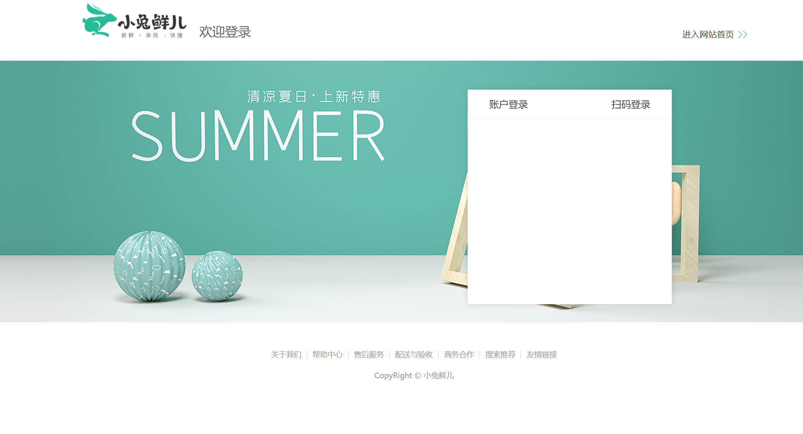
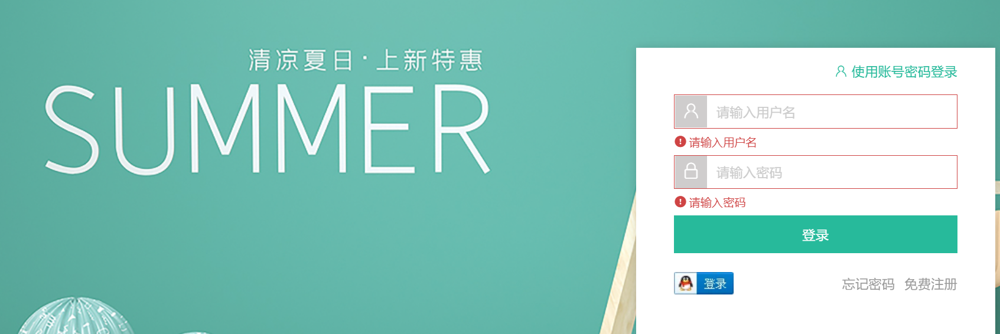
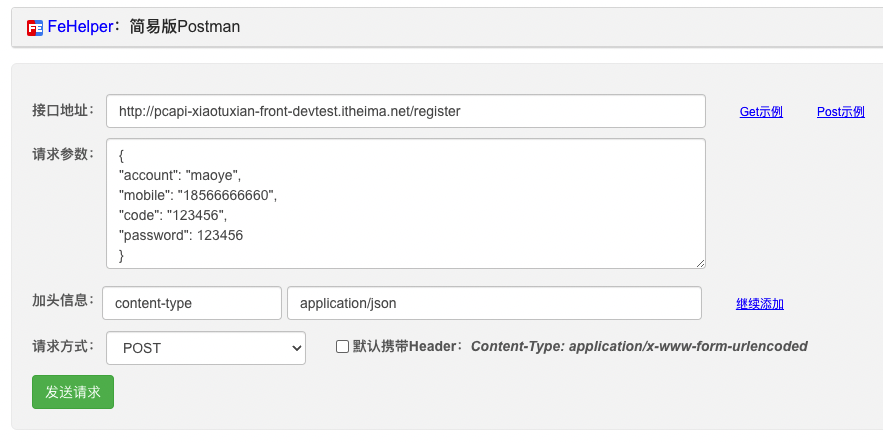

##   路由与组件

`任务目标:`  实现登录组件和路由绑定

1）新建组件

`src/views/login/index.vue`

```vue
<template>
  <div class="page-login">
    Login
  </div>
</template>
<script>
export default {
  name: 'PageLogin'
}
</script>
<style scoped lang="less"></style>
```

2）绑定路由（一级路由）

`src/router/index.js` 

```js
const Login = () => import('@/views/login/index')
const routes = [
  { path: '/login', component: Login }
]
```

3）跳转链接：`src/Layout/components/topnav.vue`

```html
<li><RouterLink to="/login">请先登录</RouterLink></li>
```

## 基础布局

`任务目标:`  实现登录页面的整体大结构布局



### 组件拆分

**结构分析**

> 整个登录页可以分成以下三个结构，每个结构都可以抽离成一个单独的组件维护，然后在我们的登录模块入口文件中引入渲染，其中表单部分比较复杂，我们先把头部和底部抽离出来

- 登录头部区域
- 登录主体表单区域
- 登录底部区域

1）新建头部组件 

`src/views/Login/components/login-header.vue`

```vue
<template>
  <header class="login-header">
    <div class="container">
      <h1 class="logo"><RouterLink to="/">小兔鲜</RouterLink></h1>
      <h3 class="sub"><slot /></h3>
      <RouterLink class="entry" to="/">
        进入网站首页
        <i class="iconfont icon-angle-right"></i>
        <i class="iconfont icon-angle-right"></i>
      </RouterLink>
    </div>
  </header>
</template>

<script>
export default {
  name: 'LoginHeader'
}
</script>

<style scoped lang='less'>
.login-header {
  background: #fff;
  border-bottom: 1px solid #e4e4e4;
  .container {
    display: flex;
    align-items: flex-end;
    justify-content: space-between;
  }
  .logo {
    width: 200px;
    a {
      display: block;
      height: 132px;
      width: 100%;
      text-indent: -9999px;
      background: url(../../../assets/images/logo.png) no-repeat center 18px / contain;
    }
  }
  .sub {
    flex: 1;
    font-size: 24px;
    font-weight: normal;
    margin-bottom: 38px;
    margin-left: 20px;
    color: #666;
  }
  .entry {
    width: 120px;
    margin-bottom: 38px;
    font-size: 16px;
    i {
      font-size: 14px;
      color: @xtxColor;
      letter-spacing: -5px;
    }
  }
}
</style>
```

2）新建底部组件 

`src/views/Login/components/login-footer.vue`

```vue
<template>
  <footer class="login-footer">
    <div class='container'>
      <p>
        <a href="javascript:;">关于我们</a>
        <a href="javascript:;">帮助中心</a>
        <a href="javascript:;">售后服务</a>
        <a href="javascript:;">配送与验收</a>
        <a href="javascript:;">商务合作</a>
        <a href="javascript:;">搜索推荐</a>
        <a href="javascript:;">友情链接</a>
      </p>
      <p>CopyRight &copy; 小兔鲜儿</p>
    </div>
  </footer>
</template>

<script>
export default {
  name: 'LoginFooter'
}
</script>

<style scoped lang='less'>
.login-footer {
  padding: 30px 0 50px;
  background: #fff;
  p {
    text-align: center;
    color: #999;
    padding-top: 20px;
    a {
      line-height: 1;
      padding:0 10px;
      color: #999;
      display: inline-block;
      ~ a {
        border-left: 1px solid #ccc;
      }
    }
  }
}
</style>
```

3）新建表单组件

`src/views/Login/component/login-form.vue`

```html
<template>
  <div class="account-box">
    <div class="form">
      <div class="form-item">
        <div class="input">
          <i class="iconfont icon-user"></i>
          <input type="text" placeholder="请输入用户名或手机号" />
        </div>
        <!-- 表单验证错误信息提示 -->
        <!-- <div class="error"><i class="iconfont icon-warning" />请输入手机号</div> -->
      </div>
      <div class="form-item">
        <div class="input">
          <i class="iconfont icon-lock"></i>
          <input type="password" placeholder="请输入密码" />
        </div>
      </div>
      <div class="form-item">
        <div class="agree">
          <XtxCheckBox/>
          <span>我已同意</span>
          <a href="javascript:;">《隐私条款》</a>
          <span>和</span>
          <a href="javascript:;">《服务条款》</a>
        </div>
      </div>
      <a href="javascript:;" class="btn">登录</a>
    </div>
    <div class="action">
      
      <div class="url">
        <a href="javascript:;">忘记密码</a>
        <a href="javascript:;">免费注册</a>
      </div>
    </div>
  </div>
</template>

<style lang="less" scoped>
// 账号容器
.account-box {
  .toggle {
    padding: 15px 40px;
    text-align: right;
    a {
      color: @xtxColor;
      i {
        font-size: 14px;
      }
    }
  }
  .form {
    padding: 0 20px;
    &-item {
      margin-bottom: 28px;
      .input {
        position: relative;
        height: 36px;
        > i {
          width: 34px;
          height: 34px;
          background: #cfcdcd;
          color: #fff;
          position: absolute;
          left: 1px;
          top: 1px;
          text-align: center;
          line-height: 34px;
          font-size: 18px;
        }
        input {
          padding-left: 44px;
          border: 1px solid #cfcdcd;
          height: 36px;
          line-height: 36px;
          width: 100%;
          &.error {
            border-color: @priceColor;
          }
          &.active,
          &:focus {
            border-color: @xtxColor;
          }
        }
        .code {
          position: absolute;
          right: 1px;
          top: 1px;
          text-align: center;
          line-height: 34px;
          font-size: 14px;
          background: #f5f5f5;
          color: #666;
          width: 90px;
          height: 34px;
          cursor: pointer;
        }
      }
      > .error {
        position: absolute;
        font-size: 12px;
        line-height: 28px;
        color: @priceColor;
        i {
          font-size: 14px;
          margin-right: 2px;
        }
      }
    }
    .agree {
      a {
        color: #069;
      }
    }
    .btn {
      display: block;
      width: 100%;
      height: 40px;
      color: #fff;
      text-align: center;
      line-height: 40px;
      background: @xtxColor;
      &.disabled {
        background: #cfcdcd;
      }
    }
  }
  .action {
    padding: 20px 40px;
    display: flex;
    justify-content: space-between;
    align-items: center;
    .url {
      a {
        color: #999;
        margin-left: 10px;
      }
    }
  }
}
</style>
```

### 导入使用

4）模块入口组件 
`src/views/Login/index.vue`

> 将头部组件，表单组件和底部组件引入并使用

```vue
<template>
  <div class="page-login">
    <LoginHeader />
    <!-- 主体登录区域 -->
    <section class="login-section">
      <div class="wrapper">
        <nav>
          <a href="javascript:;">账户登录</a>
        </nav>
        <LoginForm/>
      </div>
    </section>
    <LoginFooter />
  </div>
</template>
<script>
import LoginHeader from './components/login-header'
import LoginFooter from './components/login-footer'
import LoginForm from './components/login-form'
export default {
  name: 'PageLogin',
  components: {
    LoginHeader,
    LoginFooter,
    LoginForm
  }
}
</script>
<style scoped lang='less'>
.login-section {
  background: url(../../assets/images/login-bg.png) no-repeat center / cover;
  height: 488px;
  position: relative;
  .wrapper {
    width: 380px;
    background: #fff;
    position: absolute;
    left: 50%;
    top: 54px;
    transform: translate3d(100px,0,0);
    box-shadow: 0 0 10px rgba(0,0,0,.15);
    nav {
      font-size:14px;
      height: 55px;
      margin-bottom: 20px;
      border-bottom: 1px solid #f5f5f5;
      display: flex;
      padding: 0 40px;
      text-align: right;
      align-items: center;
      a {
        flex: 1;
        line-height: 1;
        display: inline-block;
        font-size: 18px;
        position: relative;
        text-align: center;
      }
    }
  }
}
</style>
```


## 表单校验实现

`任务目标:`  使用`vee-validate`插件进行表单校验



### 安装插件和准备组件校验规则

1）安装校验插件`vee-validate`

```bash
npm i vee-validate@4.5.7
```

文档：https://vee-validate.logaretm.com/v4/guide/components/validation#form-level-validation 支持vue3.0

2）导入校验组件并注册 `src/views/Login/components/login-form.vue`

```js
import { Form, Field } from 'vee-validate'

components: {
  Form,
  Field
},
```

3）定义校验规则  `src/utils/vee-validate-schema.js` 

> 一般应用的表单校验可能多个地方都需要使用，所以我们有必要把所有的规则集中管理起来

```js
export default {
  // 校验account
  account (value) {
    if (!value) return '请输入用户名'
    return true
  },
  password (value) {
    if (!value) return '请输入密码'
    if (!/^\w{6,24}$/.test(value)) return '密码是6-24个字符'
    return true
  },
  isAgree (value) {
    if (!value) return '请勾选同意用户协议'
    return true
  }
}
```

### 定义表单和校验规则数据并使用

4）使用`Form`组件配置校验规则和错误对象

>validation-schema :  配置校验规则
>
>v-slot：导出错误对象=>错误提示信息

说明❓：使用Form组件元素替换类名为form的div元素

```diff
<Form
  class="form"
+  :validation-schema="mySchema"
+  v-slot="{ errors }"
  autocomplete="off"
>
 <!-- 表单元素 -->
</Form>
```

```html
<script>
  import schema from '@/utils/vee-validate-schema'
  setup () {
    // 表单对象数据
    const form = reactive({
      account: null, // 账号
      password: null // 密码
    })
    // 校验规则对象
    const mySchema = {
      // 对应表单项属性的校验函数
      account: schema.account,
      password: schema.password
    }
    return { form, mySchema }
 } 
</script>
```

### 表单项应用数据和校验错误提示

5）使用 `Field` 组件，添加表单项目校验

> 步骤说明：
>
> 1. 把input改成 `Field` 组件，默认解析成input
>
> 2. `Field` 添加name属性，作用是指定使用schema中哪个校验规则
> 3. `Field`添加v-model，作用是提供表单数据的双向绑定
> 4. 发生表单校验错误，显示错误类名`error`，提示红色边框并显示`errors`对象中的错误提示信息

校验账号

```diff
<div class="form-item">
  <div class="input">
    <i class="iconfont icon-user"></i>
+    <Field
+      v-model="form.account"
+      name="account"
      type="text"
      placeholder="请输入用户名"
+     :class="{ error: errors.account }"
+    />
    <!-- <input type="text" placeholder="请输入用户名" /> -->
  </div>
+  <div class="error" v-if="errors.account">
+    <i class="iconfont icon-warning" />{{ errors.account }}
+  </div>
</div>
```

校验密码

```diff
<div class="form-item">
  <div class="input">
    <i class="iconfont icon-lock"></i>
+    <Field
+      :class="{ error: errors.password }"
+      v-model="form.password"
+      name="password"
      type="password"
      placeholder="请输入密码"
    />
    <!-- <input type="password" placeholder="请输入密码" /> -->
  </div>
+  <div class="error" v-if="errors.password">
+    <i class="iconfont icon-warning" />{{ errors.password }}
+  </div>
</div>
```

### 表单提交整体校验

6）整体表单校验

> 实现步骤：
>
> 1. 通过ref获得表单组件对象
>
> 2. 执行组件对象身上的validate方法 （**执行完毕返回promise对象**）

```jsx
<a @click="submit" href="javascript:;" class="btn">登 录</a>

setup(){
    async submit () {
      // valid 返回true（通过校验）/false
      const valid = await target.value.validate()
      console.log(valid)
    }
}
```

## 协议框单独校验

`任务目标:`  使用`vee-validate`校验checkbox框

> 使用Field来渲染一个自定义的组件 而不是浏览器支持的原生标签时，需要我们添加as属性来渲染自定义组件
>
> `<Field as="XtxCheckbox"/>`

1）使用as渲染自定义全局组件

```diff
<div class="form-item">
  <div class="agree">
+    <Field
+      as="XtxCheckbox"
+      name="isAgree"
+      v-model="form.isAgree"
+    />
    <span>我已同意</span>
    <a href="javascript:;">《隐私条款》</a>
    <span>和</span>
    <a href="javascript:;">《服务条款》</a>
  </div>
-  <!-- 当错误发生时显示错误提示语 -->
+  <div class="error" v-if="errors.isAgree">
+    <i class="iconfont icon-warning" />
+    {{ errors.isAgree }}
+  </div>
</div>
```

2）补充表单数据和验证规则数据

```diff
// 表单绑定的数据
const form = reactive({
  account: null, // 账号
  password: null, // 密码
+  isAgree: false // 是否同意协议
})

// 声明当前表单需要的校验数据规则
const curSchema = {
  account: schema.account, // 账号
  password: schema.password, // 密码
+  isAgree: schema.isAgree // 是否同意协议
}
```


## 账户登录实现

`任务目标:`  实现账户名密码登录功能

### 定义接口

1）定义API 

`src/api/user.js`

```js
import request from '@/utils/request'

/**
 * 帐号登录
 * @param {String} account - 用户名  
 * @param {String} password - 密码
 * @returns Promise
 */

export const userAccountLogin = ({ account, password }) => {
  return request('/login', 'post', { account, password })
}
```

说明❓：登录测试账号：`xiaotuxian001 ` 密码：123456

### 使用vuex管理登录用户数据

2）定义修改用户数据的muation函数和action函数

`src/store/module/user.js`

```js
import { userAccountLogin } from '@/api/user'
// 用户状态
export default {
  namespaced: true,
  state: () => ({
    profile: {
      id: '',
      account: '',
      nickname: '',
      avatar: '',
      token: '',
      mobile: ''
    }
  }),
  mutations: {
    setUser (state, payload) {
      state.profile = payload
    },
    delUser (state) {
      state.profile = {}
    }
  },
  actions: {
    async asyncSetUser (ctx, useInfo) {
      const res = await userAccountLogin(useInfo)
      ctx.commit('setUser', res.result)
    }
  }
}
```

### 页面调用action登录

3）实现登录逻辑

说明：这里需要使用`Message`做消息提示

 `src/views/login/components/login-form.vue`

```js {20-25}
import { msg as Message } from 'rabbit-ui-core'
import { useStore } from 'vuex'
import { useRoute, useRouter } from 'vue-router'

setup(){
    const store = useStore()
    const router = useRouter()
       
    // 提交登录
    const fm = ref(null)
    const login = async () => {
      const fg = await fm.value.validate()
      if (fg.valid) {
        store.dispatch('user/asyncSetUser', form).then(() => {
          // 1.提示用户登录成功
          Message({ type: 'success', text: '登录成功' })
          // 2.跳转到首页
          router.push('/')
        })
      }
    }
}
```

### 扩展-快速注册测试账号

> ⚠️注册使用自己手机号

步骤：

1. 首页执行（get）：http://pcapi-xiaotuxian-front-devtest.itheima.net/register/code?mobile=自己的手机号
2. 然后调用（post）：http://pcapi-xiaotuxian-front-devtest.itheima.net/register注册

```js
{
"account": "自己的用户名",
"mobile": "自己的手机号",
"code": "123456",
"password": 123456
}
```

注意： content-type=application/json



## 退出登录实现

`任务目标:`  实现账户名密码退出登录功能

**实现步骤**

1. 清空用户数据 （本地和数据库）
2. 跳回到登录页 （401记录当前发生退出登录行为时完整地址 fullPath = path + 路径参数）

`src/views/Layout/components/topnav.vue`

```html
<template v-if="profile.token">
  <li>
    <a href="javascript:;"><i class="iconfont icon-user"></i>
      {{ profile.nickname||profile.account}}
    </a>
  </li>
  <li><a @click="logOut" href="javascript:;">退出登录</a></li>
</template>

<script>
import { useStore } from 'vuex'
import { useRouter } from 'vue-router'
export default {
  name: 'AppTopnav',
  setup () {
    const store = useStore()
    const router = useRouter()
    function loginOut () {
      // 退出登录的逻辑
      // 1. 清空用户数据  vuex
      store.commit('user/delUser')
      // 2. 跳转到登录页
      router.push({
        path: '/login'
      })
    }
    return {
      loginOut
    }
  }
}
</script>
```

注意⚠️：处理请求401情况下本地数据清除


## 第六天重点总结


