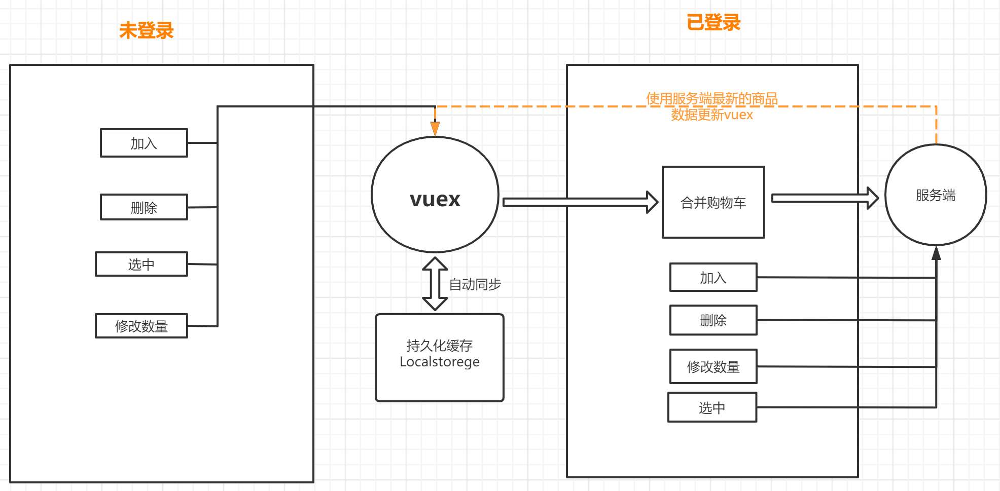
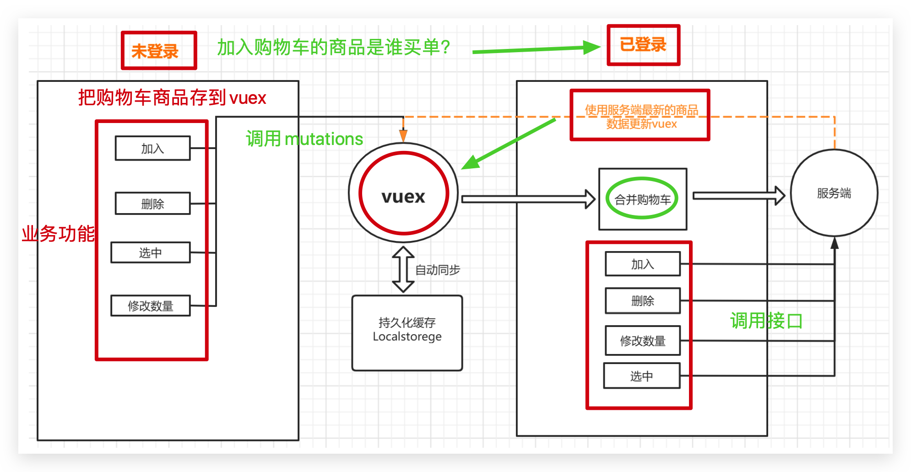
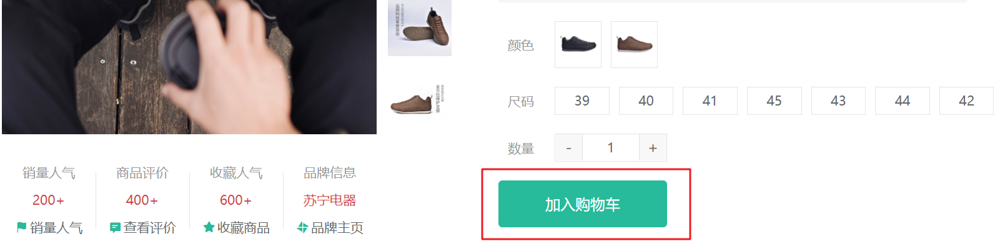
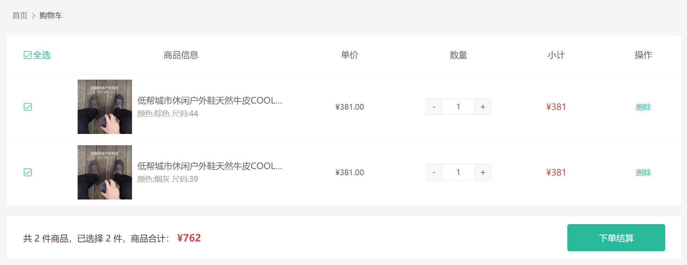
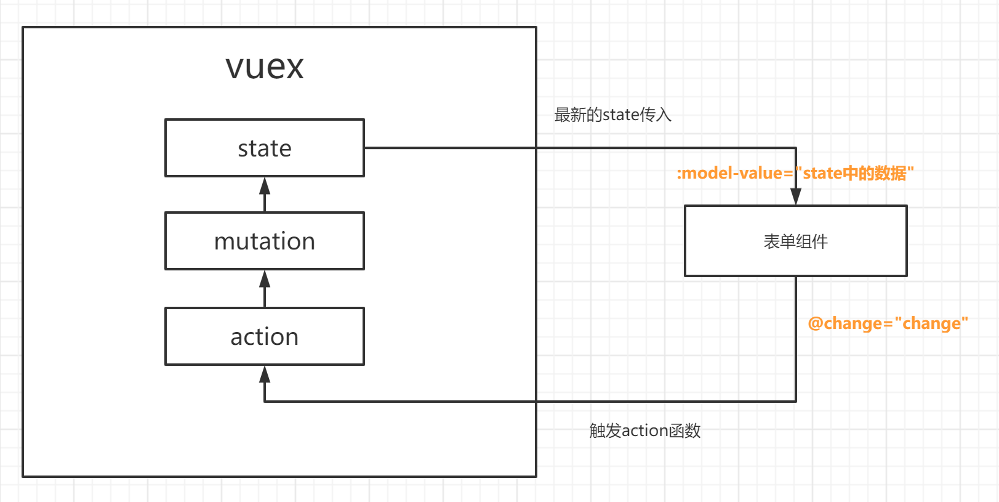

## 购物车功能分析





**思路流程**

1. 购物车的各种操作都会有俩种状态的区分，登录和未登录

2. 所有操作都封装到vuex中，组件只需要触发actions函数

3. 在actions中通过user信息去区分登录状态
   1. 未登录时，通过mutations修改vuex中的数据即可，vuex已经实现持久化，会同步保存在本地
   2. 已登录，通过API接口去服务端操作，响应成功会通过mutations修改vuex中的数据即可，它也会同步到本地
4. 不管何种状态下，actions函数始终返回一个promise对象，方便我们组件中能够判断操作是否成功，然后处理剩下的业务逻辑

**注意事项**

- 登录后，需要合并本地购物车到服务端

- 退出后，清空vuex数据也会同步清空本地数据

  

## 添加购物车功能实现



`本节目标:`  完成商品详情的添加购物车操作

**实现步骤**

1. 约定本地存储的信息内容 （定义state）
2. 编写mutaions添加购物车逻辑  （unshift新增 + 同项数量加一）
3. 编写actions进行添加操作（区分登录和未登录）
4. 在商品详情页实现添加逻辑触发action函数

**代码落地**

### vuex加入购物车准备

1）vuex逻辑编写

`store/modules/cart.js`

```js
// 购物车状态
export default {
  namespaced: true,
  state: () => {
    return {
      list: [] // 购物车列表
    }
  },
  mutations: {
    insertCart(state, goods){
      const sameIndex = state.list.findIndex(item => item.skuId === goods.skuId)
      // 逻辑: 有相同的给goods累加数量
      if (sameIndex >= 0) {
        state.list[sameIndex].count = state.list[sameIndex].count + goods.count
      } else {
        // 新增
        state.list.unshift(goods)
      }
    }
  },
  actions: {
    // 区分俩种状态
    asyncInsertCart (ctx, goods) {
      return new Promise((resolve, reject) => {
        if (ctx.rootState.user.profile.token) {
          // 已登录 TODO

        } else {
          // 未登录 把商品信息加入本地vuex中
          ctx.commit('insertCart', goods)
          resolve()
        }
      })
    }
  }
}
```

### 详情页调用action加入购物车

2）详情组件调用action函数加入购物车

**购物车商品规范参数（后台）**

| 参数字段名称 | 含义         | 是否必须 |
| ------------ | ------------ | -------- |
| id           | 商品id       | 是       |
| name         | 商品名称     | 是       |
| picture      | 商品图片     | 否       |
| skuId        | 有效skuId    | 是       |
| price        | 原价格       | 是       |
| nowPrice     | 现价格       | 是       |
| attrsText    | 规格文案     | 是       |
| stock        | 库存         | 是       |
| selected     | 是否选中     | 是       |
| isEffective  | 是否有效商品 | 是       |
| count        | 商品数量     | 是       |

`views/goods/index.vue`

说明：

1. 存储当前选择完规格生成的sku商品数据
2. 没有选择商品规格或库存不足不能添加
3. 调用action传入当前商品必要数据存到vuex
4. 成功后提示

```js
<!-- 库存 -->
    <XtxNumbox v-model="buyNum" :max="goods.inventory" />
<!-- 购买 -->
   <XtxButton
    @click="insertCart"
    style="margin-top: 20px"
    type="primary"
    >
    加入购物车
</XtxButton>


import { msg as Message } from 'rabbit-ui-core'
import { useStore } from 'vuex'  

// 获取sku数据
    const getSku = (sku) => {
      console.log('sku:', sku)
      // 修改商品的现价原价库存信息
      if (sku.skuId) {
        goods.value.price = sku.price
        goods.value.oldPrice = sku.oldPrice
        goods.value.inventory = sku.inventory
        // 存储sku信息
        currSku.value = sku
      } else {
        currSku.value = null
      }
    }

    // 加入购物车
    const currSku = ref(null)
    const store = useStore()
    const insertCart = () => {
      // 没有完整的sku数据 直接return
      if (!currSku.value) {
        return Message({ text: '请选择商品规格' })
      }
      // 库存为0
      if (currSku.value.inventory === 0) {
        return Message({ text: '库存不足' })
      }
      store.dispatch('cart/asyncInsertCart', {
        id: goods.value.id,
        name: goods.value.name,
        picture: goods.value.mainPictures[0],
        skuId: currSku.value.skuId,
        price: currSku.value.oldPrice,
        nowPrice: currSku.value.price,
        attrsText: currSku.value.specsText,
        stock: currSku.value.inventory,
        selected: true,
        isEffective: true,
        count: buyNum.value
      }).then(() => {
        Message({ type: 'success', text: '加入购物车成功' })
      })
    }
```


## 列表购物车 - 路由和组件

`本节目标:`  完成购物车组件基础布局和路由配置与跳转链接



### 准备页面模板

1）新建购物车页面组件

 `src/views/Cart/index.vue`

```vue
<template>
  <div class="xtx-cart-page">
    <div class="container">
      <XtxBread>
        <XtxBreadItem to="/">首页</XtxBreadItem>
        <XtxBreadItem>购物车</XtxBreadItem>
      </XtxBread>
      <div class="cart">
        <table>
          <thead>
            <tr>
              <!-- 全选 -->
              <th width="120"><XtxCheckBox>全选</XtxCheckBox></th>
              <th width="400">商品信息</th>
              <th width="220">单价</th>
              <th width="180">数量</th>
              <th width="180">小计</th>
              <th width="140">操作</th>
            </tr>
          </thead>
          <!-- 有效商品 -->
          <tbody>
            <tr v-for="i in 3" :key="i">
              <td><XtxCheckBox /></td>
              <td>
                <div class="goods">
                  <RouterLink to="/"></RouterLink>
                  <div>
                    <p class="name ellipsis">和手足干裂说拜拜 ingrams手足皲裂修复霜</p>
                    <!-- 选择规格组件 -->
                  </div>
                </div>
              </td>
              <td class="tc">
                <p>&yen;200.00</p>
                <p>比加入时降价 <span class="red">&yen;20.00</span></p>
              </td>
              <td class="tc">
                <XtxNumBox />
              </td>
              <td class="tc"><p class="f16 red">&yen;200.00</p></td>
              <td class="tc">
                <p><a class="green" href="javascript:;">删除</a></p>
              </td>
            </tr>
          </tbody>
        </table>
      </div>
      <!-- 操作栏 -->
      <div class="action">
        <div class="batch">
          共 7 件商品，已选择 2 件，商品合计：
          <span class="red">¥400</span>
        </div>
        <div class="total">
          <XtxButton type="primary">下单结算</XtxButton>
        </div>
      </div>
    </div>
  </div>
</template>
<script>
export default {
  name: 'XtxCartPage'
}
</script>
<style scoped lang="less">
.tc {
  text-align: center;
  .xtx-numbox {
    margin: 0 auto;
    width: 120px;
  }
}
.red {
  color: @priceColor;
}
.green {
  color: @xtxColor
}
.f16 {
  font-size: 16px;
}
.goods {
  display: flex;
  align-items: center;
  img {
    width: 100px;
    height: 100px;
  }
  > div {
    width: 280px;
    font-size: 16px;
    padding-left: 10px;
    .attr {
      font-size: 14px;
      color: #999;
    }
  }
}
.action {
  display: flex;
  background: #fff;
  margin-top: 20px;
  height: 80px;
  align-items: center;
  font-size: 16px;
  justify-content: space-between;
  padding: 0 30px;
  .xtx-checkbox {
    color: #999;
  }
  .batch {
    a {
      margin-left: 20px;
    }
  }
  .red {
    font-size: 18px;
    margin-right: 20px;
    font-weight: bold;
  }
}
.tit {
  color: #666;
  font-size: 16px;
  font-weight: normal;
  line-height: 50px;
}
.xtx-cart-page {
  .cart {
    background: #fff;
    color: #666;
    table {
      border-spacing: 0;
      border-collapse: collapse;
      line-height: 24px;
      th,td{
        padding: 10px;
        border-bottom: 1px solid #f5f5f5;
        &:first-child {
          text-align: left;
          padding-left: 30px;
          color: #999;
        }
      }
      th {
        font-size: 16px;
        font-weight: normal;
        line-height: 50px;
      }
    }
  }
}
</style>
```

### 配置路由和跳转

```diff
  {
    path: '/',
    component: Layout,
    children: [
      {
        path: '/',
        component: Home
      },
      // 一级分类详情页面
      {
        path: '/category/:id',
        component: TopCategory
      },
      {
        path: '/category/sub/:id',
        component: SubCategory
      },
      {
        path: '/goods/:id',
        component: Goods
      },
+      {
+        path: '/cart',
+        component: Cart
+      }
    ]
  },
```
`layout/components/header.vue`

```vue
<!-- 购物车图标 -->
<div class="cart">
  <router-link class="curr" to="/cart">
    <i class="iconfont icon-cart"></i><em>2</em>
  </router-link>
</div>
```

## 列表购物车 - 数据展示

`本节目标:`  实现本地状态下的，购物车商品列表展示功能

### 准备getters数据

1）准备数据 `src/store/modules/cart.js`

在`getters`中新增：

1. 有效商品列表=》无效商品（没库存或下架了）
2. 选中的购物车商品数据
3. 选中商品总价
4. 购物车中有效商品是否是全部选中状态

```js
// 计算有效商品列表 isEffective = true  filter
effectiveList (state) {
  return state.list.filter(item => item.isEffective === true)
},
// 已选中列表 selected = true
selectedList (state, getters) {
  return getters.effectiveList.filter(item => item.selected)
},
// 已选择列表总钱数  selectedList 中所有项的单价*数据进行叠加
allSelectedPrice (state, getters) {
  return getters.selectedList.reduce((a, c) => a + c.count * c.nowPrice, 0)
},
// 全选：有效列表中的seleted字段全为true 才为true
isAll (state, getters) {
  return getters.effectiveList.every(item => item.selected)
}
```

### 使用getters数据渲染

2）渲染列表页面

```html
<template>
  <div class="xtx-cart-page">
    <div class="container">
      <XtxBread>
        <XtxBreadItem to="/">首页</XtxBreadItem>
        <XtxBreadItem>购物车</XtxBreadItem>
      </XtxBread>
      <div class="cart">
        <table>
          <thead>
            <tr>
              <th width="120"><XtxCheckBox :model-value="$store.getters['cart/isAll']" @change="checkAll">全选</XtxCheckBox></th>
              <th width="400">商品信息</th>
              <th width="220">单价</th>
              <th width="180">数量</th>
              <th width="180">小计</th>
              <th width="140">操作</th>
            </tr>
          </thead>
          <!-- 有效商品 -->
          <tbody>
            <tr v-for="i in $store.getters['cart/effectiveList']" :key="i">
              <!-- 单选框 -->
              <!--
                有效果,但是不推荐 在严格模式下会报错 必须走mutation函数进行修改才可以
                难点：选择框最新的数据状态拿到 给它修改到vuex中对应的数据项上
                父组件中需要拿到子组件中的状态  子传父   自定义事件
               -->
              <td>
                <XtxCheckBox
                  :model-value="i.selected"
                  @change="(selected) => checkChange(i, selected)"
                />
              </td>
              <td>
                <div class="goods">
                  <RouterLink to="/"
                    ></RouterLink>
                  <div>
                    <p class="name ellipsis">{{ i.name }}</p>
                    <!-- 选择规格组件 -->
                  </div>
                </div>
              </td>
              <td class="tc">
                <p>&yen;{{ i.nowPrice }}</p>
                <p>
                  比加入时降价
                  <span class="red">&yen;{{ i.price - i.nowPrice }}</span>
                </p>
              </td>
              <td class="tc">
                <XtxNumbox
                  :model-value="i.count"
                  :is-label="false"
                  @change="(num) => numChange(i, num)"
                  />
              </td>
              <td class="tc">
                <p class="f16 red">
                  &yen;{{ (i.nowPrice * i.count).toFixed(2) }}
                </p>
              </td>
              <td class="tc">
                <p>
                  <a class="green" href="javascript:;" @click="delCart(i)"
                    >删除</a
                  >
                </p>
              </td>
            </tr>
          </tbody>
        </table>
      </div>
      <!-- 操作栏 -->
      <div class="action">
        <div class="batch">
          共 {{ $store.getters["cart/effectiveList"].length }} 件商品，已选择
          {{ $store.getters["cart/selectedList"].length }}件，商品合计：
          <span class="red"
            >¥{{ $store.getters["cart/allSelectedPrice"].toFixed(2) }}</span
          >
        </div>
        <div class="total">
          <XtxButton type="primary">下单结算</XtxButton>
        </div>
      </div>
    </div>
  </div>
</template>
```

## 列表购物车 - 单选操作

> 从单选开始，我们进入到一个vuex + 表单数据的交互功能实现，这里面有些小坑，我们先来看一下
>
> https://vuex.vuejs.org/zh/guide/forms.html#%E8%A1%A8%E5%8D%95%E5%A4%84%E7%90%86



`本节目标:`  实现本地状态下的商品单选功能

**思路分析**

1. 通过切换选择框组件获得当前的最新状态
2. 根据当前点击的单选框获得它所属的商品的skuId
3. 通过skuId在vuex中查找到对应的商品数据，然后把它的`selected属性`设置为选择框的最新状态

**代码落地**

1）获取到当前选择框的最新状态

说明`XtxCheckbox`组件新增子传父选中状态数据支持

> 因为需要查找对应的商品数据，除了把状态传下来还需要把当前的商品信息传下来

```jsx
<XtxCheckbox
  :modelValue="i.selected"
  @change="(selected) => checkChange(i, selected)"
/>

function checkChange (good, selected) {
  console.log(good, selected)
}
```


2）定义vuex中操作selected的mutation函数和action函数

```js
// mutation
singleCheck (state, { good, selected }) {
  const curItem = state.list.find(item => item.skuId === good.skuId)
  curItem.selected = selected
}

// action
singleCheck (ctx, { good, selected }) {
  return new Promise((resolve, reject) => {
    if (ctx.rootState.user.profile.token) {
      // 已登录 TODO

    } else {
      // 未登录 把商品信息加入本地vuex中
      ctx.commit('singleCheck', { good, selected })
      resolve()
    }
  })
}
```

3）在选择框操作时调用action函数

```diff
function checkChange (good, selected) {
  console.log(good, selected)
+  store.dispatch('cart/singleCheck', { good, selected })
}
```

## 列表购物车 - 全选操作

`本节目标:`  实现本地状态下的商品全选功能

**思路分析**

1. 通过切换全选选择框组件获得当前的最新状态
2. 遍历vuex中的商品列表，把每一项的selected属性都设置为最新状态

**代码落地**

1）vuex中准备全选功能的action函数和mutation函数

```js
// mutaion
allCheck (state, selected) {
  state.list.forEach(item => {
    item.selected = selected
  })
}
// action
allCheck (ctx, selected) {
  return new Promise((resolve, reject) => {
    if (ctx.rootState.user.profile.token) {
      // 已登录 TODO

    } else {
      // 未登录
      ctx.commit('allCheck', selected)
      resolve()
    }
  })
}
```

2）全选按钮切换时触发action函数

```jsx
<XtxCheckbox
  :model-value="$store.getters['cart/isCheckAll']"
  @change="checkAll"
  >全选</XtxCheckbox
>

function checkAll (selected) {
  store.dispatch('cart/allCheck', selected)
}
```

## 列表购物车 -  删除操作

`本节目标:`  实现本地状态下的商品删除功能

**思路分析**

1. 点击删除按钮记录当前点击的商品数据
2. 使用商品数据的skuId在vuex中找到对应项删除（splice）=》调用已有删除action逻辑

**代码落地**

> 删除按钮绑定事件触发删除action函数

```jsx
<td class="tc">
    <p><a class="green" href="javascript:;" @click="delCart(i)">删除</a></p>
</td>

function delCart (good) {
  store.dispatch('cart/deleteCart', good)
}
```

## 列表购物车 -  修改数量（作业）

`本节目标:`  实现本地状态下的商品数量修改功能

**思路分析**

1. 点击数量组件的加减按钮记录当前点击的商品数据
2. 使用点击的商品数据根据skuId在vuex中找到对应项把count字段做增减

**代码落地**

1）准备mutation函数和action函数

```js
// 数量修改mutation
changeCount (state, { good, count }) {
  const item = state.list.find(item => item.skuId === good.skuId)
  item.count = count
}

// 修改数量action
changeCount (ctx, {good,count}) {
  return new Promise((resolve, reject) => {
    if (ctx.rootState.user.profile.token) {
      // 登录 TODO

    } else {
      // 本地
      ctx.commit('changeCount', { good, count })
      resolve()
    }
  })
}
```

2）绑定事件触发action

```jsx
// 修改购物车商品数量
function changeCount (good, count) {
    // console.log(good, count)
    store.dispatch('cart/changeCount', { good, count })
}
<XtxNumbox :model-value="i.count" @change="changeCount(i, $event)"/>
```


## 第七天重点总结


## 登录后 - 合并购物车

`本节目标:`  登录后把本地的购物车数据合并到后端服务

> 本地已经存好的所有购物车列表数据都需要去合并一下，不区分状态

说明❓：登录前，本地存储的有购物车商品数据（归谁 ❓），随后谁（账号）登陆，之前本地的购物车数据就归属谁（合并）

**实现思路**

1. 编写合并购物车的API接口函数
2. 编写合并购物车的action函数
4. 在登录完成后调用合并购物车的action函数

**落地代码**

1）编写合并购物车的API接口函数

 `src/api/cart.js`

```js
/**
 * 合并本地购物车
 * @param {Array<object>} cartList - 本地购物车数组
 * @param {String} item.skuId - 商品skuId
 * @param {Boolean} item.selected - 是否选中
 * @param {Integer} item.count - 数量
 */
export const mergeLocalCart = (cartList) => {
  return request('/member/cart/merge', 'post', cartList)
}
```

2）编写合并购物车的actions函数

`src/store/module/cart.js`

```js
// 购物车状态
import { mergeLocalCart } from '@/api/cart'
// 合并本地购物车
async mergeLocalCart (ctx) {
    // 本地购物车数据为零无需合并
    if (ctx.state.list.length) {
        // 存储token后调用合并API接口函数进行购物合并
        const cartList = ctx.state.list.map(({ skuId, selected, count }) => {
            return { skuId, selected, count }
        })
        await mergeLocalCart(cartList)
        // 合并成功后从后端获取最新购物车列表替换本地
    }
    // 后续=》需要立刻获取最新的购物车列表
}
```

3）在登录完成（绑定成功，完善信息成功）后调用合并购物车函数

`views/Login/components/login-form.vue`

```diff
 async function submit () {
      // 实现兜底校验
      const valid = await target.value.validate()
      // 如果valid为true 就执行登录逻辑 todo
      if (valid) {
        // 触发action函数
        // store.dispatch 方法执行结果是一个待解决的promise对象
        // .then中书写后续逻辑 可以保证action函数中的异步请求完全结束之后才进行后续逻辑的操作
        store.dispatch('user/asyncSetUser', form).then(() => {
          // 1.提示用户登录成功
          message({ type: 'success', text: '登录成功' })
-          // 触发action函数进行购物车合并
+          store.dispatch('cart/mergeLocalCart')
          // 2.跳转到首页
          router.push('/')
        })
      }
    }
```

合并完毕之后，我们需要从服务端拿到最新的购物车列表，然后替换掉本地的state中的list，接下来我们去获取最新的购物车列表

## 登录后 - 获取购物车列表

> 当我们完成使用本地的购物车数据到服务端合并成功之后，后端那边已经生成了有效的购物车数据，我们需要做的是拉取一下服务端的数据，然后覆盖我们本地的购物列表数据

`本节目标:`  登录后调用接口获取最新的购物车商品列表

**实现步骤**

1. 编写获取最新购物车列表的API接口函数
2. 合并购物车成功之后调用API接口获取最新购物车列表
3. **退出登录需要清空购物车（重要防止无效叠加）**

**代码落地**

1）编写获取商品列表的API接口函数

 `src/api/cart.js`

```js
/**
 * 获取登录后的购物车列表
 * @returns Promise
 */
export const findCartList = () => {
  return request('/member/cart', 'get')
}
```

2）合并购物车完毕之后获取最新购物车列表

 `src/store/module/cart.js`

* 设置修改购物车list的mutation

```js
// 设置list的mutation
setList(state,list){
    state.list = list
}
```

* 调用接口，存到本地state

说明：建议获取最新合并购物车列表使用action处理

```diff
    // 登陆后
    // 合并本地购物车
    async mergeLocalCart (ctx) {
      // 存储token后调用合并API接口函数进行购物合并
      const cartList = ctx.state.list.map(({ skuId, selected, count }) => {
        return { skuId, selected, count }
      })
      await mergeLocalCart(cartList)
      // 合并成功后从后端获取最新购物车列表替换本地
      // 立刻获取最新的购物车列表
+      findCartList().then((res) => {
-        // 1.把成功返回的最新的购物车列表交给我们本地的state中的list
+        ctx.commit('setList', res.result)
+      })
    }
```

3）退出登录需要清空购物车

 `views/Layout/components/topnav.vue`

```diff
// 退出登录
// 1. 清空本地存储信息和vuex的用户信息
// 2. 跳转登录
  setup () {
    const store = useStore()
    const router = useRouter()
    function logout () {
      // 退出登录的逻辑
      // 1. 清空用户数据  vuex
      store.commit('user/delUser')
      // 清空购物车
+      store.commit('cart/setList', [])
      // 2. 跳转到登录页
      router.push({
        path: '/login'
      })
    }
    return {
      logout
    }
  }
```

## 登录后 -  加入购物车

`本节目标:`  登录后加入购物车

**实现步骤**

1. 编写加入购物车的API接口函数
2. 在actions原有预留TODO位置加入购物车
   1. 调用加入购物车API
   2. 重新获取最新购物车商品数据

**代码落地**

1）编写加入购物车的API接口函数 

`src/api/cart.js`

```js
/**
 * 加入购物车
 * @param {String} skuId - 商品SKUID
 * @param {Integer} count - 商品数量
 * @returns Promise
 */
export const insertCart = ({ skuId, count }) => {
  return request('/member/cart', 'post', { skuId, count })
}
```

2）在actions原有预留TODO位置加入购物车 

`src/store/module/cart.js`

```diff
// 加入购物车
insertCart (ctx, goods) {
  return new Promise((resolve, reject) => {
    if (ctx.rootState.user.profile.token) {
      // 已登录 TODO
-      // 先执行后台加入购物车
+      insertCart(goods).then(() => {
-        // 再拉取最新购物车列表
+        findCartList().then(res => {
+          ctx.commit('setList', res.result)
+          resolve()
+        })
+      })
    } else {
      // 未登录 把商品信息加入本地vuex中
      ctx.commit('insertCart', goods)
      resolve()
    }
  })
}
```

## 登录后 - 删除购物车

`本节目标:`  实现登录之后的删除操作

**实现步骤**

1. 编写删除购物车商品的API接口函数
2. 在actions原有预留TODO位置删除购物车商品
3. 在执行完删除之后重新拉取最新购物车数据

**落地代码**

1）编写删除购物车商品的API接口函数 

`src/api/cart.js`

```js
/**
 * 删除商品（支持批量删除）
 * @param {Array<string>} ids - skuId集合
 * @returns Promise
 */
export const deleteCart = (ids) => {
  return request('/member/cart', 'delete', {ids})
}
```

2）在actions原有预留TODO位置删除购物车商品 

`src/store/module/cart.js`

```diff
// 删除购物车
deleteCart (ctx, {skuId}) {
  return new Promise((resolve, reject) => {
    if (ctx.rootState.user.profile.token) {
      // 登录 TODO
+      deleteCart([skuId]).then(() => {
+        findCartList().then((res) => {
+          ctx.commit('setList', res.result)
+          resolve()
+        })
+      })
    } else {
      // 本地
      ctx.commit('deleteCart', skuId)
      resolve()
    }
  })
}
```

## 登录后 -  选中状态切换和修改数量

`本节目标:`  实现登录状态下的商品选中状态的切换和修改商品数量

**实现步骤**

1. 编写修改购物车商品的API接口函数
2. 在actions原有预留TODO位置修改购物车商品选中状态和数量
3. 选中状态接口执行完毕重新获取最新商品列表

**代码落地**

1）编写修改购物车商品的API接口函数

 `src/api/cart.js`

```js
/**
 * 修改购物车商品的状态和数量
 * @param {String} goods.skuId - 商品sku
 * @param {Boolean} goods.selected - 选中状态
 * @param {Integer} goods.count - 商品数量
 * @returns Promise
 */
export const updateCart = (goods) => {
  return request('/member/cart/' + goods.skuId, 'put', goods)
}
```

2）在actions原有预留TODO位置修改购物车商品 

`src/store/module/cart.js`

```diff
// 单选功能mutation
singleCheck (state, { skuId, curCheck }) {
  const curItem = state.list.find(item => item.skuId === skuId)
  curItem.selected = curCheck
}
// 修改数量功能muation
deleteCart (state, skuId) {
  const index = state.list.findIndex(item => item.skuId === skuId)
  state.list.splice(index, 1)
}

- // 单选action
singleCheck (ctx, { good, selected }) {
  return new Promise((resolve, reject) => {
    if (ctx.rootState.user.profile.token) {
      // 已登录 TODO
      // 合并参数
+      updateCart({ ...good, selected }).then(() => {
+        findCartList().then(data => {
+          ctx.commit('setList', data.result)
+          resolve()
+        })
+      })
    } else {
      // 未登录 把商品信息加入本地vuex中
      ctx.commit('singleCheck', { skuId: good.skuId, selected })
      resolve()
    }
  })
}
- // 修改数量action
changeCount (ctx, { good, count }) {
  return new Promise((resolve, reject) => {
    if (ctx.rootState.user.profile.token) {
      // 登录 TODO
+      updateCart({ ...good, count }).then(() => {
+        findCartList().then(data => {
+          ctx.commit('setList', data.result)
+          resolve()
+        })
+      })
    } else {
      // 本地
      ctx.commit('changeCount', { skuId: good.skuId, count })
      resolve()
    }
  })
```

**注意事项**

1. vuex配合表单时默认是没有双向绑定效果的，需要我们手动触发事件然后修改

2. 如果我们想出了接受自定义事件默认抛出来的参数之外，还需要传下来其它参数，可以这样来写

   ` <XtxNumbox :modelValue="item.count" @change="count=>changeCount(item,count)"/>`

## 登录后 -  全选取消全选

`本节目标:`  实现登录状态下商品选中状态的切换

**实现步骤**

1. 准备全选与反选的API接口函数
2. 全选和反选成功之后重新获取最新的购物车列表

**代码落地**

1）准备接口 `src/api/cart.js`

```js
/**
 * 全选反选
 * @param {Boolean} selected - 选中状态
 * @param {Array<string>} ids - 有效商品skuId集合
 * @returns Promise
 */
export const checkAllCart = ({ selected, ids }) => {
  return request('/member/cart/selected', 'put', { selected, ids })
}
```

2）actions中补充逻辑

`src/store/modules/cart.js`

```diff
allCheck (ctx, selected) {
  return new Promise((resolve, reject) => {
    if (ctx.rootState.user.profile.token) {
      // 登录 TODO
-      // 准备id list
+      const ids = ctx.getters.effectiveList.map(item => item.skuId)
+      checkAllCart({ selected, ids }).then(() => {
+        findCartList().then(res => {
+          ctx.commit('setList', res.result)
+          resolve()
+        })
+      })
    } else {
      // 未登录
      ctx.commit('allCheck', selected)
      resolve()
    }
  })
}
```

## 下单跳转

`本节目标:`  实现下单结算跳转

> 下单结算环节的主要任务就是做各种判断，其中包括
>
> 1. 判断是否登录  token
>
> 2. 判断是否选中有效商品  数量不能为零
>
> 满足以上条件跳转去订单页面

1）准备结算页面

`views/Member/order/index.vue` 

```html
<template>
  <div>
    下单 
  </div>
</template>
```

`router/index.js`

> 二级路由

```js
const Settlement = () => import('@/views/Member/order/index.vue')

{
    path: '/order',
    component: Settlement
}
```

2）判断逻辑

`src/views/Cart/index.vue`

```jsx
import { msg as Message } from 'rabbit-ui-core'
import { useRouter } from 'vue-router'


// 跳转结算页面
const router = useRouter()
// 下单
function goSettled () {
  // 1.不能为非登录状态
  if (!store.state.user.profile.token) {
    message({ type: 'warn', text: '请先登录' })
    return false
  }
  // 2.选择的商品数量不能为零 vuex getters(selectedList) length
  if (store.getters['cart/selectedList'].length === 0) {
    Message({ type: 'warn', text: '已选商品数不能为零' })
    return false
  }

  // 跳转到订单结算页
  router.push('/order')
}

<XtxButton type="primary" @click="goSettled">下单结算</XtxButton>
```


