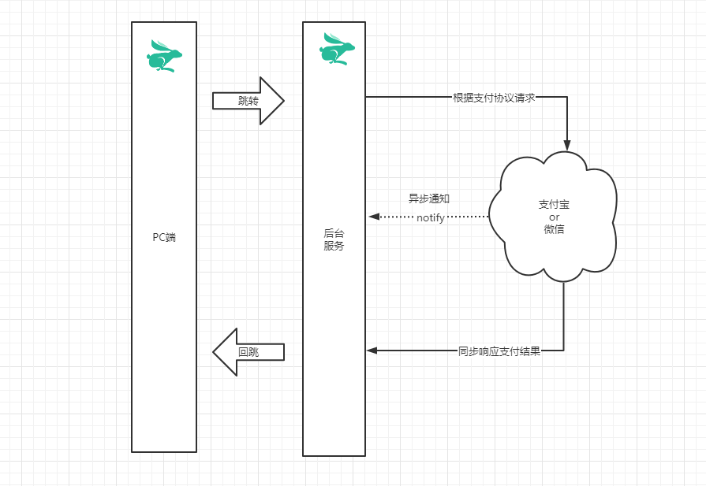
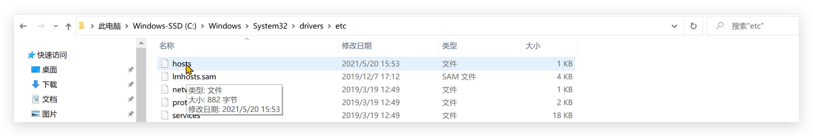
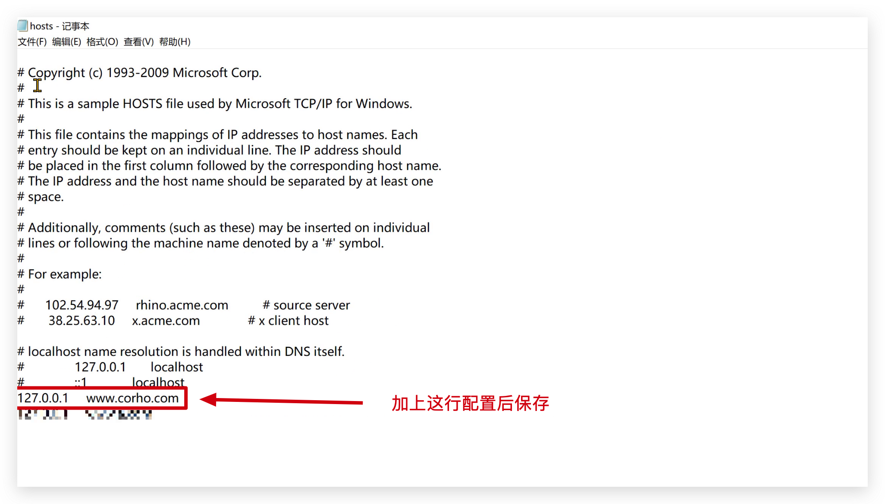
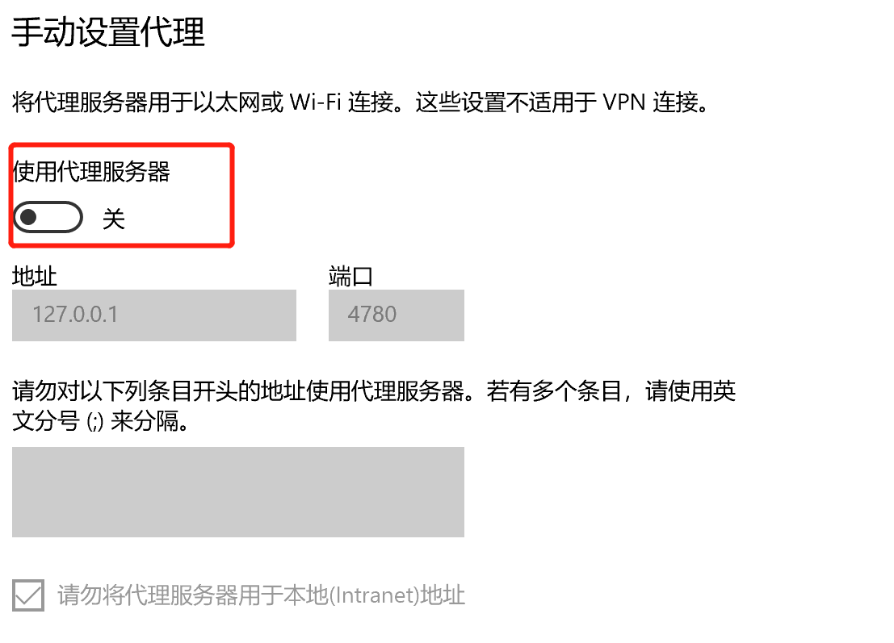
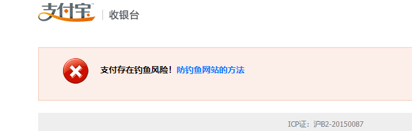
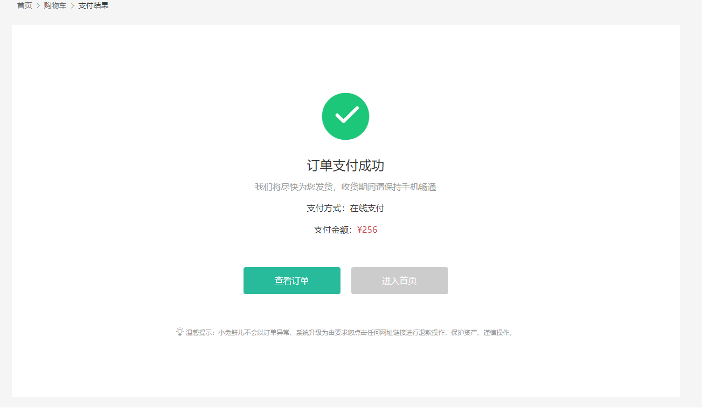

# 创建订单

## 订单组件

`任务目标:` 准备下单组件

定义组件基础结构 `views/Member/settlement/index.vue` 

```html
<template>
  <div class="xtx-pay-checkout-page">
    <div class="container">
      <XtxBread>
        <XtxBreadItem to="/">首页</XtxBreadItem>
        <XtxBreadItem to="/cart">购物车</XtxBreadItem>
        <XtxBreadItem >填写订单</XtxBreadItem>
      </XtxBread>
      <div class="wrapper">
        <!-- 收货地址 -->
        <h3 class="box-title">收货地址</h3>
        <div class="box-body">
          <div class="address">
            <div class="text">
              <!-- <div class="none">您需要先添加收货地址才可提交订单。</div> -->
              <ul>
                <li><span>收<i/>货<i/>人：</span>朱超</li>
                <li><span>联系方式：</span>132****2222</li>
                <li><span>收货地址：</span>海南省三亚市解放路108号物质大厦1003室</li>
              </ul>
            </div>
            <div class="action">
              <XtxButton class="btn">切换地址</XtxButton>
              <XtxButton class="btn">添加地址</XtxButton>
            </div>
          </div>
        </div>
        <!-- 商品信息 -->
        <h3 class="box-title">商品信息</h3>
        <div class="box-body">
          <table class="goods">
            <thead>
              <tr>
                <th width="520">商品信息</th>
                <th width="170">单价</th>
                <th width="170">数量</th>
                <th width="170">小计</th>
                <th width="170">实付</th>
              </tr>
            </thead>
            <tbody>
              <tr v-for="i in 4" :key="i">
                <td>
                  <a href="javascript:;" class="info">
                    
                    <div class="right">
                      <p>轻巧多用锅雪平锅 麦饭石不粘小奶锅煮锅</p>
                      <p>颜色：白色 尺寸：10cm 产地：日本</p>
                    </div>
                  </a>
                </td>
                <td>&yen;100.00</td>
                <td>2</td>
                <td>&yen;200.00</td>
                <td>&yen;200.00</td>
              </tr>
            </tbody>
          </table>
        </div>
        <!-- 配送时间 -->
        <h3 class="box-title">配送时间</h3>
        <div class="box-body">
          <a class="my-btn active" href="javascript:;">不限送货时间：周一至周日</a>
          <a class="my-btn" href="javascript:;">工作日送货：周一至周五</a>
          <a class="my-btn" href="javascript:;">双休日、假日送货：周六至周日</a>
        </div>
        <!-- 支付方式 -->
         <h3 class="box-title">支付方式</h3>
        <div class="box-body">
          <a class="my-btn active" href="javascript:;">在线支付</a>
          <a class="my-btn" href="javascript:;">货到付款</a>
          <span style="color:#999">货到付款需付5元手续费</span>
        </div>
        <!-- 金额明细 -->
        <h3 class="box-title">金额明细</h3>
        <div class="box-body">
          <div class="total">
            <dl><dt>商品件数：</dt><dd>5件</dd></dl>
            <dl><dt>商品总价：</dt><dd>¥5697.00</dd></dl>
            <dl><dt>运<i></i>费：</dt><dd>¥0.00</dd></dl>
            <dl><dt>应付总额：</dt><dd class="price">¥5697.00</dd></dl>
          </div>
        </div>
        <!-- 提交订单 -->
        <div class="submit">
          <XtxButton type="primary">提交订单</XtxButton>
        </div>
      </div>
    </div>
  </div>
</template>
<script>
export default {
  name: 'XtxPayCheckoutPage'
}
</script>
<style scoped lang="less">
.xtx-pay-checkout-page {
  .wrapper {
    background: #fff;
    padding: 0 20px;
    .box-title {
      font-size: 16px;
      font-weight: normal;
      padding-left: 10px;
      line-height: 70px;
      border-bottom: 1px solid #f5f5f5;
    }
    .box-body {
      padding: 20px 0;
    }
  }
}
.address {
  border: 1px solid #f5f5f5;
  display: flex;
  align-items: center;
  .text {
    flex: 1;
    min-height: 90px;
    display: flex;
    align-items: center;
    .none {
      line-height: 90px;
      color: #999;
      text-align: center;
      width: 100%;  
    }
    > ul {
      flex: 1;
      padding: 20px;
      li {
        line-height: 30px;
        span {
          color: #999;
          margin-right: 5px;
          > i {
            width: 0.5em;
            display: inline-block;
          }
        }
      }
    }
    > a {
      color: @xtxColor;
      width: 160px;
      text-align: center;
      height: 90px;
      line-height: 90px;
      border-right: 1px solid #f5f5f5;
    }
  }
  .action {
    width: 420px;
    text-align: center;
    .btn {
      width: 140px;
      height: 46px;
      line-height: 44px;
      font-size: 14px;
      &:first-child {
        margin-right: 10px;
      }
    }
  }
}
.goods {
  width: 100%;
  border-collapse: collapse;
  border-spacing: 0;
  .info {
    display: flex;
    text-align: left;
    img {
      width: 70px;
      height: 70px;
      margin-right: 20px;
    }
    .right {
      line-height: 24px;
      p {
        &:last-child {
          color: #999;
        }
      }
    }
  }
  tr {
    th {
      background: #f5f5f5;
      font-weight: normal;
    }
    td,th {
      text-align: center;
      padding: 20px;
      border-bottom: 1px solid #f5f5f5;
      &:first-child {
        border-left: 1px solid #f5f5f5;
      }
      &:last-child {
        border-right: 1px solid #f5f5f5;
      }
    }
  }
}
.my-btn {
  width: 228px;
  height: 50px;
  border: 1px solid #e4e4e4;
  text-align: center;
  line-height: 48px;
  margin-right: 25px;
  color: #666666;
  display: inline-block;
  &.active,&:hover {
    border-color: @xtxColor;
  }
}
.total {
  dl {
    display: flex;
    justify-content: flex-end;
    line-height: 50px;
    dt {
      i {
        display: inline-block;
        width: 2em;
      }
    }
    dd {
      width: 240px;
      text-align: right;
      padding-right: 70px;
      &.price {
        font-size: 20px;
        color: @priceColor;
      }
    }
  }
}
.submit {
  text-align: right;
  padding: 60px;
  border-top: 1px solid #f5f5f5;
}
</style>
```


## 接口数据渲染

`任务目标:` 使用接口数据渲染结算页

**实现步骤**

1. 定义获取结算信息API接口
2. 页面组件获取数据，传入地址组件，渲染页面内容
3. 渲染地址组件

**代码落地**

1）定义接口`src/api/order.js` 

```js
import request from '@/utils/request'

/**
 * 获取下单信息
 */
export const findCheckoutInfo = () => {
  return request('/member/order/pre', 'get')
}
```

2）组件获取数据

```js
import { findCheckoutInfo } from '@/api/order'
export default {
  name: 'XtxPayCheckoutPage',
  setup () {
    // 获取订单信息
    const checkoutInfo = ref(null)
    async function loadCheckoutInfo () {
      const res = await findCheckoutInfo()
      checkoutInfo.value = res.result
    }
    onMounted(() => {
      loadCheckoutInfo()
    })

    return { checkoutInfo}
  }
}
```

### 渲染下单商品

> 用户确认下单信息

3）渲染页面

```html
<!--商品信息 -->
<tbody>
  <tr v-for="item in checkoutInfo.goods" :key="item.id">
    <td>
      <a href="javascript:;" class="info">
        
        <div class="right">
          <p>{{item.name}}</p>
          <p>{{item.attrsText}}</p>
        </div>
      </a>
    </td>
    <td>&yen;{{item.payPrice}}</td>
    <td>{{item.count}}</td>
    <td>&yen;{{item.totalPrice}}</td>
    <td>&yen;{{item.totalPayPrice}}</td>
  </tr>
</tbody>
<!-- 金额明细 -->    
<div class="box-body">
    <div class="total">
    <dl><dt>商品件数：</dt><dd>{{checkoutInfo.summary.goodsCount}}件</dd></dl>
    <dl><dt>商品总价：</dt><dd>¥{{checkoutInfo.summary.totalPrice}}</dd></dl>
    <dl><dt>运<i></i>费：</dt><dd>¥{{checkoutInfo.summary.postFee}}</dd></dl>
    <dl><dt>应付总额：</dt><dd class="price">¥{{checkoutInfo.summary.totalPayPrice}}</dd>                 </dl>
  </div>
</div>
```


## 提交订单

`任务目标:`  汇总提交订单需要的数据，进行提交

**实现步骤**

1. 定义需要提交的数据对象
2. 绑定提交订单点击事件，进行提交即可
3. 提交成功之后 跳转到支付页
4. 重新拉取一下购物车列表

**代码落地**

1）准备接口

```js
/**
 * 提交订单
 * @param {Object} order - 订单信息对象
 *  deliveryTimeType: 1, 配送时间类型，1为不限，2为工作日，3为双休或假日
 *  payType: 1, 支付方式，1为在线支付，2为货到付款
 *  buyerMessage: '', 买家留言
 *  addressId: '1429265915203031042', // 地址id
 *  goods: [] // { skuId, count } 由所有商品的skuId 和 count字段组成的数组
 */
export const createOrder = (order) => {
  return request('/member/order', 'post', order)
}
```

2）准备数据处理数据提交接口

```js
// 提交订单
// 需要提交的字段
const reqParams = reactive({
  deliveryTimeType: 1,
  payType: 1,
  buyerMessage: '',
  addressId: '1429265915203031042', // 地址id(测试)
  goods: [] // {skuId, count}
})

const router = useRouter()
function submitOrder () {
  // 处理参数
  // reqParams.addressId = curAddress.value.id
  reqParams.goods = checkoutInfo.value.goods.map(item => {
    return {
      skuId: item.skuId,
      count: item.count
    }
  })
  // 调用接口
  createOrder(reqParams).then(res => {
    router.push({ path: '/pay', query: { id: res.result.id } })
  })
}
```

3）重新拉取购物车列表

```diff
createOrder(reqParams).then(res => {
    router.push({ path: '/pay', query: { id: res.result.id } })
-    // 更新购物车列表
+    findCartList().then((res) => {
+      store.commit('cart/setList', res.result)
+    })
})
```

到此，我们就完成结算页面的所有核心功能，接下来我们就可以进行正式的支付环节了

# 在线支付
## 路由和组件

`任务目标:` 完成支付页路由和组件


1）准备组件

src/views/Member/pay/index.vue

```html
<template>
  <div class="xtx-pay-page">
    <div class="container">
      <XtxBread>
        <XtxBreadItem to="/">首页</XtxBreadItem>
        <XtxBreadItem to="/cart">购物车</XtxBreadItem>
        <XtxBreadItem>支付订单</XtxBreadItem>
      </XtxBread>
      <!-- 付款信息 -->
      <div class="pay-info">
        <span class="icon iconfont icon-queren2"></span>
        <div class="tip">
          <p>订单提交成功！请尽快完成支付。</p>
          <p>支付还剩 <span>24分59秒</span>, 超时后将取消订单</p>
        </div>
        <div class="amount">
          <span>应付总额：</span>
          <span>¥5673.00</span>
        </div>
      </div>
      <!-- 付款方式 -->
      <div class="pay-type">
        <p class="head">选择以下支付方式付款</p>
        <div class="item">
          <p>支付平台</p>
          <a class="btn wx" href="javascript:;"></a>
          <a class="btn alipay" href="javascript:;"></a>
        </div>
        <div class="item">
          <p>支付方式</p>
          <a class="btn" href="javascript:;">招商银行</a>
          <a class="btn" href="javascript:;">工商银行</a>
          <a class="btn" href="javascript:;">建设银行</a>
          <a class="btn" href="javascript:;">农业银行</a>
          <a class="btn" href="javascript:;">交通银行</a>
        </div>
      </div>
    </div>
  </div>
</template>
<script>
export default {
  name: 'XtxPayPage'
}
</script>
<style scoped lang="less">
.pay-info {
  background: #fff;
  display: flex;
  align-items: center;
  height: 240px;
  padding: 0 80px;
  .icon {
    font-size: 80px;
    color: #1dc779;
  }
  .tip {
    padding-left: 10px;
    flex: 1;
    p {
      &:first-child {
        font-size: 20px;
        margin-bottom: 5px;
      }
      &:last-child {
        color: #999;
        font-size: 16px;
      }
    }
  }
  .amount {
    span {
      &:first-child {
        font-size: 16px;
        color: #999;
      }
      &:last-child {
        color: @priceColor;
        font-size: 20px;
      }
    }
  }
}
.pay-type {
  margin-top: 20px;
  background-color: #fff;
  padding-bottom: 70px;
  p {
    line-height: 70px;
    height: 70px;
    padding-left: 30px;
    font-size: 16px;
    &.head {
      border-bottom: 1px solid #f5f5f5;
    }
  }
  .btn {
    width: 150px;
    height: 50px;
    border: 1px solid #e4e4e4;
    text-align: center;
    line-height: 48px;
    margin-left: 30px;
    color: #666666;
    display: inline-block;
    &.active,
    &:hover {
      border-color: @xtxColor;
    }
    &.alipay {
      background: url(https://cdn.cnbj1.fds.api.mi-img.com/mi-mall/7b6b02396368c9314528c0bbd85a2e06.png) no-repeat center / contain;
    }
    &.wx {
      background: url(https://cdn.cnbj1.fds.api.mi-img.com/mi-mall/c66f98cff8649bd5ba722c2e8067c6ca.jpg) no-repeat center / contain;
    }
  }
}
</style>
```

2）配置路由

> 二级路由

```js
const Pay = () => import('@/views/Member/pay/index')
{ path: '/pay', component: Pay }
```

## 准备支付

`任务目标:` 渲染真实支付数据

**实现步骤**

1. 准备API接口函数获取订单详情
2. 在组件获取数据渲染
3. 完成倒计时效果

**代码落地**

### 获取订单详情

1）准备API接口函数获取订单详情 

`src/api/order.js`

```js
/**
 * 获取订单详情
 * @param {String} id - 订单ID
 */
export const findOrder = (id) => {
  return request('/member/order/' + id, 'get')
}
```

2）在组件获取数据渲染支付金额 `src\views\Member\pay\index.vue`

```html
<div class="amount">
    <span>应付总额：</span>
    <span>¥{{ order.payMoney }}</span>
</div>

<script>
import { onMounted, ref } from 'vue'
import { findOrder } from '@/api/order'
import { useRoute } from 'vue-router'
export default {
  name: 'XtxPayPage',
  setup () {
    // 订单
    const order = ref(null)
    // 路由信息
    const route = useRoute()
    // 查询订单
    async function loadOrder () {
      const res = await findOrder(route.query.id)
      order.value = res.data.result
    }
    onMounted(() => {
      loadOrder()
    })
    return { order }
  }
}
</script>
```

### 处理支付状态

> orderState - 订单状态，1为待付款、2为待发货(已付款)、3为待收货、4为待评价、5为已完成、6为已取消或超时
>
> 注意⚠️：订单状态后台有延迟

```vue
<!-- 付款信息 -->
<div class="pay-info" v-if="order">
  <span class="icon iconfont icon-queren2"></span>
  <div class="tip" v-if="order.orderState === 1">
    <p>订单提交成功！请尽快完成支付。</p>
    <p>
      支付还剩 <span>{{ countTimeText }}</span
      >, 超时后将取消订单
    </p>
  </div>
  <div class="tip" v-if="order.orderState === 2">
    <p>订单已支付！</p>
  </div>
  <div class="tip" v-if="order.orderState === 6">
    <p>订单支付超时！</p>
  </div>
  <div class="amount">
    <span>应付总额：</span>
    <span>¥{{ order.payMoney }}</span>
  </div>
</div>
```

### 支付倒计时

3）完成倒计时效果

`src\hooks\index.js`

思路：

1. 使用倒计时函数
2. 渲染倒计时格式化的时间


```diff
+ import { useCountDown } from 'rabbit-ui-core'

  // 订单
  const order = ref(null)
  // 路由信息
  const route = useRoute()
+  const { countTimeText, start } = useCountDown()
  // 查询订单
  async function loadOrder () {
    const res = await findOrder(route.query.id)
    order.value = res.result
-    // 开启倒计时
+  order.value.orderState === 1 && start(order.value.countdown)
  }
  onMounted(() => {
    loadOrder()
  })
+  return { countTimeText }
```

```vue
<p>
    支付还剩 <span>{{ countTimeText }}</span
    >, 超时后将取消订单
</p>
```


## 支付流程

`任务目标:` 了解支付的前后端业务流程



### 流程说明

1. PC前台点击支付按钮，新开标签页打开后台提供的支付链接带上`订单ID和回跳地址`
2. 后台服务发起支付，等待支付结果，修改订单状态，回跳PC前台结果页
3. PC前台在结果页获取回跳URL参数订单ID查询支付状态，展示支付结果

**支付宝回跳地址（根据当前业务制定）**

```yaml
http://www.corho.com:8080/#/pay/callback
```

**测试支付**

如果使用客户端需要下载 `沙箱支付宝` [开放平台](https://open.alipay.com)扫码下载

```text
买家账号: jfjbwb4477@sandbox.com
登录密码: 111111
支付密码: 111111
```

### 配置本地回调域名(预习作业)

> 开发环境适配：
>
> ​	由于本地我们的网站是访问`http://localhost:8080`，而回调地址的域名是`http://www.corho.com:8080`，俩个地址不一致是无法进行支付成功回跳，需要我们修改本地的hosts文件，让域名访问时解析到我们本地的ip上
>
> 
>
> DNS：
>
> 1. 作用是将域名地址解析成ip地址
> 2. 优先级  先以本地的host文件为主  然后才走线上的dns服务器

#### windows

> 操作步骤：

```bash
1. 找到 C:\Windows\System32\drivers\etc 下hosts文件
2. 在文件中加入  127.0.0.1       www.corho.com
3. 保存即可
# 如果提示没有权限
1. 将hosts文件移到桌面，然后进行修改，确认保存。
2. 将桌面hosts文件替换c盘文件
```

图示：





#### mac

> 操作步骤：

```bash
1. 打开命令行窗口
2. 输入：sudo vim /etc/hosts
3. 按下：i 键
4. 输入：127.0.0.1       www.corho.com
5. 按下：esc
6. 按下：shift + :
7. 输入：wq 回车即可
```

#### ⚠️注意事项

1. 需要开启IP或域名访问webpack服务器权限，在vue.config.js中配置

```json
// 这个是给webpack-dev-server开启可以IP和域名访问权限
module.exports = defineConfig({
	// ...
  configureWebpack: {
    devServer: { allowedHosts: ['www.corho.com'] }
  }
})
```

2. 关闭VPN软件代理



3. 重启下浏览器
4. 多服务端口冲突，需要关闭多余的服务


**最后**❓：

浏览器输入`http://www.corho.com:8080/#/`  如果也能正常访问小兔鲜儿页面则配置已经生效

## 跳转支付

`任务目标:` 携带关键参数进行支付操作

**关键参数**

1. 订单id  （ orderId ）
2. 回跳地址  （redirectUrl）

`src\views\Member\pay\index.vue`

```js
// 支付地址
// const payUrl = '后台服务基准地址+支付页面地址+订单ID+回跳地址'
const baseURL = 'http://pcapi-xiaotuxian-front-devtest.itheima.net/'
// encodeURIComponent 编码后url作为参数(避免乱码)
const redirectUrl = encodeURIComponent('http://www.corho.com:8080/#/pay/callback')
const payUrl = `${baseURL}pay/aliPay?orderId=${route.query.id}&redirect=${redirectUrl}`

return { order, payUrl }
```

```vue
 <a class="btn alipay" :href="payUrl" target="_blank"></a>
```

注意⚠：

1. 出现对象不存在，说明基础地址或参数不全
2. 如果出现钓鱼提示，清除浏览器缓存并重启再试



3. 测试使用域名=>http://www.corho.com:8080

## 支付结果

`任务目标:` 对支付完的结果进行展示（可以在支付之前准备）



**实现步骤**

1. 准备一个基础页面
2. 根据地址订单ID查询订单状态进行展示，或者是地址栏支付结果

**代码落地**

1）准备结果页面和配置二级路由

`src\views\Member\pay\result.vue`

```js
const PayResult = () => import('@/views/Member/pay/result')
{ path: '/pay/callback', component: PayResult }
```

2）根据地址订单ID查询订单状态进行展示

```vue
<template>
  <div class="xtx-pay-page">
    <div class="container">
      <XtxBread>
        <XtxBreadItem to="/">首页</XtxBreadItem>
        <XtxBreadItem to="/cart">购物车</XtxBreadItem>
        <XtxBreadItem>支付结果</XtxBreadItem>
      </XtxBread>
      <!-- 支付结果 -->
      <div class="pay-result">
        <span class="iconfont icon-queren2 green" v-if="$route.query.payResult"></span>
        <span class="iconfont icon-shanchu red" v-else></span>
        <p class="tit">{{$route.query.payResult?'支付成功':'支付失败'}}</p>
        <p class="tip">我们将尽快为您发货，收货期间请保持手机畅通</p>
        <p>支付方式：<span>支付宝</span></p>
        <p>支付金额：<span>¥{{payResultInfo.payMoney}}</span></p>
        <div class="btn">
          <XtxButton type="primary" style="margin-right:20px">查看订单</XtxButton>
          <XtxButton type="gray">进入首页</XtxButton>
        </div>
        <p class="alert">
          <span class="iconfont icon-tip"></span>
          温馨提示：小兔鲜儿不会以订单异常、系统升级为由要求您点击任何网址链接进行退款操作，保护资产、谨慎操作。
        </p>
      </div>
    </div>
  </div>
</template>
<script>
import { findOrder } from '@/api/order'
import { onMounted, ref } from 'vue'
import { useRoute } from 'vue-router'
export default {
  name: 'XtxPayResultPage',
  setup () {
    const payResultInfo = ref({})
    const route = useRoute()
    async function loadInfo () {
      const res = await findOrder(route.query.orderId)
      payResultInfo.value = res.result
    }
    onMounted(() => {
      loadInfo()
    })
    return {
      payResultInfo
    }
  }
}
</script>
<style scoped lang="less">
.pay-result {
  padding: 100px 0;
  background: #fff;
  text-align: center;
  > .iconfont {
    font-size: 100px;
  }
  .green {
    color: #1dc779;
  }
  .red {
    color: @priceColor;
  }
  .tit {
    font-size: 24px;
  }
  .tip {
    color: #999;
  }
  p {
    line-height: 40px;
    font-size: 16px;
  }
  .btn {
    margin-top: 50px;
  }
  .alert {
    font-size: 12px;
    color: #999;
    margin-top: 50px;
  }
}
</style>
```


# 第八天重点总结


