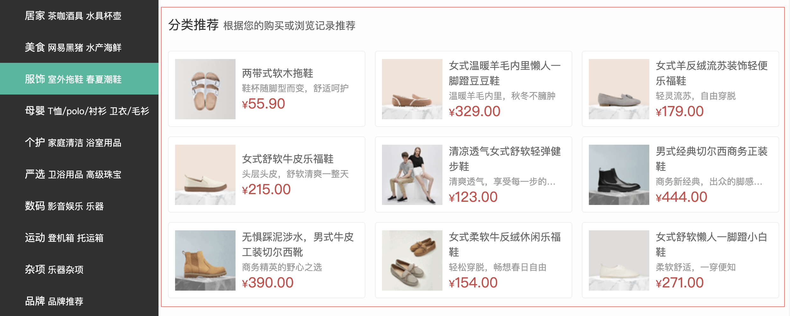
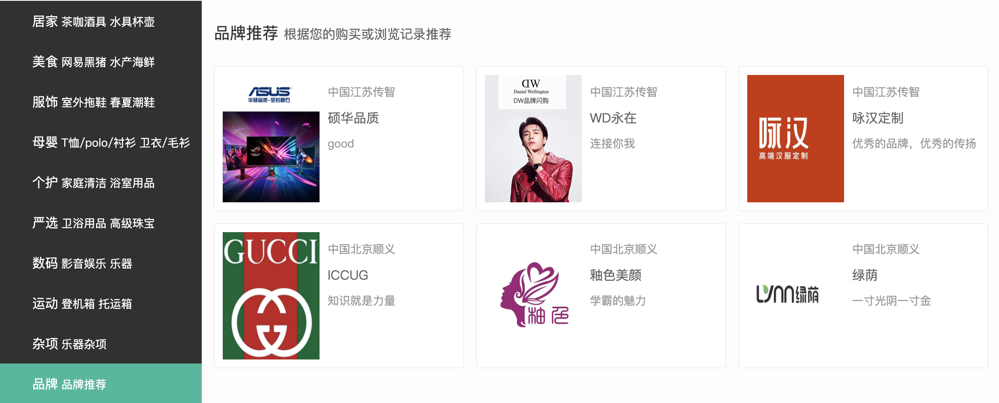
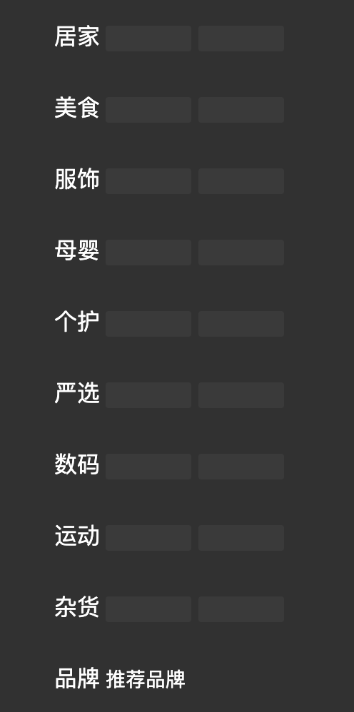
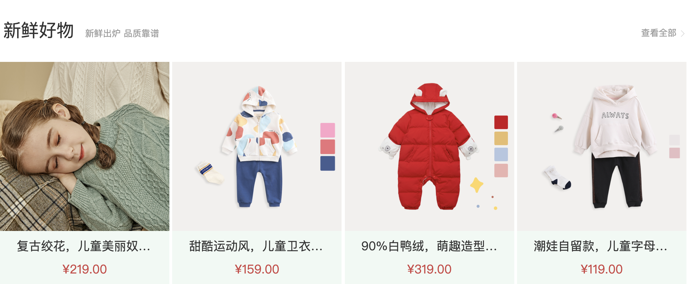
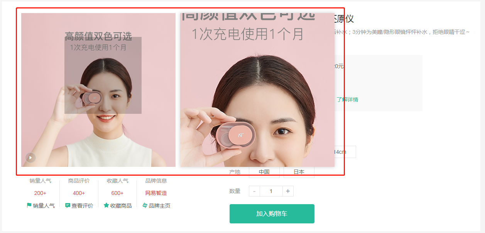

# rabbit-client_pc

小兔鲜项目

### :point_right: 实现左侧分类列表商品推荐

> 目标: 完成左侧分类弹层中的分类商品推荐基础布局及数据渲染
>
> ------

- [ ] 在 `HomeCategory` 组件中添加弹层基础结构和样式
- [ ] 当鼠标移入分类列表时记录当前移入的分类
- [ ] 根据当前移入的分类渲染对应的推荐商品至模板

-----

### :point_right: 实现左侧分类列表品牌推荐

>  目标: 实现品牌推荐数据的获取和渲染
>

------

- [ ] 在 `HomeCategory` 组件中添加品牌推荐的基础布局
- [ ] 创建用于获取品牌推荐数据的API接口函数
- [ ] 获取品牌推荐数据并渲染至模板
- [ ] 实现移入分类的选中效果

------

`api/home.js` [首页-热门品牌](http://zhoushugang.gitee.io/erabbit-client-pc-document/api.html#u9996u9875-u70edu95e8u54c1u724c0a3ca20id3du9996u9875-u70edu95e8u54c1u724c3e203ca3e)

### :point_right: 实现左侧分类骨架效果

> 目标: 创建一个通用的用于实现骨架效果的组件, 实现左侧分类骨架效果
>
> ------

### :point_right: 首页轮播图布局

> 目标：实现轮播图布局
>
> ------

### :point_right: 首页轮播图渲染结构

>[首页-广告区域(pc-小程序)](http://zhoushugang.gitee.io/erabbit-client-pc-document/api.html#u9996u9875-u5e7fu544au533au57df28pc-u5c0fu7a0bu5e8f290a3ca20id3du9996u9875-u5e7fu544au533au57df28pc-u5c0fu7a0bu5e8f293e203ca3e)
>
>------

### :point_right: 首页轮播图逻辑封装

> 目标: 实现轮播图轮播及自动轮播逻辑

------

- [ ] 实现点击轮播图左右按钮切换轮播图功能
- [ ] 实现点击导航原点轮播
- [ ] 实现轮播图的自动轮播功能

------

### :point_right: 封装面板组件

> 目标: 封装首页公共面板组件, 封装查看更多组件

------

### :point_right: 实现新鲜好物

> 目标: 实现新鲜好物组件数据渲染
------

 

### :point_right:   渲染面包屑导航

> 目标：渲染面包屑导航组件
>
> ----

------

- [ ] 创建用于获取商品详细信息的API接口函数, 渲染面包屑组件需要用到商品详细信息接口中返回的数据
- [ ] 在商品详情页面组件中调用API接口函数获取商品详情信息
- [ ] 根据商品详情信息渲染面包屑组件

------

第一步: 创建用于获取商品详细信息的API方法。

`api/goods.js` [商品详情](http://zhoushugang.gitee.io/erabbit-client-pc-document/api.html#u5546u54c1u8be6u60c50a3ca20id3du5546u54c1u8be6u60c53e203ca3e)

注意: 此接口存在问题, 服务器端要验证 token, 但在实际的业务中获取商品详情数据不需要验证token。

### :point_right:   图片预览组件

> 目标: 实现图片预览组件布局及图片切换效果
>
> ----

------

- [ ] 创建图片预览组件 `GoodsImages`, 实现基础布局
- [ ] 在商品详情组件组件中调用图片预览组件
- [ ] 实现图片预览组件中图片的渲染及切换效果

### :point_right:  实现放大镜效果

> 目标: 实现商品图片的放大镜效果

------

- [ ] 在图片预览组件中添加大图容器
- [ ] 在图片预览组件中添加镜片容器
- [ ] 实现放大镜效果
  1. 声明 `show` 布尔值用于控制镜片容器和大图容器的显示和隐藏
  2. 通过 `useMouseInElement` 方法获取元素和鼠标之前的关系 (鼠标是否移入到元素中、鼠标在元素中的位置)
  3. 根据鼠标是否在元素中决定大图容器和镜片容器的显示和隐藏
  4. 根据鼠标在元素中的位置计算镜片容器位置
  5. 根据镜片元素位置计算大图位置
