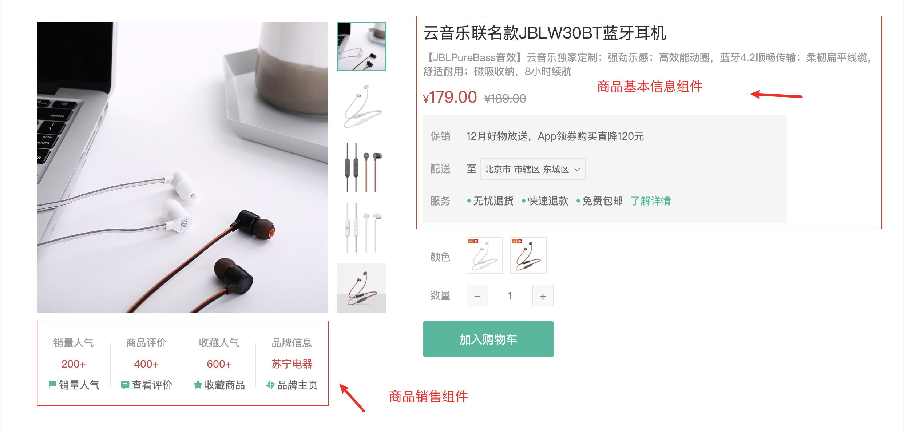
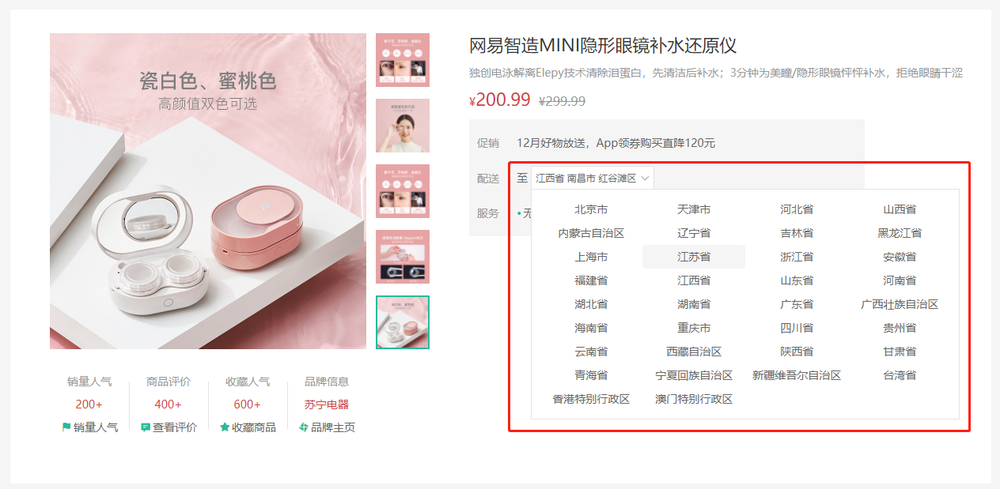
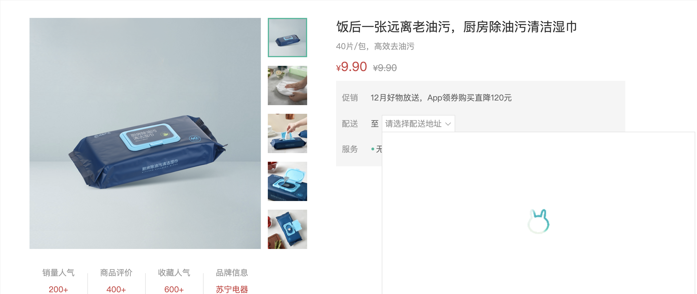
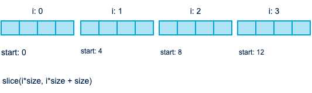

# rabbit-client_pc

小兔鲜项目


### :point_right: 实现左侧分类列表商品推荐

> 目标: 完成左侧分类弹层中的分类商品推荐基础布局及数据渲染
>
> ------

- [ ] 在 `HomeCategory` 组件中添加弹层基础结构和样式
- [ ] 当鼠标移入分类列表时记录当前移入的分类
- [ ] 根据当前移入的分类渲染对应的推荐商品至模板

-----


### :point_right: 实现左侧分类列表品牌推荐

>  目标: 实现品牌推荐数据的获取和渲染
>

------

- [ ] 在 `HomeCategory` 组件中添加品牌推荐的基础布局
- [ ] 创建用于获取品牌推荐数据的API接口函数
- [ ] 获取品牌推荐数据并渲染至模板
- [ ] 实现移入分类的选中效果

------

`api/home.js` [首页-热门品牌](http://zhoushugang.gitee.io/erabbit-client-pc-document/api.html#u9996u9875-u70edu95e8u54c1u724c0a3ca20id3du9996u9875-u70edu95e8u54c1u724c3e203ca3e)


### :point_right: 实现左侧分类骨架效果

> 目标: 创建一个通用的用于实现骨架效果的组件, 实现左侧分类骨架效果
>
> ------


### :point_right: 首页轮播图布局

> 目标：实现轮播图布局
>
> ------


### :point_right: 首页轮播图渲染结构

>[首页-广告区域(pc-小程序)](http://zhoushugang.gitee.io/erabbit-client-pc-document/api.html#u9996u9875-u5e7fu544au533au57df28pc-u5c0fu7a0bu5e8f290a3ca20id3du9996u9875-u5e7fu544au533au57df28pc-u5c0fu7a0bu5e8f293e203ca3e)
>
>------


### :point_right: 首页轮播图逻辑封装

> 目标: 实现轮播图轮播及自动轮播逻辑

------

- [ ] 实现点击轮播图左右按钮切换轮播图功能
- [ ] 实现点击导航原点轮播
- [ ] 实现轮播图的自动轮播功能

------


### :point_right: 封装面板组件

> 目标: 封装首页公共面板组件, 封装查看更多组件

------


### :point_right: 实现新鲜好物

> 目标: 实现新鲜好物组件数据渲染
------

 


### :point_right:   渲染面包屑导航

> 目标：渲染面包屑导航组件
>
> ----


------

- [ ] 创建用于获取商品详细信息的API接口函数, 渲染面包屑组件需要用到商品详细信息接口中返回的数据
- [ ] 在商品详情页面组件中调用API接口函数获取商品详情信息
- [ ] 根据商品详情信息渲染面包屑组件

------


第一步: 创建用于获取商品详细信息的API方法。

`api/goods.js` [商品详情](http://zhoushugang.gitee.io/erabbit-client-pc-document/api.html#u5546u54c1u8be6u60c50a3ca20id3du5546u54c1u8be6u60c53e203ca3e)

注意: 此接口存在问题, 服务器端要验证 token, 但在实际的业务中获取商品详情数据不需要验证token。


### :point_right:   图片预览组件

> 目标: 实现图片预览组件布局及图片切换效果
>
> ----


------

- [ ] 创建图片预览组件 `GoodsImages`, 实现基础布局
- [ ] 在商品详情组件组件中调用图片预览组件
- [ ] 实现图片预览组件中图片的渲染及切换效果


### :point_right:  实现放大镜效果

> 目标: 实现商品图片的放大镜效果


------

- [ ] 在图片预览组件中添加大图容器
- [ ] 在图片预览组件中添加镜片容器
- [ ] 实现放大镜效果
  1. 声明 `show` 布尔值用于控制镜片容器和大图容器的显示和隐藏
  
  2. 通过 `useMouseInElement` 方法获取元素和鼠标之前的关系 (鼠标是否移入到元素中、鼠标在元素中的位置)
  
  3. 根据鼠标是否在元素中决定大图容器和镜片容器的显示和隐藏
  
  4. 根据鼠标在元素中的位置计算镜片容器位置
  
  5. 根据镜片元素位置计算大图位置
  
     

### :point_right:   商品基本信息展示

> 目标: 创建商品销售信息组件实现基础布局, 创建商品基本信息组件实现基础布局并渲染商品基本信息



------

- [ ] 创建商品销售信息组件 `GoodsSales`, 实现基础布局
- [ ] 在商品详情页面组件中调用商品销售信息组件
- [ ] 创建商品基本信息组件 `GoodsInfo`, 实现基础布局
- [ ] 在商品详情页面组件中调用商品基本信息组件并传递商品信息
- [ ] 在商品基本信息组件中渲染商品的基本信息

------

第一步: 创建商品销售信息组件, 实现基础布局

`views/goods/components/GoodsSales.vue`

```html
<template>
  <ul class="goods-sales">
    <li>
      <p>销量人气</p>
      <p>200+</p>
      <p><i class="iconfont icon-task-filling"></i>销量人气</p>
    </li>
    <li>
      <p>商品评价</p>
      <p>400+</p>
      <p><i class="iconfont icon-comment-filling"></i>查看评价</p>
    </li>
    <li>
      <p>收藏人气</p>
      <p>600+</p>
      <p><i class="iconfont icon-favorite-filling"></i>收藏商品</p>
    </li>
    <li>
      <p>品牌信息</p>
      <p>苏宁电器</p>
      <p><i class="iconfont icon-dynamic-filling"></i>品牌主页</p>
    </li>
  </ul>
</template>

<script>
export default {
  name: "GoodsSales",
};
</script>

<style scoped lang="less">
.goods-sales {
  display: flex;
  width: 400px;
  align-items: center;
  text-align: center;
  height: 140px;
  li {
    flex: 1;
    position: relative;
    ~ li::after {
      position: absolute;
      top: 10px;
      left: 0;
      height: 60px;
      border-left: 1px solid #e4e4e4;
      content: "";
    }
    p {
      &:first-child {
        color: #999;
      }
      &:nth-child(2) {
        color: @priceColor;
        margin-top: 10px;
      }
      &:last-child {
        color: #666;
        margin-top: 10px;
        i {
          color: @xtxColor;
          font-size: 14px;
          margin-right: 2px;
        }
        &:hover {
          color: @xtxColor;
          cursor: pointer;
        }
      }
    }
  }
}
</style>
```

第二步: 在商品详情信息组件中调用商品销售信息组件

`views/goods/GoodsDetailPages`

```html
<div class="media">
   <GoodsSales />
</div>
<script>
import GoodsSales from "@/views/goods/components/GoodsSales";
export default {
  components: { GoodsSales }
}
</script>
```

第三步: 创建商品基本信息组件, 实现基础布局

`views/goods/component/GoodsInfo.vue`

```html
<template>
  <p class="g-name">2件装 粉釉花瓣心意点缀 点心盘*2 碟子盘子</p>
  <p class="g-desc">花瓣造型干净简约 多功能使用堆叠方便</p>
  <p class="g-price">
    <span>108.00</span>
    <span>199.00</span>
  </p>
  <div class="g-service">
    <dl>
      <dt>促销</dt>
      <dd>12月好物放送，App领券购买直降120元</dd>
    </dl>
    <dl>
      <dt>配送</dt>
      <dd>至</dd>
    </dl>
    <dl>
      <dt>服务</dt>
      <dd>
        <span>无忧退货</span>
        <span>快速退款</span>
        <span>免费包邮</span>
        <a href="javascript:">了解详情</a>
      </dd>
    </dl>
  </div>
</template>

<script>
export default {
  name: "GoodsInfo",
  props: {
    goods: {
      type: Object,
      default: () => ({}),
    },
  },
};
</script>

<style lang="less" scoped>
.g-name {
  font-size: 22px;
}
.g-desc {
  color: #999;
  margin-top: 10px;
}
.g-price {
  margin-top: 10px;
  span {
    &::before {
      content: "¥";
      font-size: 14px;
    }
    &:first-child {
      color: @priceColor;
      margin-right: 10px;
      font-size: 22px;
    }
    &:last-child {
      color: #999;
      text-decoration: line-through;
      font-size: 16px;
    }
  }
}
.g-service {
  background: #f5f5f5;
  width: 500px;
  padding: 20px 10px 0 10px;
  margin-top: 10px;
  dl {
    padding-bottom: 20px;
    display: flex;
    align-items: center;
    dt {
      width: 50px;
      color: #999;
    }
    dd {
      color: #666;
      &:last-child {
        span {
          margin-right: 10px;
          &::before {
            content: "•";
            color: @xtxColor;
            margin-right: 2px;
          }
        }
        a {
          color: @xtxColor;
        }
      }
    }
  }
}
</style>
```

第四步: 在商品详情组件 `GoodsDetailPage` 中调用 `GoodsInfo` 组件

`views/goods/GoodsDetailPage.vue`

```html
<div class="spec">
  <GoodsInfo :goods="result" />
</div>
<script>
import GoodsInfo from "@/views/goods/components/GoodsInfo";
export default {
  components: { GoodsInfo }
}
</script>
```

第五步: 在商品基本信息组件 `GoodsInfo` 中展示商品的基本信息

`views/goods/components/GoodsInfo.vue`

```html
<p class="g-name">{{goods.name}}</p>
<p class="g-desc">{{goods.desc}}</p>
<p class="g-price">
  <span>{{goods.price}}</span>
  <span>{{goods.oldPrice}}</span>
</p>
```


### :point_right: 城市选择组件-基础布局

> 目标：创建城市选择组件, 实现基础布局



------

- [ ] 创建城市选择组件 `XtxCity`, 实现基础布局
- [ ] 在商品基本信息组件中调用城市选择组件
- [ ] 实现城市选择组件内部弹框的显示隐藏逻辑

------

第一步: 创建城市选择组件, 实现基础布局

`components/library/XtxCity.vue`

```html
<template>
  <div class="xtx-city">
    <div class="select">
      <span class="placeholder">请选择配送地址</span>
      <span class="value"></span>
      <i class="iconfont icon-angle-down"></i>
    </div>
    <div class="option">
      <span class="ellipsis" v-for="i in 24" :key="i">北京市</span>
    </div>
  </div>
</template>
<script>
export default {
  name: "XtxCity",
};
</script>
<style scoped lang="less">
.xtx-city {
  display: inline-block;
  position: relative;
  z-index: 400;
  .select {
    border: 1px solid #e4e4e4;
    height: 30px;
    padding: 0 5px;
    line-height: 28px;
    cursor: pointer;
    &.active {
      background: #fff;
    }
    .placeholder {
      color: #999;
    }
    .value {
      color: #666;
      font-size: 12px;
    }
    i {
      font-size: 12px;
      margin-left: 5px;
    }
  }
  .option {
    width: 542px;
    border: 1px solid #e4e4e4;
    position: absolute;
    left: 0;
    top: 29px;
    background: #fff;
    min-height: 30px;
    line-height: 30px;
    display: flex;
    flex-wrap: wrap;
    padding: 10px;
    > span {
      width: 130px;
      text-align: center;
      cursor: pointer;
      border-radius: 4px;
      padding: 0 3px;
      &:hover {
        background: #f5f5f5;
      }
    }
  }
}
</style>
```

第二步: 在 `GoodsInfo` 组件中调用 `XtxCity` 组件

```html
<dl>
  <dt>配送</dt>
  <dd>至 <XtxCity /></dd>
</dl>
```

第三步: 实现组件内部弹框的显示隐藏逻辑

```html
<template>
  <div class="xtx-city" ref="target">
    <div class="select" @click="toggle" :class="{ active: visible }"></div>
    <div class="option" v-if="visible"></div>
  </div>
</template>
<script>
import { ref } from "vue";
import { onClickOutside } from "@vueuse/core";

export default {
  name: "XtxCity",
  setup() {
    // 控制下拉菜单是否显示
    const visible = ref(false);
    // 用于获取下拉框元素
    const target = ref(null);
    // 显示下拉菜单
    const show = () => {
      visible.value = true;
    };
    // 隐藏下拉菜单
    const hide = () => {
      visible.value = false;
    };
    // 切换下拉菜单的显示和隐藏
    const toggle = () => {
      visible.value ? hide() : show();
    };
    // 在下拉框元素外面点击时
    onClickOutside(target, () => {
      // 隐藏下拉框
      hide();
    });
    return { visible, toggle, target };
  },
};
</script>
```


### :point_right:  城市选择组件-获取数据

> 目标：实现城市选择组件中城市数据的获取, 加载过程的提示效果



------

- [ ] 获取并缓存城市数据
- [ ] 添加加载等待提示的结构和样式
- [ ] 优化 loading 图片展示效果

------

数据获取地址: https://yjy-oss-files.oss-cn-zhangjiakou.aliyuncs.com/tuxian/area.json

虽然以上代码实现了加载过程的 loading 提示,  但是 loading 图片也是在调用 show 方法时动态请求的, 所以 loading 图片并不能立即显示. (演示时清空浏览器缓存)

第三步: 优化 loading 图片展示效果

将应用中小于 10kb 的图片打包为 base64 编码格式, 这样 loading 图片就可以随样式一起加载, 当调用 show 方法时, 它就可以立即显示了.

在 img 标签的 src 属性中如果填写的是图片的外链地址, 那么当代码执行到 img 标签的时候, 浏览器会动态向服务器端发送请求获取图片资源本身, 图片资源获取完成之后才能显示。

如果在 img 标签的 src 属性中填写的是图片的 base64 编码, 那么相当于将图片资源本身嵌入了 html 文件中, 当浏览器解析到 img 标签时, 图片会立即显示, 因为图片资源本身已经存在了.

```json
// vue.config.json
chainWebpack: (config) => {
  config.module
  .rule("images")
  .use("url-loader")
  .loader("url-loader")
  .tap((options) => Object.assign(options, { limit: 10000 }));
},
```

配置修改完成后重启应用.


### :point_right: 城市选择组件-交互逻辑

> 目标: 实现城市组件的交互逻辑: 渲染城市数据信息, 收集用户选择的城市信息

------

- [ ] 声明 `selectedCityData` 用于存储用户选择的城市信息
- [ ] 声明 `selectCityData` 方法, 用于供用户选择城市数据的方法
- [ ] 声明计算属性, 当用户选择城市数据以后, 更新组件中要显示的城市数据, 用户选择完城市数据以后, 重置组件显示数据, 将用户选择的城市信息传递到父组件
- [ ] 在组件中渲染城市数据并为数据添加点击事件, 实现城市数据的选择
- [ ] 在调用 `XtxCity` 组件时传递 `location` 属性, 值为用户已经选择城市信息名称
- [ ] 在城市信息组件 `XtxCity` 中接收并渲染用户选择的城市信息名称集合


## :point_right: 规格组件-基础布局

> 目标: 实现规格组件的基础布局


------

- [ ] 创建规则组件, 实现基础布局
- [ ] 在商品详情页面组件中调用规格组件并传入供用户选择的规格数据

------

第一步: 创建规则组件, 实现基础布局

`views/goods/components/GoodsSku.vue`

```vue
<template>
  <div class="goods-sku">
    <dl>
      <dt>颜色</dt>
      <dd>
        
        
      </dd>
    </dl>
    <dl>
      <dt>尺寸</dt>
      <dd>
        <span class="disabled">10英寸</span>
        <span class="selected">20英寸</span>
        <span>30英寸</span>
      </dd>
    </dl>
    <dl>
      <dt>版本</dt>
      <dd>
        <span>美版</span>
        <span>港版</span>
      </dd>
    </dl>
  </div>
</template>
<script>
export default {
  name: "GoodsSku",
};
</script>
<style scoped lang="less">
.sku-state-mixin () {
  border: 1px solid #e4e4e4;
  margin-right: 10px;
  cursor: pointer;
  margin-bottom: 10px;
  &.selected {
    border-color: @xtxColor;
  }
  &.disabled {
    opacity: 0.6;
    border-style: dashed;
    cursor: not-allowed;
  }
}
.goods-sku {
  padding-left: 10px;
  padding-top: 20px;
  dl {
    display: flex;
    padding-bottom: 5px;
    align-items: center;
    dt {
      width: 50px;
      color: #999;
    }
    dd {
      flex: 1;
      color: #666;
      > img {
        width: 50px;
        height: 50px;
        .sku-state-mixin ();
      }
      > span {
        display: inline-block;
        height: 30px;
        line-height: 28px;
        padding: 0 20px;
        .sku-state-mixin ();
      }
    }
  }
}
</style>
```

第二步: 在商品详情页面组件 `GoodsDetailPage` 中调用 `GoodsSku` 组件并传入供用户选择的规格数据

`views/goods/GoodsDetailPage.vue`

```vue
<div class="spec">
  <GoodsSku :specs="result.specs" />
</div>
```

`views/goods/components/GoodsSku.vue`

```javascript
export default {
  name: "GoodsSku",
  props: {
    // 供用户选择的规格选项数据
    specs: {
      type: Array,
      default: () => [],
    },
  }
};
```

## 11. 规格组件-数据渲染与选中

> 目标: 实现规格组件渲染, 实现规格的选中效果

------

- [ ] 根据传入的规格数据渲染规格组件
- [ ] 为规格选项添加点击事件, 点击事件发生后更改规格的选中标识, 为规格添加选中效果

------

第一步: 根据传入的规格数据渲染规格组件

在渲染规格数据时, 由于有些规格提供的是图片, 有些规格提供的是文字, 渲染原则是有图片优先使用图片, 没有图片使用文字.

```vue
<div class="goods-sku">
  <dl v-for="spec in specs" :key="spec.name">
    <dt>{{ spec.name }}</dt>
    <dd>
      <template v-for="value in spec.values" :key="value.name">
        
        <span v-else>{{ value.name }}</span>
      </template>
    </dd>
  </dl>
</div>
```

第二步: 为规格选项添加点击事件, 点击事件发生后更改规格的选中标识, 为规格添加选中效果

选中的规格添加 `selected` 类名, 禁用的贵添加 `disabled` 类名.

`views/goods/components/GoodsSku.vue`

```vue

<span @click="updateSpecSelected(spec, value)" :class="{ selected: value.selected }"></span>
```

```javascript
export default {
  setup(props) {
    // 更新规格的选中状态
    const updateSpecSelected = (spec, value) => {
      // 如果用户点击的规格已经是选中的
      if (value.selected) {
        // 让其取消选中
        value.selected = false;
      } else {
        // 先将该规格中的所有规格取消选中
        spec.values.forEach((item) => (item.selected = false));
        // 将当前用户点击的规格设置为选中
        value.selected = true;
      }
    };
    return { updateSpecSelected };
  },
};
```

## 12. 规格组件-禁选效果分析

> 目标: 分析规格选项禁用效果的实现思路

------

如果当前规格对应的商品没有库存, 禁用该规格。

如果当前规格和其他规格组合后对应的商品没有库存，禁用该规格。

------

规格禁用的触发有两种情况:

1. 规格组件初始化时, 查看每一个单独的规格对应的商品是否有库存, 如果当前规格对的应商品没有库存, 禁用。
2. 当用户选择规格后, 使用其他规格和用户选择的规格进行组合, 查看规格组合对应商品是否有库存, 如果没有, 禁用被组合规格。

------

思路: 实现禁用效果的核心是匹配, 匹配不上就禁用。

1. 准备一个规格查询对象, 在该对象中存储有库存的商品对应的规格及规格组合
2. 规格组件初始化时, 遍历规格数组, 在规格查询对象中查找当前遍历到的规格, 找不到就禁用当前遍历到的规格
3. 当用户选择规格后, 使用用户选择的规格和其他规格进行组合, 在规格对象中查找该规格组合, 找不到就禁用被组合规格

```javascript
{
	"黑色": null,
	"蓝色": null,
	"中国": null,
	"日本": null,
	"10cm": null,
	"30cm": null,
	"黑色_中国": null,
	"黑色_日本": null,
	"黑色_30cm": null,
	"黑色_10cm": null
	"黑色_日本_30cm": "skuId",
	"蓝色_日本": null
	"蓝色_中国": null,
	"蓝色_30cm": null,
	"蓝色_10cm": null,
	"蓝色_日本_30cm": "skuId",
	"蓝色_中国_10cm": "skuId"
}
```

## 13. 规格组件-禁用效果实现

> 目标: 实现规格选项的禁用效果

------

- [ ] 创建规格查询对象
- [ ] 实现规格按钮的禁选效果（初始化）
- [ ] 实现规格按钮的禁选效果 (用户选择)

------

规格组件测试商品: `/goods/1369155859933827074`

接口: `https://apipc-xiaotuxian-front.itheima.net`

------

第一步: 创建规格查询对象

1. 将商品的可组合的规格数组传递到规格组件内部
2. 遍历可组合的规格数组, 留下有库存的商品对应的规格组合
3. 遍历有库存的商品规格组合数组, 返回规格名称数组 `['黑色', '蓝色']`
4. 将规格名称数组传递给 `powerSet` 方法, 得到规格名称的子级. `[['黑色'],['黑色', '中国'], ['黑色', '中国', '10cm'], ...]`
5. 遍历规格子级二维数组, 将规格名称使用 `_`  进行拼接, 比如: `黑色`, `黑色_中国`, `黑色_中国_10cm`
6. 判断规格查询对象中是否存在当前规格名称, 如果不存在, 将当前规格名称存储到规格查询对象中作为对象属性
7. 如果当前规格是一个完整的规格, 将 skuId 作为属性值, 如果当前规格不是一个完整的规格, 将 null 作为属性值

`views/goods/components/GoodsSku.vue`

```javascript
import powerSet from "@/vendor/power-set.js";
export default {
  props: {
    // 所有可组合的规格组合
    skus: {
      type: Array,
      default: () => [],
    },
  },
  setup(props) {
    // 获取规格查询对象
    const pathMap = createPathMap(props.skus);
  },
};
// 创建规格查询对象
function createPathMap(skus) {
  // skus: 存储了所有可以组合的规格集合, 数组类型
  // 用于存储最终的规格查询对象
  const pathMap = {};
  // 遍历所有可组合的规格组合
  skus.forEach((sku) => {
    // 找到有库存的规格组合
    if (sku.inventory > 0) {
      // 将可组合的规格的名称临时存到一个数组中
      const valueNames = sku.specs.map((spec) => spec.valueName);
      // 获取当前商品的规格数量, 后面将用于判断某个规格是否是完整的
      const max = sku.specs.length;
      // 获取规格集合的子级组合
      const sets = powerSet(valueNames);
      // 遍历规格子级组合
      sets.forEach((set) => {
        // 将规格名称以 _ 进行拼接
        const key = set.join("_");
        // 判断当前规格是否是完整的
        const isCompleteSku = set.length === max;
        // 判断规格查询对象中是否已经存储了当前规格
        if (key && !pathMap[key]) {
          // 没有存储会进入这个判断
          // 如果当前规格是完整的
          if (isCompleteSku) {
            // 将当前规格组合的名称作为规格查询对象的属性, 将当前商品的 skuId 最为属性值
            pathMap[key] = sku.id;
          } else {
            // 如果当前规格是子级规格, 不是完整的
            // 将当前规格组合的名称作为规格查询对象的属性, 将 null 作为属性值
            pathMap[key] = null;
          }
        }
      });
    }
  });
  // 返回规格查询对象
  return pathMap;
}
```

[幂集算法](https://raw.githubusercontent.com/trekhleb/javascript-algorithms/master/src/algorithms/sets/power-set/bwPowerSet.js)

`vendor/power-set.js`

```javascript
/**
 * Find power-set of a set using BITWISE approach.
 *
 * @param {*[]} originalSet
 * @return {*[][]}
 */
export default function bwPowerSet(originalSet) {
  const subSets = [];

  // We will have 2^n possible combinations (where n is a length of original set).
  // It is because for every element of original set we will decide whether to include
  // it or not (2 options for each set element).
  const numberOfCombinations = 2 ** originalSet.length;

  // Each number in binary representation in a range from 0 to 2^n does exactly what we need:
  // it shows by its bits (0 or 1) whether to include related element from the set or not.
  // For example, for the set {1, 2, 3} the binary number of 0b010 would mean that we need to
  // include only "2" to the current set.
  for (
    let combinationIndex = 0;
    combinationIndex < numberOfCombinations;
    combinationIndex += 1
  ) {
    const subSet = [];

    for (
      let setElementIndex = 0;
      setElementIndex < originalSet.length;
      setElementIndex += 1
    ) {
      // Decide whether we need to include current element into the subset or not.
      if (combinationIndex & (1 << setElementIndex)) {
        subSet.push(originalSet[setElementIndex]);
      }
    }

    // Add current subset to the list of all subsets.
    subSets.push(subSet);
  }

  return subSets;
}
```

第二步: 实现规格按钮的禁选效果（初始化）

```javascript

setup () {
  // 创建规格查询字典
  const pathMap = createPathMap(props.skus);
  // 初始化时更新规格按钮的禁选效果
  updateDisabled(props.specs, pathMap);
  // 当点击规格按钮的时候
  const updateSpecSelected = (spec, value) => {
    // 如果按钮是禁选的, 直接返回不让用户更改当前规格的是否选中状态
    if (value.disabled) return;
  }
}

// 更新规格按钮的禁用状态
function updateSpecDisabled (specs, pathMap) {
  // 约定在每一个规格数据中通过 disabled 属性标识禁用状态
  // 遍历规格数组
  specs.forEach(spec => {
    // 遍历具体的规格信息
    spec.values.forEach(value => {
      // 设置按钮的禁用状态
      // 如果当前遍历的规格名称不在规格查询字典对象中, 说明它需要被禁用
      value.disabled = !(value.name in pathMap)
    })
  })
}
```

```vue
</span>
<span :class="{ selected: val.selected, disabled: val.disabled }">{{ val.name }}</span>
```

第三步: 实现规格按钮的禁选效果 (用户选择)

```javascript
const updateSpecSelected = (spec, value) => {
  // 更新按钮的禁选状态
  updateDisabled(props.specs, pathMap);
}
```

```javascript
// 获取用户选中的规格
function getUserSelected(specs) {
  // 用于存储用户选择的规格
  const result = [];
  // 遍历商品规格集合
  specs.forEach((spec, index) => {
    // 在当前规格中查找用户选择的规格
    const selected = spec.values.find((value) => value.selected);
    // 如果找到了
    if (selected) {
      // 将该规格放在它自己的位置上
      result[index] = selected.name;
    } else {
      // 如果没有找到, 当前规格使用 undefined 进行占位
      result[index] = undefined;
    }
  });
  // 返回用户选中的规格
  return result;
}
```

```javascript
// 实现禁选效果
function updateDisabled(specs, pathMap) {
  specs.forEach((spec, index) => {
    // 为什么要在此处获取用户选择的规格?
    // 在每一轮规格匹配的过程中, 下面的循环都会向数组中动态添加值
    // 在下一轮开始匹配前, 获取到用户最初选中的规格名称值
    const selected = getUserSelected(specs);
    // 遍历具体的规格信息
    spec.values.forEach((value) => {
      // 如果当前规格已经被选中了, 说明它可以选, 不需要被禁用
      if (value.selected) return;
      // 将当前规格名称放入用户选择的规格数组名称中, 待匹配
      selected[index] = value.name;
      // 将 `selected` 数组中的 undefined 过滤掉, 剩下的数组值使用 _ 进行拼接
      // 如果用户未选择任何规格 (组件初始化时), selected 数组中只会包含当前遍历的规格名称
      const key = selected.filter((item) => item).join("_");
      // 如果在规格查询对象中不存在 key 属性, 说明当前规格不能和用户选择的规格进行组合, 禁选当前规格
      value.disabled = !(key in pathMap);
    });
  });
}
```

## 14. 规格组件通讯-默认选中

> 目标: 调用 `GoodsSku` 组件时如果传递了 skuId, 实现规格组件的默认选中效果

------

- [ ] 在调用 `GoodsSku` 组件时传递 skuId
- [ ] 创建设置默认选中功能的方法
- [ ] 在组件初始化时调用设置默认选中功能的方法

------

在调用 `GoodsSku` 组件时可以为组件传递 `skuId` 属性, 指定默认选中的规格组件, 该功能会在购物车组件中用到.


第一步: 在调用 `GoodsSku` 组件时传递 skuId

`views/goods/GoodsDetailPage.vue`

```html
<!-- skuId 此处为测试代码, 用完即删 -->
<GoodsSku skuId="1369155864430120962" />
```

第二步: 创建设置默认选中功能的方法

```javascript
// 设置默认选中的规格组合
function setDefaultSelected(skuId, skus, specs) {
  // 如果skuId不存在, 说明不需要设置默认选中效果
  if (!skuId) return;
  // 根据 skuId 在规格集合中查找默认选中的规格对象
  // 然后遍历其中的 specs, 返回规格名称数组
  const target = skus
    .find((sku) => sku.id === skuId)
    .specs.map((spec) => spec.valueName);
  // 循环所有的规格选项
  specs.forEach((spec) => {
    spec.values.forEach((value) => {
      if (target.includes(value.name)) {
        // 如果当前规格选项的名称在 target 数组中
        // 将它的选中状态设置为true
        value.selected = true;
      }
    });
  });
}
```

第三步: 在组件初始化时调用该方法

```javascript
export default {
  // 默认选中的规格组合的id
  skuId: {
    type: String,
    default: ''
  }
}
setup (props) {
  // 设置默认选中的规格组合
  setDefaultSelected(props.skuId, props.skus, props.specs);
}
```

## 15. 规格组件通讯-数据回传

> 目标: 用户选择完规格时, 将规格相关数据回传到父组件.

------

- [ ] 当用户选择规格时调用 `sendDataToParent` 方法将数据传递到父组件
- [ ] 创建 sendDataToParent 方法, 在内部获取到用户规格相关数据, 并调用 `emit` 触发自定义事件将数据回传到父组件
- [ ] 在父组件中监听 `on-spec-changed` 事件, 实时更改商品价格等信息

------

当用户选择完规格时, 要将规格对象中存储的现价、原价、库存、规格ID以及由规格值组成的字符串传递到父组件。

不同规格对应的商品, 它的现价和原价是不一样的, 当用户选择完规格以后要及时更新视图。

在用户选择购买的商品数量时, 数量不能超过库存.

在用户点击添加购物车按钮时, 要将用户选择的商品规格id传递到购物车中使用.

购物车中还要显示由规格值组件的字符串.

```javascript
{ skuId, price, oldPrice, inventory, specsText }
```

第一步: 当用户选择规格时调用 `sendDataToParent` 方法将数据传递到父组件

```javascript
const updateSpecSelected = (spec, value) => {
  // 将数据回传到父组件
  // props.specs: 在组件中显示的供用户选择的规格选项, 使用它获取用户已经选择的规格名称
  // pathMap: 将获取到的规格名称以下划线组合, 组合后规格名称作为 pathMap 对象的属性可获取 skuId
  // props.skus: 通过 skuId 可以在 skus 规格数组中找到具体的规格对象信息
  // emit: 具体的规格对象信息获取到以后, 可以通过 emit 将信息传递到父组件
  sendDataToParent(props.specs, props.skus, emit, pathMap);
};
```

第二步: 创建 sendData 方法

```javascript
// 将数据回传到父组件
function sendDataToParent(specs, skus, emit, pathMap) {
  // 获取到用户选择的规格名称数组
  const selected = getUserSelected(specs).filter((item) => item);
  // 判断用户是否选择了所有的规格
  if (selected.length === specs.length) {
    // 将规格名称以下划线进行组合, 组合后将它作为 pathMap 对象的属性, 以获取规格组合的 skuId
    const skuId = pathMap[selected.join("_")];
    // 通过 skuId 在规格集合中查找具体的规格对象信息
    const target = skus.find((sku) => sku.id === skuId);
    // 触发自定义事件将规格信息传递到父组件
    emit("on-spec-changed", {
      skuId,
      price: target.price,
      oldPrice: target.oldPrice,
      inventory: target.inventory,
      specsText: target.specs
        .map((spec) => `${spec.name}: ${spec.valueName}`)
        .join(" "),
    });
  }
}
```

第三步: 在父组件中监听 `on-spec-changed` 事件, 实时更改商品价格等信息

```html
<goods-sku @on-spec-changed="onSpecChanged"></goods-sku>
```

```javascript
setup () {
  const result = useGoods();
  // 监听规格组件传递过来的数据
  const onSpecChanged = (sku) => {
    result.value.price = data.price;
    result.value.oldPrice = data.oldPrice;
    result.value.inventory = data.inventory;
  }
}
```

## 16. 商品数量选择组件

> 目标: 封装商品数量选择组件, XtxNumberBox.vue


------

- [ ] 创建商品数量选择组件, 实现基础布局
- [ ] 在商品详情页面组件中调用商品数量选择组件查看静态效果
- [ ] 实现更改商品数量功能 (双向数据绑定)
- [ ] 在商品详情页面组件中调用商品数量选择组件时绑定数量数据

------

第一步: 创建商品数量选择组件, 实现基础布局

`components/library/XtxNumberBox.vue`

```html
<template>
  <div class="xtx-number-box">
    <div class="label">数量</div>
    <div class="number-box">
      <a href="javascript:">-</a>
      <input type="text" readonly value="1" />
      <a href="javascript:">+</a>
    </div>
  </div>
</template>
<script>
export default {
  name: "XtxNumberBox",
};
</script>
<style scoped lang="less">
.xtx-number-box {
  display: flex;
  align-items: center;
  .label {
    width: 60px;
    color: #999;
    padding-left: 10px;
  }
  .number-box {
    width: 120px;
    height: 30px;
    border: 1px solid #e4e4e4;
    display: flex;
    > a {
      width: 29px;
      line-height: 28px;
      text-align: center;
      background: #f8f8f8;
      font-size: 16px;
      color: #666;
      &:first-of-type {
        border-right: 1px solid #e4e4e4;
      }
      &:last-of-type {
        border-left: 1px solid #e4e4e4;
      }
    }
    > input {
      width: 60px;
      padding: 0 5px;
      text-align: center;
      color: #666;
    }
  }
}
</style>
```

第二步: 在商品详情页面组件 `GoodsDetailPage` 中调用 `XtxNumberBox` 组件

```html
<div class="spec">
  <XtxNumberBox />
</div>
```

第三步: 实现更改商品数量更能 (双向数据绑定)

```html
<template>
  <div class="xtx-number-box">
    <div class="label">{{ label }}</div>
    <div class="number-box">
      <a @click="onNumberChangeHandler(-1)" href="javascript:">-</a>
      <input type="text" readonly :value="number" />
      <a @click="onNumberChangeHandler(1)" href="javascript:">+</a>
    </div>
  </div>
</template>
<script>
import { useVModel } from "@vueuse/core";

export default {
  name: "XtxNumberBox",
  props: {
    max: {
      type: Number,
      default: 1,
    },
    modelValue: {
      type: Number,
      default: 1,
    },
    label: {
      type: String,
      default: "",
    },
  },
  setup(props, { emit }) {
    // 实现双向数据绑定
    const number = useVModel(props, "modelValue", emit);
    // 用于改变商品数量的方法
    const onNumberChangeHandler = (step) => {
      const nextNumber = number.value + step;
      if (nextNumber < 1) {
        number.value = 1;
      } else if (nextNumber > props.max) {
        number.value = props.max;
      } else {
        number.value = nextNumber;
      }
    };
    return { number, onNumberChangeHandler };
  },
};
</script>
```

第四步: 在商品详情页面中调用 `xtx-numbox` 组件时传递相关数据

```vue
<XtxNumberBox label="数量" :max="result.inventory" v-model="count" />
```

```javascript
setup () {
  // 存储用户选择的商品数量
  const count = ref(1)
  return { count }
}
```

## 17. 按钮组件

> 目标: 封装一个通用按钮组件
>
> 尺寸(size): 大(large)、中(middle)、小(small)、超小(mini)
>
> 类型(type): 默认(default)、主要(primary)、次要(plain)、灰色(gray)

------


------

创建按钮组件, 实现布局和样式

`components/library/XtxButton.vue`

```html
<template>
  <button class="xtx-button ellipsis" :class="[size, type]">
    <slot></slot>
  </button>
</template>
<script>
export default {
  name: "XtxButton",
  props: {
    size: {
      type: String,
      default: "middle",
    },
    type: {
      type: String,
      default: "default",
    },
  },
};
</script>
<style scoped lang="less">
.xtx-button {
  appearance: none;
  outline: none;
  background: #fff;
  text-align: center;
  border: 1px solid transparent;
  border-radius: 4px;
  cursor: pointer;
  a {
    display: block;
    width: 100%;
    height: 100%;
  }
}
/* 控制按钮尺寸 */
.large {
  width: 240px;
  height: 50px;
  font-size: 16px;
}
.middle {
  width: 180px;
  height: 50px;
  font-size: 16px;
}
.small {
  width: 100px;
  height: 32px;
  font-size: 14px;
}
.mini {
  width: 60px;
  height: 32px;
  font-size: 14px;
}
/* 控制按钮类型 */
.default {
  border-color: #e4e4e4;
  color: #666;
}
.primary {
  border-color: @xtxColor;
  background: @xtxColor;
  color: #fff;
}
.plain {
  border-color: @xtxColor;
  color: @xtxColor;
  background: lighten(@xtxColor, 50%);
}
.gray {
  border-color: #ccc;
  background: #ccc;
  color: #fff;
}
</style>
```

在商品详情组件中使用 `xtx-button.vue` 组件

```html
<div class="spec">
  <XtxButton type="primary" :style="{'margin-top': '20px'}">加入购物车</XtxButton>
</div>
```
---
title: 小兔鲜项目
date: 2021-11-22
sidebar: 'auto'
---

## 商品详情
### 规格组件
#### 数据渲染和选中 
#### 禁用效果实现 
#### 默认选中
#### 数据回传


## 1. 基础布局

> 目标：创建商品详情页面组件，搭建布局结构, 创建商品详情页面组件路由规则

------

- [ ] 分析商品详情页面组件中的整体布局结构
- [ ] 创建商品详情页面组件, 创建整体布局结构
- [ ] 创建同类商品推荐组件, 实现基础布局结构
- [ ] 添加商品详情页面组件的路由规则
- [ ] 在商品组件中添加商品链接

------

第一步: 创建商品详情页面组件, 实现基础布局

`views/goods/GoodsDetailPage.vue`

```html
<template>
  <AppLayout>
  	<div class="xtx-goods-page">
      <div class="container">
        <!-- 面包屑 -->
        <XtxBread>
          <XtxBreadItem path="/">首页</XtxBreadItem>
          <XtxBreadItem path="/">手机</XtxBreadItem>
          <XtxBreadItem path="/">华为</XtxBreadItem>
          <XtxBreadItem path="/">p30</XtxBreadItem>
        </XtxBread>
        <!-- 商品信息 -->
        <div class="goods-info">
          <!-- 左侧 -->
          <div class="media"></div>
          <!-- 右侧 -->
          <div class="spec"></div>
        </div>
        <!-- 商品推荐 -->
        <GoodsRelevant></GoodsRelevant>
        <!-- 商品详情 -->
        <div class="goods-footer">
          <div class="goods-article">
            <!-- 商品+评价 -->
            <div class="goods-tabs"></div>
            <!-- 注意事项 -->
            <div class="goods-warn"></div>
          </div>
          <!-- 24热榜 -->
          <div class="goods-aside"></div>
        </div>
      </div>
    </div>
  </AppLayout>
</template>

<script>
import GoodsRelevant from "@/views/goods/components/GoodsRelevant";
import AppLayout from "@/components/AppLayout";
export default {
  name: "GoodsDetailPage",
  components: { GoodsRelevant, AppLayout },
};
</script>

<style scoped lang="less">
.goods-info {
  min-height: 600px;
  background: #fff;
  display: flex;
  .media {
    width: 580px;
    height: 600px;
    padding: 30px 50px;
  }
  .spec {
    flex: 1;
    padding: 30px 30px 30px 0;
  }
}
.goods-footer {
  display: flex;
  margin-top: 20px;
  .goods-article {
    width: 940px;
    margin-right: 20px;
  }
  .goods-aside {
    width: 280px;
    min-height: 1000px;
  }
}
.goods-tabs {
  min-height: 600px;
  background: #fff;
}
.goods-warn {
  min-height: 600px;
  background: #fff;
  margin-top: 20px;
}
</style>
```

第二步: 创建商品推荐组件组件, 实现基础布局

```html
<template>
  <div class="goods-relevant"></div>
</template>

<script>
export default {
  name: "GoodsRelevant",
};
</script>

<style scoped lang="less">
.goods-relevant {
  background: #fff;
  min-height: 460px;
  margin-top: 20px;
}
</style>
```

第三步: 添加商品详情页面的路由规则

`router/index.js`

```javascript
const GoodsDetailPage = () => import("@/views/goods/GoodsDetailPage");

const routes = [
  {
    path: "/goods/:id",
    component: GoodsDetailPage,
  },
];
```

第四步: 在商品组件中添加商品链接

`views/category/components/GoodsItem.vue`

```html
<RouterLink :to="`/goods/${goods.id}`" class="goods-item"></RouterLink>
```

## 2. 渲染面包屑导航

> 目标：渲染面包屑导航组件

------

- [ ] 创建用于获取商品详细信息的API接口函数, 渲染面包屑组件需要用到商品详细信息接口中返回的数据
- [ ] 在商品详情页面组件中调用API接口函数获取商品详情信息
- [ ] 根据商品详情信息渲染面包屑组件

------


第一步: 创建用于获取商品详细信息的API方法。

`api/goods.js` [商品详情](http://zhoushugang.gitee.io/erabbit-client-pc-document/api.html#u5546u54c1u8be6u60c50a3ca20id3du5546u54c1u8be6u60c53e203ca3e)

注意: 此接口存在问题, 服务器端要验证 token, 但在实际的业务中获取商品详情数据不需要验证token。

```javascript
import request from "@/utils/request";

/**
 * 根据商品ID获取商品详情信息
 * @param id 商品ID
 * @return {AxiosPromise}
 */
export function getGoodsDetailById(id) {
  return request("/goods", "get", { id });
}
```

第二步: 在商品详情页面组件 `GoodsDetailPage` 中调用 `getGoodsDetailById` 方法获取商品详情信息

`views/goods/goodsDetailPage.vue`

```javascript
function useGoods() {
  // 获取路由信息对象
  const route = useRoute();
  // 用于存储商品详情信息
  const result = ref(null);
  // 用于获取商品详情信息
  const getGoodsDetail = (id) => {
    // 发送请求获取商品详情信息
    getGoodsDetailById(id).then((data) => {
      result.value = data.result;
    });
  };
  // 初始获取商品详情信息
  getGoodsDetail(route.params.id);
  // 当路由发生更新时, 重新获取商品详情信息
  onBeforeRouteUpdate((to) => {
    getGoodsDetail(to.params.id);
  });
  return result;
}
```

```javascript
export default {
  setup() {
    const result = useGoods();
    return { result };
  },
};
```

第三步: 根据商品详情信息渲染面包屑组件

```vue
<!-- 面包屑 -->
<XtxBread>
  <XtxBreadItem path="/">
    首页
  </XtxBreadItem>
  <XtxBreadItem :path="`/category/${goodsDetail.categories[1].id}`">
    {{ goodsDetail.categories[1].name }}
  </XtxBreadItem>
  <XtxBreadItem :path="`/category/sub/${goodsDetail.categories[0].id}`">
    {{ goodsDetail.categories[0].name }}
  </XtxBreadItem>
  <XtxBreadItem>
    {{ goodsDetail.name }}
  </XtxBreadItem>
</XtxBread>
```

## 3. 图片预览组件

> 目标: 实现图片预览组件布局及图片切换效果

------

- [ ] 创建图片预览组件 `GoodsImages`, 实现基础布局
- [ ] 在商品详情组件组件中调用图片预览组件
- [ ] 实现图片预览组件中图片的渲染及切换效果

------

第一步: 创建图片预览组件, 实现基础布局

`views/goods/components/GoodsImages.vue`

```html
<template>
  <div class="goods-image">
    <div class="middle">
      
    </div>
    <ul class="small">
      <li class="active">
        
      </li>
      <li>
        
      </li>
      <li>
        
      </li>
      <li>
        
      </li>
      <li>
        
      </li>
    </ul>
  </div>
</template>
<script>
export default {
  name: "GoodsImages",
  props: {
    images: {
      type: Array,
      default: () => [],
    },
  },
};
</script>
<style scoped lang="less">
.goods-image {
  width: 480px;
  height: 400px;
  position: relative;
  display: flex;
  z-index: 500;
  .middle {
    width: 400px;
    height: 400px;
    background: #f5f5f5;
    position: relative;
    cursor: move;
  }
  .small {
    width: 80px;
    li {
      width: 68px;
      height: 68px;
      margin-left: 12px;
      margin-bottom: 15px;
      cursor: pointer;
      &:hover,
      &.active {
        border: 2px solid @xtxColor;
      }
    }
  }
}
</style>
```

第二步: 在商品详情页面组件中调用 `GoodsImages` 组件

`views/goods/GoodsDetailPage.vue`

```html
<div class="media">
  <GoodsImages :images="result.mainPictures" />
</div>
```

```javascript
import GoodsImages from "@/views/goods/components/GoodsImages";
export default {
  components: { GoodsImages }
}
```

第三步: 实现图片预览组件中图片的渲染及切换效果

`views/goods/components/GoodsImages.vue`

```html
<template>
  <div class="goods-image">
    <div class="middle">
      
    </div>
    <ul class="small">
      <li
        @mouseenter="current = index"
        v-for="(item, index) in images"
        :key="index"
        :class="{ active: index === current }"
      >
        
      </li>
    </ul>
  </div>
</template>
<script>
import { ref } from "vue";

export default {
  setup() {
    // 当前显示的图片索引
    const current = ref(0);
    return { current };
  },
};
</script>
```

## 4. 实现放大镜效果

> 目标: 实现商品图片的放大镜效果

------

- [ ] 在图片预览组件中添加大图容器
- [ ] 在图片预览组件中添加镜片容器
- [ ] 实现放大镜效果
    1. 声明 `show` 布尔值用于控制镜片容器和大图容器的显示和隐藏
    2. 通过 `useMouseInElement` 方法获取元素和鼠标之前的关系 (鼠标是否移入到元素中、鼠标在元素中的位置)
    4. 根据鼠标是否在元素中决定大图容器和镜片容器的显示和隐藏
    5. 根据鼠标在元素中的位置计算镜片容器位置
    6. 根据镜片元素位置计算大图位置

------

第一步: 在 `GoodsImages` 组件中添加大图容器

`views/goods/components/GoodsImages.vue`

```html
<div class="goods-image">
  <div class="large" :style="{ backgroundImage: `url(${images[current]})` }"></div>
  <div class="middle"></div>
</div>
```

```less
.goods-image {
  .large {
    position: absolute;
    top: 0;
    left: 412px;
    width: 400px;
    height: 400px;
    box-shadow: 0 0 10px rgba(0,0,0,0.1);
    background-repeat: no-repeat;
    background-size: 800px 800px;
    background-color: #f8f8f8;
  }
 }
```

第二步: 在 `GoodsImages` 组件中添加镜片容器

```html
<div class="middle">
  <div class="layer"></div>
</div>
```
```less
.goods-image {
  .middle {
    .layer {
      width: 200px;
      height: 200px;
      background: rgba(0, 0, 0, 0.2);
      left: 0;
      top: 0;
      position: absolute;
    }
  }
}
```

第三步: 实现放大镜效果

[useMouseInElement](https://vueuse.org/core/useMouseInElement/): 用于获取鼠标和元素之间的位置关系

```html
<template>
  <div class="goods-image">
    <div
      class="large"
      :style="{
        backgroundImage: `url(${images[current]})`,
        backgroundPositionX: bgPosition.x + 'px',
        backgroundPositionY: bgPosition.y + 'px',
      }"
      v-show="show"
    ></div>
    <div class="middle" ref="middleElement">
      
      <div
        class="layer"
        v-show="show"
        :style="{
          left: layerPosition.left + 'px',
          top: layerPosition.top + 'px',
        }"
      ></div>
    </div>
    <ul class="small">
      <li
        @mouseenter="current = index"
        v-for="(item, index) in images"
        :key="index"
        :class="{ active: index === current }"
      >
        
      </li>
    </ul>
  </div>
</template>
<script>
import { ref, watch } from "vue";
import { useMouseInElement } from "@vueuse/core";

export default {
  name: "GoodsImages",
  props: {
    images: {
      type: Array,
      default: () => [],
    },
  },
  setup() {
    // 用于存储当前要显示的图片的索引
    const current = ref(0);
    // 用于控制镜片和大图是否显示
    const show = ref(false);
    // 用于存储中图元素
    const middleElement = ref(null);
    // 获取鼠标和元素之间的位置关系
    const { isOutside, elementX, elementY } = useMouseInElement(middleElement);
    // 用于存储镜片元素位置
    const layerPosition = ref({ left: 0, top: 0 });
    // 用于存储大图背景位置
    const bgPosition = ref({ x: 0, y: 0 });
    watch([isOutside, elementX, elementY], () => {
      /*
       * 如果鼠标在元素外部, 隐藏镜片和大图
       * if (isOutside.value) show.value = false
       * 如果鼠标在元素内部, 显示静态和大图
       * if (!isOutside.value) show.value = true
       * 下面这句代码等同以上代码
       * */
      show.value = !isOutside.value;

      // 更新镜片元素位置
      layerPosition.value = {
        left: elementX.value - 100,
        top: elementY.value - 100,
      };
      // 对镜片元素的水平方向位置进行限制
      if (layerPosition.value.left < 0) {
        layerPosition.value.left = 0;
      } else if (layerPosition.value.left > 200) {
        layerPosition.value.left = 200;
      }
      // 对镜片元素的垂直方向位置进行限制
      if (layerPosition.value.top < 0) {
        layerPosition.value.top = 0;
      } else if (layerPosition.value.top > 200) {
        layerPosition.value.top = 200;
      }

      // 更新大图背景位置
      bgPosition.value = {
        x: -layerPosition.value.left * 2,
        y: -layerPosition.value.top * 2,
      };
    });

    return {
      current,
      show,
      middleElement,
      isOutside,
      layerPosition,
      bgPosition,
    };
  },
};
</script>
```

## 5. 商品基本信息展示

> 目标: 创建商品销售信息组件实现基础布局, 创建商品基本信息组件实现基础布局并渲染商品基本信息

------

- [ ] 创建商品销售信息组件 `GoodsSales`, 实现基础布局
- [ ] 在商品详情页面组件中调用商品销售信息组件
- [ ] 创建商品基本信息组件 `GoodsInfo`, 实现基础布局
- [ ] 在商品详情页面组件中调用商品基本信息组件并传递商品信息
- [ ] 在商品基本信息组件中渲染商品的基本信息

------

第一步: 创建商品销售信息组件, 实现基础布局

`views/goods/components/GoodsSales.vue`

```html
<template>
  <ul class="goods-sales">
    <li>
      <p>销量人气</p>
      <p>200+</p>
      <p><i class="iconfont icon-task-filling"></i>销量人气</p>
    </li>
    <li>
      <p>商品评价</p>
      <p>400+</p>
      <p><i class="iconfont icon-comment-filling"></i>查看评价</p>
    </li>
    <li>
      <p>收藏人气</p>
      <p>600+</p>
      <p><i class="iconfont icon-favorite-filling"></i>收藏商品</p>
    </li>
    <li>
      <p>品牌信息</p>
      <p>苏宁电器</p>
      <p><i class="iconfont icon-dynamic-filling"></i>品牌主页</p>
    </li>
  </ul>
</template>

<script>
export default {
  name: "GoodsSales",
};
</script>

<style scoped lang="less">
.goods-sales {
  display: flex;
  width: 400px;
  align-items: center;
  text-align: center;
  height: 140px;
  li {
    flex: 1;
    position: relative;
    ~ li::after {
      position: absolute;
      top: 10px;
      left: 0;
      height: 60px;
      border-left: 1px solid #e4e4e4;
      content: "";
    }
    p {
      &:first-child {
        color: #999;
      }
      &:nth-child(2) {
        color: @priceColor;
        margin-top: 10px;
      }
      &:last-child {
        color: #666;
        margin-top: 10px;
        i {
          color: @xtxColor;
          font-size: 14px;
          margin-right: 2px;
        }
        &:hover {
          color: @xtxColor;
          cursor: pointer;
        }
      }
    }
  }
}
</style>
```

第二步: 在商品详情信息组件中调用商品销售信息组件

`views/goods/GoodsDetailPages`

```html
<div class="media">
   <GoodsSales />
</div>
<script>
import GoodsSales from "@/views/goods/components/GoodsSales";
export default {
  components: { GoodsSales }
}
</script>
```

第三步: 创建商品基本信息组件, 实现基础布局

`views/goods/component/GoodsInfo.vue`

```html
<template>
  <p class="g-name">2件装 粉釉花瓣心意点缀 点心盘*2 碟子盘子</p>
  <p class="g-desc">花瓣造型干净简约 多功能使用堆叠方便</p>
  <p class="g-price">
    <span>108.00</span>
    <span>199.00</span>
  </p>
  <div class="g-service">
    <dl>
      <dt>促销</dt>
      <dd>12月好物放送，App领券购买直降120元</dd>
    </dl>
    <dl>
      <dt>配送</dt>
      <dd>至</dd>
    </dl>
    <dl>
      <dt>服务</dt>
      <dd>
        <span>无忧退货</span>
        <span>快速退款</span>
        <span>免费包邮</span>
        <a href="javascript:">了解详情</a>
      </dd>
    </dl>
  </div>
</template>

<script>
export default {
  name: "GoodsInfo",
  props: {
    goods: {
      type: Object,
      default: () => ({}),
    },
  },
};
</script>

<style lang="less" scoped>
.g-name {
  font-size: 22px;
}
.g-desc {
  color: #999;
  margin-top: 10px;
}
.g-price {
  margin-top: 10px;
  span {
    &::before {
      content: "¥";
      font-size: 14px;
    }
    &:first-child {
      color: @priceColor;
      margin-right: 10px;
      font-size: 22px;
    }
    &:last-child {
      color: #999;
      text-decoration: line-through;
      font-size: 16px;
    }
  }
}
.g-service {
  background: #f5f5f5;
  width: 500px;
  padding: 20px 10px 0 10px;
  margin-top: 10px;
  dl {
    padding-bottom: 20px;
    display: flex;
    align-items: center;
    dt {
      width: 50px;
      color: #999;
    }
    dd {
      color: #666;
      &:last-child {
        span {
          margin-right: 10px;
          &::before {
            content: "•";
            color: @xtxColor;
            margin-right: 2px;
          }
        }
        a {
          color: @xtxColor;
        }
      }
    }
  }
}
</style>
```

第四步: 在商品详情组件 `GoodsDetailPage` 中调用 `GoodsInfo` 组件

`views/goods/GoodsDetailPage.vue`

```html
<div class="spec">
  <GoodsInfo :goods="result" />
</div>
<script>
import GoodsInfo from "@/views/goods/components/GoodsInfo";
export default {
  components: { GoodsInfo }
}
</script>
```

第五步: 在商品基本信息组件 `GoodsInfo` 中展示商品的基本信息

`views/goods/components/GoodsInfo.vue`

```html
<p class="g-name">{{goods.name}}</p>
<p class="g-desc">{{goods.desc}}</p>
<p class="g-price">
  <span>{{goods.price}}</span>
  <span>{{goods.oldPrice}}</span>
</p>
```

## 6. 城市选择组件-基础布局

> 目标：创建城市选择组件, 实现基础布局


  <div class="xtx-city">
    <div class="select">
      <span class="placeholder">请选择配送地址</span>
      <span class="value"></span>
      <i class="iconfont icon-angle-down"></i>
    </div>
    <div class="option">
      <span class="ellipsis" v-for="i in 24" :key="i">北京市</span>
    </div>
  </div>
</template>
<script>
export default {
  name: "XtxCity",
};
</script>
<style scoped lang="less">
.xtx-city {
  display: inline-block;
  position: relative;
  z-index: 400;
  .select {
    border: 1px solid #e4e4e4;
    height: 30px;
    padding: 0 5px;
    line-height: 28px;
    cursor: pointer;
    &.active {
      background: #fff;
    }
    .placeholder {
      color: #999;
    }
    .value {
      color: #666;
      font-size: 12px;
    }
    i {
      font-size: 12px;
      margin-left: 5px;
    }
  }
  .option {
    width: 542px;
    border: 1px solid #e4e4e4;
    position: absolute;
    left: 0;
    top: 29px;
    background: #fff;
    min-height: 30px;
    line-height: 30px;
    display: flex;
    flex-wrap: wrap;
    padding: 10px;
    > span {
      width: 130px;
      text-align: center;
      cursor: pointer;
      border-radius: 4px;
      padding: 0 3px;
      &:hover {
        background: #f5f5f5;
      }
    }
  }
}
</style>
```

第二步: 在 `GoodsInfo` 组件中调用 `XtxCity` 组件

```html
<dl>
  <dt>配送</dt>
  <dd>至 <XtxCity /></dd>
</dl>
```

第三步: 实现组件内部弹框的显示隐藏逻辑

```html
<template>
  <div class="xtx-city" ref="target">
    <div class="select" @click="toggle" :class="{ active: visible }"></div>
    <div class="option" v-if="visible"></div>
  </div>
</template>
<script>
import { ref } from "vue";
import { onClickOutside } from "@vueuse/core";

export default {
  name: "XtxCity",
  setup() {
    // 控制下拉菜单是否显示
    const visible = ref(false);
    // 用于获取下拉框元素
    const target = ref(null);
    // 显示下拉菜单
    const show = () => {
      visible.value = true;
    };
    // 隐藏下拉菜单
    const hide = () => {
      visible.value = false;
    };
    // 切换下拉菜单的显示和隐藏
    const toggle = () => {
      visible.value ? hide() : show();
    };
    // 在下拉框元素外面点击时
    onClickOutside(target, () => {
      // 隐藏下拉框
      hide();
    });
    return { visible, toggle, target };
  },
};
</script>
```

## 7. 城市选择组件-获取数据

> 目标：实现城市选择组件中城市数据的获取, 加载过程的提示效果

------

- [ ] 获取并缓存城市数据
- [ ] 添加加载等待提示的结构和样式
- [ ] 优化 loading 图片展示效果

------

数据获取地址: https://yjy-oss-files.oss-cn-zhangjiakou.aliyuncs.com/tuxian/area.json

第一步: 获取城市数据并添加缓存

`components/library/XtxCity.vue`

```javascript
import { ref } from "vue";
import { onClickOutside } from "@vueuse/core";
import axios from "axios";

export default {
  name: "XtxCity",
  setup() {
    // 用于存储城市数据
    const cityData = ref(null);
    // 显示下拉菜单
    const show = () => {
      // 获取城市数据
      getCityData().then((data) => {
        // 存储城市数据
        cityData.value = data;
      });
      // 显示下拉菜单
      visible.value = true;
    };
    return { cityData };
  },
};

// 在 window 对象中缓存城市数据
window.cityData = null;

// 获取城市数据
async function getCityData() {
  // 如果window对象中已经缓存了城市数据, 从 window 对象中获取城市数据
  if (window.cityData) return window.cityData;
  // window 对象中没有城市数据, 向服务器端发送请求获取城市数据
  let response = await axios.get(
    "https://yjy-oss-files.oss-cn-zhangjiakou.aliyuncs.com/tuxian/area.json"
  );
  // 将城市数据缓存到 window 对象中, 并作为当前方法的返回值
  return (window.cityData = response.data);
}
```

```vue
<div class="option" v-if="visible">
  <template v-if="cityData">
  	<span class="ellipsis" v-for="i in 24" :key="i">北京市</span>
  </template>
</div>
```

注意: 在网速比较慢的情况下, 第一次打开城市组件的下拉菜单时会有空白, 因为城市数据是在打开下拉菜单的一瞬间向服务器端请求的, 有延迟, 所以造成了空白, 用户体验不好.

第二步: 添加加载等待提示的结构和样式

```vue
<div class="option" v-if="visible">
  <template v-if="cityData">
  	<span class="ellipsis" v-for="i in 24" :key="i">北京市</span>
  </template>
  <template v-else>
  	<div class="loading"></div>
  </template>
</div>
```

```less
.option {
  // 省略...
  .loading {
    height: 290px;
    width: 100%;
    background: url(../../assets/images/loading.gif) no-repeat center;
  }
}
```

虽然以上代码实现了加载过程的 loading 提示,  但是 loading 图片也是在调用 show 方法时动态请求的, 所以 loading 图片并不能立即显示. (演示时清空浏览器缓存)

第三步: 优化 loading 图片展示效果

将应用中小于 10kb 的图片打包为 base64 编码格式, 这样 loading 图片就可以随样式一起加载, 当调用 show 方法时, 它就可以立即显示了.

在 img 标签的 src 属性中如果填写的是图片的外链地址, 那么当代码执行到 img 标签的时候, 浏览器会动态向服务器端发送请求获取图片资源本身, 图片资源获取完成之后才能显示。

如果在 img 标签的 src 属性中填写的是图片的 base64 编码, 那么相当于将图片资源本身嵌入了 html 文件中, 当浏览器解析到 img 标签时, 图片会立即显示, 因为图片资源本身已经存在了.

```json
// vue.config.json
chainWebpack: (config) => {
  config.module
  .rule("images")
  .use("url-loader")
  .loader("url-loader")
  .tap((options) => Object.assign(options, { limit: 10000 }));
},
```

配置修改完成后重启应用.

## 8. 城市选择组件-交互逻辑

> 目标: 实现城市组件的交互逻辑: 渲染城市数据信息, 收集用户选择的城市信息

------

- [ ] 声明 `selectedCityData` 用于存储用户选择的城市信息
- [ ] 声明 `selectCityData` 方法, 用于供用户选择城市数据的方法
- [ ] 声明计算属性, 当用户选择城市数据以后, 更新组件中要显示的城市数据, 用户选择完城市数据以后, 重置组件显示数据, 将用户选择的城市信息传递到父组件
- [ ] 在组件中渲染城市数据并为数据添加点击事件, 实现城市数据的选择
- [ ] 在调用 `XtxCity` 组件时传递 `location` 属性, 值为用户已经选择城市信息名称
- [ ] 在城市信息组件 `XtxCity` 中接收并渲染用户选择的城市信息名称集合

------


1. 在弹层内渲染省份数据

2. 当用户点击某一个省份以后, 显示对应省份的市级数据, 当点击某一个市级数据以后, 显示对应的县区级数据

4. 当用户选择完区级数据以后隐藏弹层, 然后将用户选择的结果传递到父组件, 供父组件使用。

5. 当用户想再次选择省市区时, 弹框打开以后显示的仍然是上一次选择的面板, 所以隐藏弹层后要清空数据.


为什么在渲染城市数据时不直接使用 cityData ?

组件中默认需要省级数据, 省级数据选择完成以后需要市级数据, 市级数据选择完成以后需要县区级数据, 为了方便组件渲染, 我们不想使用使用省市区嵌套数据, 而 cityData 就是嵌套数据, 我们想使用一个变量, 变量中默认存储省级数据, 省级数据选择完成以后, 将该变量中的值更新为市级数据, 市级数据选择完成以后, 将该变量中的值更新为县区数据, 这样的话, 我们在实现逻辑的过程中只需要做变量的数据替换, 模板就可以自动更新省市区数据了.

如何实现数据替换呢?

实时记录用户选择的城市信息, 然后使用计算属性监听用户选择的结果, 如果当前用户选择的是省级数据, 将数据替换为市级数据, 如果用户选择的是市级数据, 将数据替换了县区级数据.

需要记录的信息包括: 省市区 code 及 name.

[添加收货地址](http://zhoushugang.gitee.io/erabbit-client-pc-document/api.html#u6dfbu52a0u6536u8d27u5730u57400a3ca20id3du6dfbu52a0u6536u8d27u5730u57403e203ca3e)

第一步: 声明 `selectedCityData` 用于存储用户选择的城市信息

```javascript
// 用于存储用户选择的城市数据
const selectedCityData = reactive({
  provinceCode: "",
  cityCode: "",
  countyCode: "",
  provinceName: "",
  cityName: "",
  countyName: "",
  location: "",
});
```

第二步: 声明 `selectCityData` 方法, 用于供用户选择城市数据的方法

```javascript
// 用于供用户选择城市数据的方法
const selectCityData = (data) => {
  // 存储省级数据
  if (data.level === 0) {
    selectedCityData.provinceCode = data.code;
    selectedCityData.provinceName = data.name;
    // 存储市级数据
  } else if (data.level === 1) {
    selectedCityData.cityCode = data.code;
    selectedCityData.cityName = data.name;
  } else {
    // 存储县区级数据
    selectedCityData.countyCode = data.code;
    selectedCityData.countyName = data.name;
    selectedCityData.location = `${selectedCityData.provinceName} ${selectedCityData.cityName} ${selectedCityData.countyName}`;

  }
};
```

第三步: 声明计算属性, 当用户选择城市数据以后, 返回新的组件中要显示的城市数据, 用户选择完城市数据以后, 重置组件显示数据, 将用户选择的城市信息传递到父组件

```javascript
// 用于在组件中显示的城市数据
const list = computed(() => {
  // 默认返回省级数据
  let list = cityData.value;
  // 如果用户选择了省级数据
  if (selectedCityData.provinceCode) {
    // 将数据更新为市级数据
    list = list.find(
      (province) => province.code === selectedCityData.provinceCode
    ).areaList;
  }
  // 如果用户选择了市级数据
  if (selectedCityData.cityCode) {
    // 将数据替换为县区级数据
    list = list.find(
      (city) => city.code === selectedCityData.cityCode
    ).areaList;
  }
  // 如果用户选择了县区级数据
  if (selectedCityData.countyCode) {
    // 将用户选择的数据传递到组件外部
    emit("onCityChanged", { ...selectedCityData });
    // 重置组件需要城市数据
    list = cityData.value;
    // 隐藏弹框
    hide();
  }
  return list;
});

// 隐藏下拉菜单
const hide = () => {
  visible.value = false;
  // 重置用户选择的城市数据
  for (const attr in selectedCityData) {
  	selectedCityData[attr] = "";
  }
};
```

第四步: 在组件中渲染城市数据并为数据添加点击事件, 实现城市数据的选择

```vue
<span v-for="item in list" :key="item.code" @click="selectCityData(item)">{{ item.name }}</span>
```

第五步: 在调用 `XtxCity` 组件时传递 `location` 属性, 值为用户已经选择城市信息名称

`views/goods/GoodsDetailPage.vue`

```vue
<XtxCity :location="location" @onCityChanged="onCityChanged" />
```

```javascript
import { ref } from "vue";

export default {
  setup() {
  	// 用于存储用户选择的城市信息的名称集合
    const location = ref("");
    // 当用户选择完城市信息以后调用
    const onCityChanged = (data) => {
    	// 拼接用户选择的城市信息
      location.value = data.location;
    };
    return { onCityChanged, location };
  },
};
```

第六步: 在城市信息组件中接收并渲染用户选择的城市信息名称集合

`components/library/XtxCity.vue`

```vue
<span class="placeholder" v-if="!location">请选择配送地址</span>
<span class="value" v-else>{{ location }}</span>
```

```javascript
export default {
  props: {
    location: {
      type: String,
      default: "",
    },
  },
}
```

## 9. 规格组件-SPU、SKU

什么是 SPU ？

Standard Product Unit，标准化产品单元。

SPU 是指一类产品，比如我说 iphone12, 它是泛指 iPhone12 这一类商品, 因为我没有确切的说明它的颜色、内存等具体的规格, 在搜索商品时, 搜索结果都是 SPU 商品, 都是没有确定具体规格的商品.

什么是 SKU ?

Stock Keeping Unit，库存量单位

当商品确定了所有的规格以后, 它就是 SKU 商品, 是一款具体的商品, 比如白色的 128g 的 iphone12. 在商品详情页面, 只有选择完商品规格以后才能将商品加入购物车, 因为只有选了规格以后才能确定一款具体的商品.

每一款确定了规格的商品都会有 skuId, 通过 skuId 可以查询到该商品有多少库存, 在将商品加入购物车时, 用的也是 skuId, 因为它表示的才是一款能够确定的商品.

## 10. 规格组件-基础布局

> 目标: 实现规格组件的基础布局


------

- [ ] 创建规则组件, 实现基础布局
- [ ] 在商品详情页面组件中调用规格组件并传入供用户选择的规格数据

------

第一步: 创建规则组件, 实现基础布局

`views/goods/components/GoodsSku.vue`

```vue
<template>
  <div class="goods-sku">
    <dl>
      <dt>颜色</dt>
      <dd>
        
        
      </dd>
    </dl>
    <dl>
      <dt>尺寸</dt>
      <dd>
        <span class="disabled">10英寸</span>
        <span class="selected">20英寸</span>
        <span>30英寸</span>
      </dd>
    </dl>
    <dl>
      <dt>版本</dt>
      <dd>
        <span>美版</span>
        <span>港版</span>
      </dd>
    </dl>
  </div>
</template>
<script>
export default {
  name: "GoodsSku",
};
</script>
<style scoped lang="less">
.sku-state-mixin () {
  border: 1px solid #e4e4e4;
  margin-right: 10px;
  cursor: pointer;
  margin-bottom: 10px;
  &.selected {
    border-color: @xtxColor;
  }
  &.disabled {
    opacity: 0.6;
    border-style: dashed;
    cursor: not-allowed;
  }
}
.goods-sku {
  padding-left: 10px;
  padding-top: 20px;
  dl {
    display: flex;
    padding-bottom: 5px;
    align-items: center;
    dt {
      width: 50px;
      color: #999;
    }
    dd {
      flex: 1;
      color: #666;
      > img {
        width: 50px;
        height: 50px;
        .sku-state-mixin ();
      }
      > span {
        display: inline-block;
        height: 30px;
        line-height: 28px;
        padding: 0 20px;
        .sku-state-mixin ();
      }
    }
  }
}
</style>
```

第二步: 在商品详情页面组件 `GoodsDetailPage` 中调用 `GoodsSku` 组件并传入供用户选择的规格数据

`views/goods/GoodsDetailPage.vue`

```vue
<div class="spec">
  <GoodsSku :specs="result.specs" />
</div>
```

`views/goods/components/GoodsSku.vue`

```javascript
export default {
  name: "GoodsSku",
  props: {
    // 供用户选择的规格选项数据
    specs: {
      type: Array,
      default: () => [],
    },
  }
};
```

## 11. 规格组件-数据渲染与选中

> 目标: 实现规格组件渲染, 实现规格的选中效果

------

- [ ] 根据传入的规格数据渲染规格组件
- [ ] 为规格选项添加点击事件, 点击事件发生后更改规格的选中标识, 为规格添加选中效果

------

第一步: 根据传入的规格数据渲染规格组件

在渲染规格数据时, 由于有些规格提供的是图片, 有些规格提供的是文字, 渲染原则是有图片优先使用图片, 没有图片使用文字.

```vue
<div class="goods-sku">
  <dl v-for="spec in specs" :key="spec.name">
    <dt>{{ spec.name }}</dt>
    <dd>
      <template v-for="value in spec.values" :key="value.name">
        
        <span v-else>{{ value.name }}</span>
      </template>
    </dd>
  </dl>
</div>
```

第二步: 为规格选项添加点击事件, 点击事件发生后更改规格的选中标识, 为规格添加选中效果

选中的规格添加 `selected` 类名, 禁用的贵添加 `disabled` 类名.

`views/goods/components/GoodsSku.vue`

```vue

<span @click="updateSpecSelected(spec, value)" :class="{ selected: value.selected }"></span>
```

```javascript
export default {
  setup(props) {
    // 更新规格的选中状态
    const updateSpecSelected = (spec, value) => {
      // 如果用户点击的规格已经是选中的
      if (value.selected) {
        // 让其取消选中
        value.selected = false;
      } else {
        // 先将该规格中的所有规格取消选中
        spec.values.forEach((item) => (item.selected = false));
        // 将当前用户点击的规格设置为选中
        value.selected = true;
      }
    };
    return { updateSpecSelected };
  },
};
```

## 12. 规格组件-禁选效果分析

> 目标: 分析规格选项禁用效果的实现思路

------

如果当前规格对应的商品没有库存, 禁用该规格。

如果当前规格和其他规格组合后对应的商品没有库存，禁用该规格。

------

规格禁用的触发有两种情况:

1. 规格组件初始化时, 查看每一个单独的规格对应的商品是否有库存, 如果当前规格对的应商品没有库存, 禁用。
2. 当用户选择规格后, 使用其他规格和用户选择的规格进行组合, 查看规格组合对应商品是否有库存, 如果没有, 禁用被组合规格。

------

思路: 实现禁用效果的核心是匹配, 匹配不上就禁用。

1. 准备一个规格查询对象, 在该对象中存储有库存的商品对应的规格及规格组合
2. 规格组件初始化时, 遍历规格数组, 在规格查询对象中查找当前遍历到的规格, 找不到就禁用当前遍历到的规格
3. 当用户选择规格后, 使用用户选择的规格和其他规格进行组合, 在规格对象中查找该规格组合, 找不到就禁用被组合规格

```javascript
{
	"黑色": null,
	"蓝色": null,
	"中国": null,
	"日本": null,
	"10cm": null,
	"30cm": null,
	"黑色_中国": null,
	"黑色_日本": null,
	"黑色_30cm": null,
	"黑色_10cm": null
	"黑色_日本_30cm": "skuId",
	"蓝色_日本": null
	"蓝色_中国": null,
	"蓝色_30cm": null,
	"蓝色_10cm": null,
	"蓝色_日本_30cm": "skuId",
	"蓝色_中国_10cm": "skuId"
}
```

## 13. 规格组件-禁用效果实现

> 目标: 实现规格选项的禁用效果

------

- [ ] 创建规格查询对象
- [ ] 实现规格按钮的禁选效果（初始化）
- [ ] 实现规格按钮的禁选效果 (用户选择)

------

规格组件测试商品: `/goods/1369155859933827074`

接口: `https://apipc-xiaotuxian-front.itheima.net`

------

第一步: 创建规格查询对象

1. 将商品的可组合的规格数组传递到规格组件内部
2. 遍历可组合的规格数组, 留下有库存的商品对应的规格组合
3. 遍历有库存的商品规格组合数组, 返回规格名称数组 `['黑色', '蓝色']`
4. 将规格名称数组传递给 `powerSet` 方法, 得到规格名称的子级. `[['黑色'],['黑色', '中国'], ['黑色', '中国', '10cm'], ...]`
5. 遍历规格子级二维数组, 将规格名称使用 `_`  进行拼接, 比如: `黑色`, `黑色_中国`, `黑色_中国_10cm`
6. 判断规格查询对象中是否存在当前规格名称, 如果不存在, 将当前规格名称存储到规格查询对象中作为对象属性
7. 如果当前规格是一个完整的规格, 将 skuId 作为属性值, 如果当前规格不是一个完整的规格, 将 null 作为属性值

`views/goods/components/GoodsSku.vue`

```javascript
import powerSet from "@/vendor/power-set.js";
export default {
  props: {
    // 所有可组合的规格组合
    skus: {
      type: Array,
      default: () => [],
    },
  },
  setup(props) {
    // 获取规格查询对象
    const pathMap = createPathMap(props.skus);
  },
};
// 创建规格查询对象
function createPathMap(skus) {
  // skus: 存储了所有可以组合的规格集合, 数组类型
  // 用于存储最终的规格查询对象
  const pathMap = {};
  // 遍历所有可组合的规格组合
  skus.forEach((sku) => {
    // 找到有库存的规格组合
    if (sku.inventory > 0) {
      // 将可组合的规格的名称临时存到一个数组中
      const valueNames = sku.specs.map((spec) => spec.valueName);
      // 获取当前商品的规格数量, 后面将用于判断某个规格是否是完整的
      const max = sku.specs.length;
      // 获取规格集合的子级组合
      const sets = powerSet(valueNames);
      // 遍历规格子级组合
      sets.forEach((set) => {
        // 将规格名称以 _ 进行拼接
        const key = set.join("_");
        // 判断当前规格是否是完整的
        const isCompleteSku = set.length === max;
        // 判断规格查询对象中是否已经存储了当前规格
        if (key && !pathMap[key]) {
          // 没有存储会进入这个判断
          // 如果当前规格是完整的
          if (isCompleteSku) {
            // 将当前规格组合的名称作为规格查询对象的属性, 将当前商品的 skuId 最为属性值
            pathMap[key] = sku.id;
          } else {
            // 如果当前规格是子级规格, 不是完整的
            // 将当前规格组合的名称作为规格查询对象的属性, 将 null 作为属性值
            pathMap[key] = null;
          }
        }
      });
    }
  });
  // 返回规格查询对象
  return pathMap;
}
```

[幂集算法](https://raw.githubusercontent.com/trekhleb/javascript-algorithms/master/src/algorithms/sets/power-set/bwPowerSet.js)

`vendor/power-set.js`

```javascript
/**
 * Find power-set of a set using BITWISE approach.
 *
 * @param {*[]} originalSet
 * @return {*[][]}
 */
export default function bwPowerSet(originalSet) {
  const subSets = [];

  // We will have 2^n possible combinations (where n is a length of original set).
  // It is because for every element of original set we will decide whether to include
  // it or not (2 options for each set element).
  const numberOfCombinations = 2 ** originalSet.length;

  // Each number in binary representation in a range from 0 to 2^n does exactly what we need:
  // it shows by its bits (0 or 1) whether to include related element from the set or not.
  // For example, for the set {1, 2, 3} the binary number of 0b010 would mean that we need to
  // include only "2" to the current set.
  for (
    let combinationIndex = 0;
    combinationIndex < numberOfCombinations;
    combinationIndex += 1
  ) {
    const subSet = [];

    for (
      let setElementIndex = 0;
      setElementIndex < originalSet.length;
      setElementIndex += 1
    ) {
      // Decide whether we need to include current element into the subset or not.
      if (combinationIndex & (1 << setElementIndex)) {
        subSet.push(originalSet[setElementIndex]);
      }
    }

    // Add current subset to the list of all subsets.
    subSets.push(subSet);
  }

  return subSets;
}
```

第二步: 实现规格按钮的禁选效果（初始化）

```javascript

setup () {
  // 创建规格查询字典
  const pathMap = createPathMap(props.skus);
  // 初始化时更新规格按钮的禁选效果
  updateDisabled(props.specs, pathMap);
  // 当点击规格按钮的时候
  const updateSpecSelected = (spec, value) => {
    // 如果按钮是禁选的, 直接返回不让用户更改当前规格的是否选中状态
    if (value.disabled) return;
  }
}

// 更新规格按钮的禁用状态
function updateSpecDisabled (specs, pathMap) {
  // 约定在每一个规格数据中通过 disabled 属性标识禁用状态
  // 遍历规格数组
  specs.forEach(spec => {
    // 遍历具体的规格信息
    spec.values.forEach(value => {
      // 设置按钮的禁用状态
      // 如果当前遍历的规格名称不在规格查询字典对象中, 说明它需要被禁用
      value.disabled = !(value.name in pathMap)
    })
  })
}
```

```vue
</span>
<span :class="{ selected: val.selected, disabled: val.disabled }">{{ val.name }}</span>
```

第三步: 实现规格按钮的禁选效果 (用户选择)

```javascript
const updateSpecSelected = (spec, value) => {
  // 更新按钮的禁选状态
  updateDisabled(props.specs, pathMap);
}
```

```javascript
// 获取用户选中的规格
function getUserSelected(specs) {
  // 用于存储用户选择的规格
  const result = [];
  // 遍历商品规格集合
  specs.forEach((spec, index) => {
    // 在当前规格中查找用户选择的规格
    const selected = spec.values.find((value) => value.selected);
    // 如果找到了
    if (selected) {
      // 将该规格放在它自己的位置上
      result[index] = selected.name;
    } else {
      // 如果没有找到, 当前规格使用 undefined 进行占位
      result[index] = undefined;
    }
  });
  // 返回用户选中的规格
  return result;
}
```

```javascript
// 实现禁选效果
function updateDisabled(specs, pathMap) {
  specs.forEach((spec, index) => {
    // 为什么要在此处获取用户选择的规格?
    // 在每一轮规格匹配的过程中, 下面的循环都会向数组中动态添加值
    // 在下一轮开始匹配前, 获取到用户最初选中的规格名称值
    const selected = getUserSelected(specs);
    // 遍历具体的规格信息
    spec.values.forEach((value) => {
      // 如果当前规格已经被选中了, 说明它可以选, 不需要被禁用
      if (value.selected) return;
      // 将当前规格名称放入用户选择的规格数组名称中, 待匹配
      selected[index] = value.name;
      // 将 `selected` 数组中的 undefined 过滤掉, 剩下的数组值使用 _ 进行拼接
      // 如果用户未选择任何规格 (组件初始化时), selected 数组中只会包含当前遍历的规格名称
      const key = selected.filter((item) => item).join("_");
      // 如果在规格查询对象中不存在 key 属性, 说明当前规格不能和用户选择的规格进行组合, 禁选当前规格
      value.disabled = !(key in pathMap);
    });
  });
}
```

## 14. 规格组件通讯-默认选中

> 目标: 调用 `GoodsSku` 组件时如果传递了 skuId, 实现规格组件的默认选中效果

------

- [ ] 在调用 `GoodsSku` 组件时传递 skuId
- [ ] 创建设置默认选中功能的方法
- [ ] 在组件初始化时调用设置默认选中功能的方法

------

在调用 `GoodsSku` 组件时可以为组件传递 `skuId` 属性, 指定默认选中的规格组件, 该功能会在购物车组件中用到.

第一步: 在调用 `GoodsSku` 组件时传递 skuId

`views/goods/GoodsDetailPage.vue`

```html
<!-- skuId 此处为测试代码, 用完即删 -->
<GoodsSku skuId="1369155864430120962" />
```

第二步: 创建设置默认选中功能的方法

```javascript
// 设置默认选中的规格组合
function setDefaultSelected(skuId, skus, specs) {
  // 如果skuId不存在, 说明不需要设置默认选中效果
  if (!skuId) return;
  // 根据 skuId 在规格集合中查找默认选中的规格对象
  // 然后遍历其中的 specs, 返回规格名称数组
  const target = skus
    .find((sku) => sku.id === skuId)
    .specs.map((spec) => spec.valueName);
  // 循环所有的规格选项
  specs.forEach((spec) => {
    spec.values.forEach((value) => {
      if (target.includes(value.name)) {
        // 如果当前规格选项的名称在 target 数组中
        // 将它的选中状态设置为true
        value.selected = true;
      }
    });
  });
}
```

第三步: 在组件初始化时调用该方法

```javascript
export default {
  // 默认选中的规格组合的id
  skuId: {
    type: String,
    default: ''
  }
}
setup (props) {
  // 设置默认选中的规格组合
  setDefaultSelected(props.skuId, props.skus, props.specs);
}
```

## 15. 规格组件通讯-数据回传

> 目标: 用户选择完规格时, 将规格相关数据回传到父组件.

------

- [ ] 当用户选择规格时调用 `sendDataToParent` 方法将数据传递到父组件
- [ ] 创建 sendDataToParent 方法, 在内部获取到用户规格相关数据, 并调用 `emit` 触发自定义事件将数据回传到父组件
- [ ] 在父组件中监听 `on-spec-changed` 事件, 实时更改商品价格等信息

------

当用户选择完规格时, 要将规格对象中存储的现价、原价、库存、规格ID以及由规格值组成的字符串传递到父组件。

不同规格对应的商品, 它的现价和原价是不一样的, 当用户选择完规格以后要及时更新视图。

在用户选择购买的商品数量时, 数量不能超过库存.

在用户点击添加购物车按钮时, 要将用户选择的商品规格id传递到购物车中使用.

购物车中还要显示由规格值组件的字符串.

```javascript
{ skuId, price, oldPrice, inventory, specsText }
```

第一步: 当用户选择规格时调用 `sendDataToParent` 方法将数据传递到父组件

```javascript
const updateSpecSelected = (spec, value) => {
  // 将数据回传到父组件
  // props.specs: 在组件中显示的供用户选择的规格选项, 使用它获取用户已经选择的规格名称
  // pathMap: 将获取到的规格名称以下划线组合, 组合后规格名称作为 pathMap 对象的属性可获取 skuId
  // props.skus: 通过 skuId 可以在 skus 规格数组中找到具体的规格对象信息
  // emit: 具体的规格对象信息获取到以后, 可以通过 emit 将信息传递到父组件
  sendDataToParent(props.specs, props.skus, emit, pathMap);
};
```

第二步: 创建 sendData 方法

```javascript
// 将数据回传到父组件
function sendDataToParent(specs, skus, emit, pathMap) {
  // 获取到用户选择的规格名称数组
  const selected = getUserSelected(specs).filter((item) => item);
  // 判断用户是否选择了所有的规格
  if (selected.length === specs.length) {
    // 将规格名称以下划线进行组合, 组合后将它作为 pathMap 对象的属性, 以获取规格组合的 skuId
    const skuId = pathMap[selected.join("_")];
    // 通过 skuId 在规格集合中查找具体的规格对象信息
    const target = skus.find((sku) => sku.id === skuId);
    // 触发自定义事件将规格信息传递到父组件
    emit("on-spec-changed", {
      skuId,
      price: target.price,
      oldPrice: target.oldPrice,
      inventory: target.inventory,
      specsText: target.specs
        .map((spec) => `${spec.name}: ${spec.valueName}`)
        .join(" "),
    });
  }
}
```

第三步: 在父组件中监听 `on-spec-changed` 事件, 实时更改商品价格等信息

```html
<goods-sku @on-spec-changed="onSpecChanged"></goods-sku>
```

```javascript
setup () {
  const result = useGoods();
  // 监听规格组件传递过来的数据
  const onSpecChanged = (sku) => {
    result.value.price = data.price;
    result.value.oldPrice = data.oldPrice;
    result.value.inventory = data.inventory;
  }
}
```

## 16. 商品数量选择组件

> 目标: 封装商品数量选择组件, XtxNumberBox.vue

------

- [ ] 创建商品数量选择组件, 实现基础布局
- [ ] 在商品详情页面组件中调用商品数量选择组件查看静态效果
- [ ] 实现更改商品数量功能 (双向数据绑定)
- [ ] 在商品详情页面组件中调用商品数量选择组件时绑定数量数据

------

第一步: 创建商品数量选择组件, 实现基础布局

`components/library/XtxNumberBox.vue`

```html
<template>
  <div class="xtx-number-box">
    <div class="label">数量</div>
    <div class="number-box">
      <a href="javascript:">-</a>
      <input type="text" readonly value="1" />
      <a href="javascript:">+</a>
    </div>
  </div>
</template>
<script>
export default {
  name: "XtxNumberBox",
};
</script>
<style scoped lang="less">
.xtx-number-box {
  display: flex;
  align-items: center;
  .label {
    width: 60px;
    color: #999;
    padding-left: 10px;
  }
  .number-box {
    width: 120px;
    height: 30px;
    border: 1px solid #e4e4e4;
    display: flex;
    > a {
      width: 29px;
      line-height: 28px;
      text-align: center;
      background: #f8f8f8;
      font-size: 16px;
      color: #666;
      &:first-of-type {
        border-right: 1px solid #e4e4e4;
      }
      &:last-of-type {
        border-left: 1px solid #e4e4e4;
      }
    }
    > input {
      width: 60px;
      padding: 0 5px;
      text-align: center;
      color: #666;
    }
  }
}
</style>
```

第二步: 在商品详情页面组件 `GoodsDetailPage` 中调用 `XtxNumberBox` 组件

```html
<div class="spec">
  <XtxNumberBox />
</div>
```

第三步: 实现更改商品数量更能 (双向数据绑定)

```html
<template>
  <div class="xtx-number-box">
    <div class="label">{{ label }}</div>
    <div class="number-box">
      <a @click="onNumberChangeHandler(-1)" href="javascript:">-</a>
      <input type="text" readonly :value="number" />
      <a @click="onNumberChangeHandler(1)" href="javascript:">+</a>
    </div>
  </div>
</template>
<script>
import { useVModel } from "@vueuse/core";

export default {
  name: "XtxNumberBox",
  props: {
    max: {
      type: Number,
      default: 1,
    },
    modelValue: {
      type: Number,
      default: 1,
    },
    label: {
      type: String,
      default: "",
    },
  },
  setup(props, { emit }) {
    // 实现双向数据绑定
    const number = useVModel(props, "modelValue", emit);
    // 用于改变商品数量的方法
    const onNumberChangeHandler = (step) => {
      const nextNumber = number.value + step;
      if (nextNumber < 1) {
        number.value = 1;
      } else if (nextNumber > props.max) {
        number.value = props.max;
      } else {
        number.value = nextNumber;
      }
    };
    return { number, onNumberChangeHandler };
  },
};
</script>
```

第四步: 在商品详情页面中调用 `xtx-numbox` 组件时传递相关数据

```vue
<XtxNumberBox label="数量" :max="result.inventory" v-model="count" />
```

```javascript
setup () {
  // 存储用户选择的商品数量
  const count = ref(1)
  return { count }
}
```

## 17. 按钮组件

> 目标: 封装一个通用按钮组件
>
> 尺寸(size): 大(large)、中(middle)、小(small)、超小(mini)
>
> 类型(type): 默认(default)、主要(primary)、次要(plain)、灰色(gray)


------

创建按钮组件, 实现布局和样式

`components/library/XtxButton.vue`

```html
<template>
  <button class="xtx-button ellipsis" :class="[size, type]">
    <slot></slot>
  </button>
</template>
<script>
export default {
  name: "XtxButton",
  props: {
    size: {
      type: String,
      default: "middle",
    },
    type: {
      type: String,
      default: "default",
    },
  },
};
</script>
<style scoped lang="less">
.xtx-button {
  appearance: none;
  outline: none;
  background: #fff;
  text-align: center;
  border: 1px solid transparent;
  border-radius: 4px;
  cursor: pointer;
  a {
    display: block;
    width: 100%;
    height: 100%;
  }
}
/* 控制按钮尺寸 */
.large {
  width: 240px;
  height: 50px;
  font-size: 16px;
}
.middle {
  width: 180px;
  height: 50px;
  font-size: 16px;
}
.small {
  width: 100px;
  height: 32px;
  font-size: 14px;
}
.mini {
  width: 60px;
  height: 32px;
  font-size: 14px;
}
/* 控制按钮类型 */
.default {
  border-color: #e4e4e4;
  color: #666;
}
.primary {
  border-color: @xtxColor;
  background: @xtxColor;
  color: #fff;
}
.plain {
  border-color: @xtxColor;
  color: @xtxColor;
  background: lighten(@xtxColor, 50%);
}
.gray {
  border-color: #ccc;
  background: #ccc;
  color: #fff;
}
</style>
```

在商品详情组件中使用 `xtx-button.vue` 组件

```html
<div class="spec">
  <XtxButton type="primary" :style="{'margin-top': '20px'}">加入购物车</XtxButton>
</div>
```

## 18. 同类推荐组件

> 目标: 实现同类商品推荐组件的渲染

------

- [ ] 创建同类商品组件, 实现基础布局
- [ ] 在商品详情页面组件中调用同类商品组件时传入商品id
- [ ] 创建用于获取同类商品的API接口函数
- [ ] 在同类商品组件中调用接口函数获取数据, 并将数据结构更新为轮播图组件所需数据结构
- [ ] 在同类商品组件中调用轮播图组件并传入轮播图所需数据
- [ ] 在轮播图组件中添加同类商品数据所需结构并渲染同类商品数据
- [ ] 在同类商品组件中覆盖轮播图样式, 更正轮播按钮位置
- [ ] 动态生成同类商品组件中的标题部分: 同类商品、猜你喜欢

------

第一步: 创建同类商品组件, 实现基础布局

`views/goods/components/GoodsRelevant.vue`

```html
<template>
  <div class="goods-relevant">
    <div class="header">
      <i class="icon"></i>
      <span class="title">同类商品推荐</span>
    </div>
    <!-- 此处使用改造后的xtx-carousel.vue -->
  </div>
</template>

<script>
export default {
  name: "GoodsRelevant",
};
</script>

<style scoped lang="less">
.goods-relevant {
  background: #fff;
  min-height: 460px;
  margin-top: 20px;
  .header {
    height: 80px;
    line-height: 80px;
    padding: 0 20px;
    .title {
      font-size: 20px;
      padding-left: 10px;
    }
    .icon {
      width: 16px;
      height: 16px;
      display: inline-block;
      border-top: 4px solid @xtxColor;
      border-right: 4px solid @xtxColor;
      box-sizing: border-box;
      position: relative;
      transform: rotate(45deg);
      &::before {
        content: "";
        width: 10px;
        height: 10px;
        position: absolute;
        left: 0;
        top: 2px;
        background: lighten(@xtxColor, 40%);
      }
    }
  }
}
</style>
```

第二步: 在商品详情页面组件中调用同类商品组件时传入商品id

`goods/components/GoodsDetailPage.vue`

```vue
<GoodsRelevant :goodsId="result.id"></GoodsRelevant>
```

`views/goods/components/GoodsRelevant.vue`

```javascript
export default {
  props: {
    goodsId: {
      type: String,
    },
  }
};
```

第三步: 创建用于获取同类商品的API接口函数

`api/goods.js` [同类推荐(也支持猜你喜欢)](http://zhoushugang.gitee.io/erabbit-client-pc-document/api.html#u540cu7c7bu63a8u835028u4e5fu652fu6301u731cu4f60u559cu6b22290a3ca20id3du540cu7c7bu63a8u835028u4e5fu652fu6301u731cu4f60u559cu6b22293e203ca3e)

```javascript
/**
 * 获取相关商品、猜你喜欢
 * @param id 商品id - 如果传了id参数表示获取相关商品数据, 如果没有传id参数表示获取猜你喜欢数据
 * @return {AxiosPromise}
 */
export function getRelevantGoods(id, limit = 16) {
  return request("/goods/relevant", "get", { id, limit });
}
```

第四步: 在同类商品组件中调用接口函数获取数据, 并将数据结构更新为轮播图组件所需数据结构

以前轮播图数据是一个数组中包含多个对象, 每个对象就是一张轮播图的信息 `[{}, {}]`

现在我们将四个商品信息看做一张轮播图信息, 所以数据结构应该是 `[[{},{},{},{}], [{},{},{},{}]]`

`views/goods/components/GoodsRelevant.vue`

```javascript
import { getRelevantGoods } from "@/api/goods";
import { ref } from 'vue'

function useRelativeGoods (goodsId) {
  // 轮播图需要的数据结构 [[{}],[{}],[{}]]
  const carousels = ref([]);
  // 发送请求获取数据
  getRelevantGoods(goodsId).then((data) => {
    // 每页显示4条数据
    const size = 4
    // 一共有多少页数据
    // 只有计算出了一共有多少页, 才能知道循环多少次才能将数据拆分完成
    const total = Math.ceil(data.result.length / size)
    carousels.value = []
    // 组织数据结构
    for (let i = 0; i < total; i++) {
      // 第一页: 0-3 第二页: 4-7 第三页: 8-11
      // 从哪开始取: i*size
      // 取到哪 i*size + size, 由于 slice 方法在截取时不包含第二个参数位置的元素, 所以是 + size, 不是 + size - 1
      carousels.value.push(data.result.slice(i * size, i * size + size));
    }
  })
  return carousels
}
```



```javascript
export default {
  setup (props) {
    // 获取轮播图所需数据数据
    const carousels = useRelativeGoods(props.goodsId)
    return { carousels }
  }
}
```

第五步: 在同类商品组件中调用轮播图组件并传入轮播图所需数据

`views/goods/components/GoodsRelevant.vue`

```vue
<XtxCarousel :carousels="carousels" />
```

第六步: 在轮播图组件中添加同类商品数据所需结构并渲染同类商品数据

`components/library/xtxCarousel.vue`

```vue
<li class="carousel-item" :class="{ fade: index === currentIndex }" v-for="(item, index) in carousels" :key="item.id">
	<!-- 如果 item 是数组就表示当前遍历的同类商品数据 -->
  <div class="slider" v-if="Array.isArray(item)">
    <router-link v-for="goods in item" :key="goods.id" :to="`/goods/${goods.id}`">
      
      <p class="name ellipsis">{{ goods.name }}</p>
      <p class="price">&yen;{{ goods.price }}</p>
    </router-link>
  </div>
  <!-- 如果 item 是对象就表示当前遍历的是普通轮播图数据 -->
  <router-link :to="item.hrefUrl" v-else>
  	
  </router-link>
</li>
```

`components/library/XtxCarousel.vue`

```less
.slider {
  display: flex;
  justify-content: space-around;
  padding: 0 40px;
  > a {
    width: 240px;
    text-align: center;
    img {
      padding: 20px;
      width: 230px !important;
      height: 230px !important;
    }
    .name {
      font-size: 16px;
      color: #666;
      padding: 0 40px;
    }
    .price {
      font-size: 16px;
      color: @priceColor;
      margin-top: 15px;
    }
  }
}
```

第七步: 在同类商品组件中覆盖轮播图样式, 更正轮播按钮位置

`views/goods/components/GoodsRelevant.vue`

```less
.goods-relevant {
	:deep(.xtx-carousel) {
    height: 380px;
    .carousel {
      &-indicator {
        bottom: 30px;
        span {
          &.active {
            background: @xtxColor;
          }
        }
      }
      &-btn {
        top: 110px;
        opacity: 1;
        background: rgba(0,0,0,0);
        color: #ddd;
        i {
          font-size: 30px;
        }
      }
    }
  }
}
```

第八步: 动态生成同类商品组件中的标题部分: 同类商品、猜你喜欢

```html
<span class="title">{{goodsId ? '同类商品': '猜你喜欢'}}</span>
```

## 19. 标签页组件

> 目标: 实现标签页组件渲染, 标题切换效果及内容切换效果

------

- [ ] 创建标签页组件, 实现基础布局
- [ ] 在商品详情组件中调用标签页组件
- [ ] 实现标签页组件中标题的切换效果
- [ ] 实现标签页内容切换效果 (商品详情组件和商品评价组件)

------

第一步: 创建标签页组件, 实现基础布局

`views/goods/component/GoodsTab.vue`

```html
<template>
  <div class="goods-tabs">
    <nav>
      <a class="active" href="javascript:">商品详情</a>
      <a href="javascript:">商品评价<span>(500+)</span></a>
    </nav>
    <!-- 切换内容的地方 -->
  </div>
</template>
<script>
export default {
  name: "GoodsTab",
};
</script>
<style lang="less" scoped>
.goods-tabs {
  min-height: 600px;
  background: #fff;
  nav {
    height: 70px;
    line-height: 70px;
    display: flex;
    border-bottom: 1px solid #f5f5f5;
    a {
      padding: 0 40px;
      font-size: 18px;
      position: relative;
      > span {
        color: @priceColor;
        font-size: 16px;
        margin-left: 10px;
      }
      &:first-child {
        border-right: 1px solid #f5f5f5;
      }
      &.active {
        &::before {
          content: "";
          position: absolute;
          left: 40px;
          bottom: -1px;
          width: 72px;
          height: 2px;
          background: @xtxColor;
        }
      }
    }
  }
}
</style>
```

第二步: 在商品详情页组件中调用标签页组件

`views/goods/GoodsDetailPage.vue`

```html
<div class="goods-article">
  <!-- 商品+评价 -->
  <GoodsTab />
</div>
```

```javascript
import GoodsTab from "@/views/goods/components/GoodsTab";
export default {
  components: { GoodsTab }
}
```

第三步: 实现标签页组件中标题的切换效果

```html
<template>
  <a
    @click="activeComponentName = 'GoodsDetail'"
    :class="{ active: activeComponentName === 'GoodsDetail' }"
    >商品详情</a
  >
  <a
    @click="activeComponentName = 'GoodsComment'"
    :class="{ active: activeComponentName === 'GoodsComment' }"
    >商品评价<span>(500+)</span></a
  >
</template>
<script>
import { ref } from 'vue'
export default {
  name: 'GoodsTab',
  setup () {
    // GoodsDetail 展示商品详细信息、GoodsComment 展示商品评论信息
    const activeComponentName = ref("GoodsDetail");
    return { activeComponentName };
  }
}
</script>
```

第四步: 实现标签页内容切换效果 (商品详情组件和商品评价组件)

创建商品详情页组件 `views/goods/components/GoodsDetail.vue`

```vue
<template>商品详情</template>
<script>
export default {
  name: "GoodsDetail",
};
</script>
```

创建商品评价页组件 `views/goods/components/GoodsComment.vue`

```vue
<template>商品评价</template>
<script>
export default {
  name: "GoodsComment",
};
</script>
```

在标签页组件中调用以上两个组件并实现切换效果

`views/goods/component/GoodsTab.vue`

```vue
<GoodsDetail v-if="activeComponentName==='GoodsDetail'"></GoodsDetail>
<GoodsComment v-if="activeComponentName==='GoodsComment'"></GoodsComment>
```

```vue
<!-- 根据组件名称动态渲染组件 -->
<component :is="activeComponentName"></component>
```

```javascript
import GoodsDetail from "@/views/goods/components/GoodsDetail";
import GoodsComment from "@/views/goods/components/GoodsComment";

export default {
  components: { GoodsDetail, GoodsComment },
};
```

## 20. 热榜组件

> 目标: 实现热榜组件数据渲染

------

- [ ] 创建热榜组件, 实现基础布局
- [ ] 在商品详情页面组件中调用热榜组件
- [ ] 创建用于获取热榜数据的 API 接口函数
- [ ] 在商品详情页面组件中调用热榜组件时传递榜单类型, 用以显示标题和数据获取
- [ ] 在热销组件中获取并渲染热销商品数据

------

第一步: 创建热榜组件, 实现基础布局

`views/goods/components/GoodsHot.vue`

```vue
<template>
  <div class="goods-hot">
    <h3>24小时热榜</h3>
    <GoodsItem v-for="item in 3" :key="item"></GoodsItem>
  </div>
</template>
<script>
import GoodsItem from "@/views/category/components/GoodsItem";
export default {
  name: "GoodsHot",
  components: { GoodsItem },
};
</script>
<style scoped lang="less">
.goods-hot {
  h3 {
    height: 70px;
    background: @helpColor;
    color: #fff;
    font-size: 18px;
    line-height: 70px;
    padding-left: 25px;
    margin-bottom: 10px;
    font-weight: normal;
  }
  :deep(.goods-item) {
    background: #fff;
    width: 100%;
    margin-bottom: 10px;
    img {
      width: 200px;
      height: 200px;
    }
    p {
      margin: 0 10px;
    }
    &:hover {
      transform: none;
      box-shadow: none;
    }
  }
}
</style>
```

第二步: 在商品详情页页面组件中调用热榜组件

`views/goods/GoodsDetailPage.vue`

```html
<div class="goods-aside">
  <GoodsHot />
</div>
```

第三步: 创建用于获取热榜数据的 API 函数

`api/goods.js` [热销推荐](http://zhoushugang.gitee.io/erabbit-client-pc-document/api.html#u70edu9500u63a8u83500a3ca20id3du70edu9500u63a8u83503e203ca3e)

```javascript
/**
 * 获取热销商品
 * @param id 商品ID, 根据该商品推荐其同类的热销商品
 * @param limit 获取多少条商品数据
 * @param type 热销类型, 1为24小时，2为周榜，3为总榜，默认为1
 * @return {AxiosPromise}
 */
export function getHotGoodsApi({ id, limit = 3, type = 1 }) {
  return request("/goods/hot", "get", { id, limit, type });
}
```

第四步: 在商品详情页面组件中调用热榜组件时传递榜单类型, 用以显示标题和数据获取

`views/goods/GoodsDetailPage.vue`

```vue
<div class="goods-aside">
  <GoodsHot :type="1" />
  <GoodsHot :type="2" />
  <GoodsHot :type="3" />
</div>
```

`views/goods/components/GoodsHot.vue`

```javascript
export default {
  props: {
    type: {
      type: Number,
      default: 1,
    },
  }
};
```

第五步: 在热销组件中获取并渲染热销商品数据

```javascript
function useHotGoods(type) {
  // 获取路由信息对象
  const route = useRoute();
  // 用于存储热销商品数据
  const hotGoods = ref(null);
  // 榜单名称
  const names = { 1: "24小时热销榜", 2: "周热销榜", 3: "总热销榜" };
  // 用于获取热销商品数据
  const getHotGoods = (id) => {
    // 发送请求获取热销商品数据
    getHotGoodsApi({ id, type }).then((data) => {
      // 存储热销商品数据
      hotGoods.value = data.result;
    });
  };
  // 初始调用获取热销商品数据
  getHotGoods(route.params.id);
  // 当路由更新时重新获取热榜数据
  onBeforeRouteUpdate((to) => getHotGoods(to.params.id));
  // 返回热销商品数据
  return { hotGoods, typeName: names[type] };
}
```

```javascript
export default {
  setup(props) {
    // 获取热销商品数据
    const { hotGoods, typeName } = useHotGoods(props.type);
    return { hotGoods, typeName };
  },
};
```

```vue
<template>
  <div class="goods-hot" v-if="hotGoods">
    <h3>{{ typeName }}</h3>
    <GoodsItem
      v-for="goods in hotGoods"
      :key="goods.id"
      :goods="goods"
    ></GoodsItem>
  </div>
</template>
```

## 21. 详情组件

> 目标: 渲染商品属性集合、渲染商品图片集合、渲染商品评论数量

------

- [ ] 在商品详情页页面组件中将商品详情数据通过 provide 开放到子组件
- [ ] 在商品详情组件中通过 inject 获取商品详情信息, 渲染商品详情属性和商品详情图片
- [ ] 在标签页组件中获取商品数据渲染评论数量

------

第一步: 在商品详情页页面组件中将商品详情数据通过 provide 开放到子组件

`views/goods/GoodsDetailPage.vue`

```javascript
import { provide } from 'vue'
// 将 product 数据开放到子组件
provide('result', result)
```

第二步: 在商品详情组件中通过 reject 获取商品详情信息 result

`result.details.properties`: 商品详情属性集合
`result.details.pictures`: 商品详情图片集合

`views/goods/components/GoodsDetail.vue`

```javascript
import { inject } from 'vue'
export default {
  setup () {
    const result = inject('result')
    return { result }
  }
}
```

```vue
<!-- 静态布局 -->
<template>
  <div class="goods-detail">
    <!-- 属性 -->
    <ul class="attrs">
      <li>
        <span class="dt">属性名称</span>
        <span class="dd">属性值</span>
      </li>
    </ul>
    <!-- 图片 -->
    
  </div>
</template>

<style scoped lang="less">
.goods-detail {
  padding: 40px;
  .attrs {
    display: flex;
    flex-wrap: wrap;
    margin-bottom: 30px;
    li {
      display: flex;
      margin-bottom: 10px;
      width: 50%;
      .dt {
        width: 100px;
        color: #999;
      }
      .dd {
        flex: 1;
        color: #666;
      }
    }
  }
  > img {
    width: 100%;
  }
}
</style>
```

```vue
<template>
  <div class="goods-detail">
    <!-- 属性 -->
    <ul class="attrs">
      <li v-for="property in result.details.properties" :key="property.name">
        <span class="dt">{{ property.name }}</span>
        <span class="dd">{{ property.value }}</span>
      </li>
    </ul>
    <!-- 图片 -->
    
  </div>
</template>
```

第三步: 在标签页组件中获取商品数据展示评论数量

`views/goods/components/GoodsTab.vue`

```javascript
import { inject } from 'vue'
const result = inject('result')
```

```html
<span>({{result.commentCount}})</span>
```

## 22. 注意事项组件

> 目标: 创建注意事项静态内容组件并调用

------

- [ ] 创建注意事项组件, 实现基础布局
- [ ] 在商品详情页面组件中调用注意事项组件

------

第一步: 创建注意事项组件, 实现基础布局

`views/goods/components/GoodsWarn.vue`

```html
<template>
  <!-- 注意事项 -->
  <div class="goods-warn">
    <h3>注意事项</h3>
    <p class="tit">• 购买运费如何收取？</p>
    <p>
      单笔订单金额(不含运费)满88元免邮费；不满88元，每单收取10元运费。（港澳台地区需满500元免邮费；不满500元，每单收取30元运费)
    </p>
    <br />
    <p class="tit">• 使用什么快递发货?</p>
    <p>默认使用顺丰快递发货(个别商品使用其他快递）</p>
    <p>配送范围覆盖全国大部分地区(港澳台地区除外）</p>
    <br />
    <p class="tit">• 如何申请退货?</p>
    <p>
      1.自收到商品之日起30日内，顾客可申请无忧退货，退款将原路返还，不同的银行处理时间不同，预计1-5个工作日到账；
    </p>
    <p>2.内裤和食品等特殊商品无质量问题不支持退货；</p>
    <p>
      3.退货流程：
      确认收货-申请退货-客服审核通过-用户寄回商品-仓库签收验货-退款审核-退款完成；
    </p>
    <p>
      4.因小兔鲜儿产生的退货，如质量问题，退货邮费由小兔鲜儿承担，退款完成后会以现金券的形式报销。因客户个人原因产生的退货，购买和寄回运费由客户个人承担。
    </p>
  </div>
</template>
<style lang="less" scoped>
.goods-warn {
  margin-top: 20px;
  background: #fff;
  padding-bottom: 40px;
  h3 {
    height: 70px;
    line-height: 70px;
    border-bottom: 1px solid #f5f5f5;
    padding-left: 50px;
    font-size: 18px;
    font-weight: normal;
    margin-bottom: 10px;
  }
  p {
    line-height: 40px;
    padding: 0 25px;
    color: #666;
    &.tit {
      color: #333;
    }
  }
}
</style>
```

第二步: 在商品详情页面组件中调用注意事项组件

`views/goods/GoodsDetailPage.vue`

```vue
<template>
<div class="goods-footer">
  <div class="goods-article">
    <!-- 注意事项 -->
    <GoodsWarn />
  </div>
</div>
</template>
<script>
import GoodsWarn from "@/views/goods/components/GoodsWarn";
export default {
  components: { GoodsWarn },
}
</script>
```

## 23. 评价组件-头部渲染

> 目标: 实现评价组件头部区域数据渲染

------

- [ ] 实现评价组件头部基本布局
- [ ] 创建用于获取评价组件头部数据的 API 接口函数
- [ ] 获取评价组件头部数据, 渲染评价组件头部数据
- [ ] 实现评价头部标记的选中效果

------

第一步: 实现评价组件头部基本布局

`views/goods/components/GoodsComment.vue`

```html
<template>
  <div class="goods-comment">
    <div class="head">
      <div class="data">
        <p><span>100</span><span>人购买</span></p>
        <p><span>99.99%</span><span>好评率</span></p>
      </div>
      <div class="tags">
        <div class="dt">大家都在说：</div>
        <div class="dd">
          <a href="javascript:" class="active">全部评价（1000）</a>
          <a href="javascript:">好吃（1000）</a>
          <a href="javascript:">便宜（1000）</a>
          <a href="javascript:">很好（1000）</a>
          <a href="javascript:">再来一次（1000）</a>
          <a href="javascript:">快递棒（1000）</a>
        </div>
      </div>
    </div>
    <div class="sort">
      <span>排序：</span>
      <a href="javascript:" class="active">默认</a>
      <a href="javascript:">最新</a>
      <a href="javascript:">最热</a>
    </div>
    <div class="list"></div>
  </div>
</template>
<script>
export default {
  name: "GoodsComment",
};
</script>
<style scoped lang="less">
.goods-comment {
  .head {
    display: flex;
    padding: 30px 0;
    .data {
      width: 340px;
      display: flex;
      padding: 20px;
      p {
        flex: 1;
        text-align: center;
        span {
          display: block;
          &:first-child {
            font-size: 32px;
            color: @priceColor;
          }
          &:last-child {
            color: #999;
          }
        }
      }
    }
    .tags {
      flex: 1;
      display: flex;
      border-left: 1px solid #f5f5f5;
      .dt {
        font-weight: bold;
        width: 100px;
        text-align: right;
        line-height: 42px;
      }
      .dd {
        flex: 1;
        display: flex;
        flex-wrap: wrap;
        > a {
          width: 132px;
          height: 42px;
          margin-left: 20px;
          margin-bottom: 20px;
          border-radius: 4px;
          border: 1px solid #e4e4e4;
          background: #f5f5f5;
          color: #999;
          text-align: center;
          line-height: 40px;
          &:hover {
            border-color: @xtxColor;
            background: lighten(@xtxColor, 50%);
            color: @xtxColor;
          }
          &.active {
            border-color: @xtxColor;
            background: @xtxColor;
            color: #fff;
          }
        }
      }
    }
  }
  .sort {
    height: 60px;
    line-height: 60px;
    border-top: 1px solid #f5f5f5;
    border-bottom: 1px solid #f5f5f5;
    margin: 0 20px;
    color: #666;
    > span {
      margin-left: 20px;
    }
    > a {
      margin-left: 30px;
      &.active,
      &:hover {
        color: @xtxColor;
      }
    }
  }
}
</style>
```

第二步: 创建用于获取评价组件头部数据的 API 接口函数

`api/goods.js` [商品的评价信息](http://zhoushugang.gitee.io/erabbit-client-pc-document/api.html#u5546u54c1u7684u8bc4u4ef7u4fe1u606f0a3ca20id3du5546u54c1u7684u8bc4u4ef7u4fe1u606f3e203ca3e)

由于后端接口中暂时没有数据，所以目前我们通过模拟接口获取数据。

模拟接口地址：https://mock.boxuegu.com/mock/1175/goods/${id}/evaluate

```javascript
/**
 * 获取商品评价头部数据
 * @param id 商品id
 * @return {AxiosPromise}
 */
export function getCommentInfoApi(id) {
  return request(
    `https://mock.boxuegu.com/mock/1175/goods/${id}/evaluate`,
    "get"
  );
}
```

第三步: 获取评论头部信息数据, 渲染头部信息数据

注意：每个商品的评论头部信息中都会包含 '全部评价' 和 '有图', 但是接口数据中不包含, 所以需要手动添加。

`views/goods/components/GoodsComment.vue`

```javascript
import { onBeforeRouteUpdate, useRoute } from "vue-router";
import { getCommentInfoApi } from "@/api/goods";
import { ref } from "vue";

export default {
  name: 'GoodsComment',
  setup () {
  	// 获取评论头部信息
    const { commentInfo } = useCommentInfo();
    return { commentInfo };
  }
}
// 获取评论头部信息
function useCommentInfo() {
  // 获取路由信息对象
  const route = useRoute();
  // 用于存储商品评论的头部信息
  const commentInfo = ref(null);
  // 获取商品评论头部信息
  const getCommentInfo = (id) => {
    // 发送请求获取商品头部信息
    getCommentInfoApi(id).then((data) => {
      // 每个商品的评论头部信息中都会包含 '全部评价' 和 '有图'
      // 但是接口数据中不包含, 所以需要手动添加
      data.result.tags.unshift(
        {
          title: "全部评价",
          tagCount: data.result.evaluateCount,
        },
        {
          title: "有图",
          tagCount: data.result.hasPictureCount,
        }
      );
      // 存储商品评论头部信息
      commentInfo.value = data.result;
    });
  };
  // 初始获取商品评论头部信息
  getCommentInfo(route.params.id);
  // 当路由更新时重新获取商品评论头部信息
  onBeforeRouteUpdate((to) => getCommentInfo(to.params.id));
  // 返回商品评论头部信息
  return { commentInfo };
}
```

```vue
<template>
  <div class="goods-comment">
    <div class="head" v-if="commentInfo">
      <div class="data">
        <p>
          <span>{{ commentInfo.salesCount }}</span
          ><span>人购买</span>
        </p>
        <p>
          <span>{{ commentInfo.praisePercent }}</span
          ><span>好评率</span>
        </p>
      </div>
      <div class="tags">
        <div class="dt">大家都在说：</div>
        <div class="dd">
          <a v-for="tag in commentInfo.tags" :key="tag.title" href="javascript:"
            >{{ tag.title }} ({{ tag.tagCount }})</a
          >
        </div>
      </div>
    </div>
  </div>
</template>
```

第四步: 实现评价头部标记的选中效果

`views/goods/components/GoodsComment.vue`

```javascript
function useCommentInfo() {
  const currentTagTitle = ref("全部评价");
  return { currentTagTitle };
}
```

```javascript
export default {
  setup() {
    const { currentTagTitle } = useCommentInfo();
    return { currentTagTitle };
  },
};
```

```vue
<a :class="{ active: currentTagTitle === tag.title }" @click="currentTagTitle = tag.title"></a>
```

## 24. 评价组件-列表渲染

> 目标: 实现评价组件中评价列表数据渲染

------

- [ ] 在评价组件中实现评价列表数据的基本布局
- [ ] 创建用于获取评价列表数据的API接口函数
- [ ] 在取评组件中获取评论列表数据
- [ ] 渲染商品取评列表数据, 对商品评价列表数据进行格式化

------

第一步：在评价组件中实现评价列表数据的基本布局

```vue
<div class="list">
  <div class="item">
    <div class="user">
      
      <span>兔****m</span>
    </div>
    <div class="body">
      <div class="score">
        <i class="iconfont icon-wjx01"></i>
        <i class="iconfont icon-wjx01"></i>
        <i class="iconfont icon-wjx01"></i>
        <i class="iconfont icon-wjx01"></i>
        <i class="iconfont icon-wjx02"></i>
        <span class="attr">颜色：黑色 尺码：M</span>
      </div>
      <div class="text">
        网易云app上这款耳机非常不错 新人下载网易云购买这款耳机优惠大
        而且耳机🎧确实正品 音质特别好 戴上这款耳机
        听音乐看电影效果声音真是太棒了 无线方便 小盒自动充电
        最主要是质量好音质棒 想要买耳机的放心拍 音效巴巴滴 老棒了
      </div>
      <div class="time">
        <span>2020-10-10 10:11:22</span>
        <span class="zan"><i class="iconfont icon-dianzan"></i>100</span>
      </div>
    </div>
  </div>
</div>
```

```less
.list {
  padding: 0 20px;
  .item {
    display: flex;
    padding: 25px 10px;
    border-bottom: 1px solid #f5f5f5;
    .user {
      width: 160px;
      img {
        width: 40px;
        height: 40px;
        border-radius: 50%;
        overflow: hidden;
      }
      span {
        padding-left: 10px;
        color: #666;
      }
    }
    .body {
      flex: 1;
      .score {
        line-height: 40px;
        .iconfont {
          color: #ff9240;
          padding-right: 3px;
        }
        .attr {
          padding-left: 10px;
          color: #666;
        }
      }
    }
    .text {
      color: #666;
      line-height: 24px;
    }
    .time {
      color: #999;
      display: flex;
      justify-content: space-between;
      margin-top: 5px;
    }
  }
}
```

第二步: 创建用于获取评论列表数据的API接口函数

`api/goods.js`

```javascript
/**
 * 获取评论列表数据
 * @param id 商品ID
 * @param params 其他的查询参数
 * @return {AxiosPromise}
 */
export function getCommentListApi(id, params) {
  return request(
    `https://mock.boxuegu.com/mock/1175/goods/${id}/evaluate/page`,
    "get",
    params
  );
}
```

第三步: 在评论组件中获取评论列表数据

`views/goods/components/GoodsComment.vue`

```javascript
// 获取评论列表数据
function useCommentList() {
  // 获取路由信息对象
  const route = useRoute();
  // 用于存储商品评论数据
  const commentList = ref(null);
  // 获取商品评论列表数据
  const getCommentList = (id) => {
    // 发送请求获取商品评论列表数据
    getCommentListApi(id).then((data) => {
      // 存储评论列表数据
      commentList.value = data.result;
    });
  };
  // 初始获取评论列表数据
  getCommentList(route.params.id);
  // 当路由发生更新时获取评论列表数据
  onBeforeRouteUpdate((to) => getCommentList(to.params.id));
  // 返回评论列表数据
  return { commentList };
}
```

```javascript
export default {
  name: "GoodsComment",
  setup() {
    const { commentList } = useCommentList();
    return { commentList };
  },
};
```

第四步: 渲染商品评论列表数据, 对商品评论列表数据进行格式化

`views/goods/components/GoodsComment.vue`

```vue
<div class="list" v-if="commentList">
  <div class="item" v-for="item in commentList.items" :key="item.id">
    <div class="user">
      
      <span>{{ formatNickname(item.member.nickname) }}</span>
    </div>
    <div class="body">
      <div class="score">
        <!-- 此处由于 i 标记是通过两个 for 循环遍历生成的, 将索引作为 key 值, key 值重复 -->
        <i class="iconfont icon-wjx01" v-for="i in item.score" :key="i + 's'"></i>
        <i class="iconfont icon-wjx02" v-for="i in 5 - item.score" :key="i + 'k'"></i>
        <span class="attr">{{ formatAttrs(item.orderInfo.specs) }}</span>
      </div>
      <div class="text">{{ item.content }}</div>
      <div class="time">
        <span>{{ item.createTime }}</span>
        <span class="zan"><i class="iconfont icon-dianzan"></i>{{ item.praiseCount }}</span>
      </div>
    </div>
  </div>
</div>
```

```javascript
function useCommentList() {
  // 格式化商品属性信息
  const formatAttrs = (specs) => {
    return specs.map((spec) => `${spec.name}: ${spec.nameValue}`).join(" ");
  };
  // 格式化用户昵称
  const formatNickname = (nickname) => {
    return nickname.substr(0, 1) + "****" + nickname.substr(-1);
  };
  return { formatAttrs, formatNickname }
}
```

```javascript
export default {
  setup() {
    // 获取评论列表
    const { formatAttrs, formatNickname } = useCommentList();
    return { formatAttrs, formatNickname };
  },
};
```


## 25. 评价组件-图片预览

> 目标: 实现评价组件数据渲染, 实现评价组件大图预览功能

------

- [ ] 创建图片预览组件，实现基础布局
- [ ] 在评论组件中调用图片预览组件
- [ ] 渲染图片并实现大图预览效果

------

第一步：创建图片预览组件，添加基本布局及样式

`views/goods/components/GoodsCommentImage.vue`

```html
<template>
  <div class="goods-comment-image">
    <div class="list">
      <a href="javascript:">
        
      </a>
    </div>
    <div class="preview">
      
      <i class="iconfont icon-close-new"></i>
    </div>
  </div>
</template>
<script>
export default {
  name: "GoodsCommentImage",
  props: {
    pictures: {
      type: Array,
      default: () => [],
    },
  },
};
</script>
<style scoped lang="less">
.goods-comment-image {
  .list {
    display: flex;
    flex-wrap: wrap;
    margin-top: 10px;
    a {
      width: 120px;
      height: 120px;
      border: 1px solid #e4e4e4;
      margin-right: 20px;
      margin-bottom: 10px;
      img {
        width: 100%;
        height: 100%;
        object-fit: contain;
      }
      &.active {
        border-color: @xtxColor;
      }
    }
  }
  .preview {
    width: 480px;
    height: 480px;
    border: 1px solid #e4e4e4;
    background: #f8f8f8;
    margin-bottom: 20px;
    position: relative;
    img {
      width: 100%;
      height: 100%;
      object-fit: contain;
    }
    i {
      position: absolute;
      right: 0;
      top: 0;
      width: 30px;
      height: 30px;
      background: rgba(0, 0, 0, 0.2);
      color: #fff;
      text-align: center;
      line-height: 30px;
    }
  }
}
</style>
```

第二步：在评论组件中调用图片预览组件

```html
<div class="text"></div>
<GoodsCommentImage :pictures="item.pictures" />
<div class="time"></div>
```

第三步：渲染图片并实现大图预览效果

```vue
<template>
  <div class="goods-comment-image">
    <div class="list">
      <a
        href="javascript:"
        @click="preview = picture"
        v-for="picture in pictures"
        :key="picture"
      >
        
      </a>
    </div>
    <div class="preview" v-if="preview">
      
      <i class="iconfont icon-close-new" @click="preview = null"></i>
    </div>
  </div>
</template>
<script>
import { ref } from "vue";

export default {
  name: "GoodsCommentImage",
  props: {
    pictures: {
      type: Array,
      default: () => [],
    },
  },
  setup() {
    // 大图预览地址
    const preview = ref(null);
    return { preview };
  },
};
</script>
```

## 26. 评价组件-数据排序与筛选

> 目标: 实现评价列表数据的筛选与排序

------

- [ ] 收集用户选择的筛选条件和排序条件
- [ ] 检测筛选条件变化重新获取评价列表数据
- [ ] 为排序按钮添加选中效果


------

第一步: 收集用户选择的筛选条件和排序条件

`views/goods/components/GoodsComment.vue`

```javascript
function useCommentList() {
  // 用于存储请求参数 (页码、筛选条件、排序条件)
  // 注意: 目前 pageSize 参数不生效, 所以此处不进行设置
  const reqParams = ref({
    page: 1,
    hasPicture: null,
    tag: "",
    // praiseCount 最热, createTime 最新
    sortField: "",
  });
  // 用于更新请求参数
  // 虽然请求参数是响应式数据, 它可以被放置在模板中直接修改, 但是我们不想将过多的逻辑写在模板中
  // 所以此处将更新请求参数的方法开放到模板中, 逻辑写在方法中
  const updateReqParams = (params) => {
    // 如果用户选择的是评价标签, 单独处理
    if (params.tag) {
      // 如果用户选择的是有图
      if (params.tag === "有图") {
        // 将 hasPicture 设置 true
        reqParams.value.hasPicture = true;
      } else {
        // 用户选择的不是有图, 将 hasPicture 设置为 false
        reqParams.value.hasPicture = false;
        // 如果用户选择的是 全部
        if (params.tag === "全部评价") {
          // 将 tag 设置为空字符串
          reqParams.value.tag = "";
        } else {
          // 其他标签, 用户选什么设置什么
          reqParams.value.tag = params.tag;
        }
      }
    } else {
      // 排序选项
      reqParams.value = { ...reqParams.value, ...params };
    }
    // 当筛选条件发生变化后重置页码
    reqParams.value.page = 1;
  };
  return { updateReqParams, reqParams }
}
```

```javascript
export default {
  setup() {
    // 获取评论列表
    const {updateReqParams, reqParams } = useCommentList();
    return { updateReqParams, reqParams };
  },
};
```

```vue
<a @click="updateReqParams({ tag: tag.title });">筛选条件按钮</a>
```

```vue
<a @click="updateReqParams({ sortField: '' })">默认</a>
<a @click="updateReqParams({ sortField: 'createTime' })">最新</a>
<a @click="updateReqParams({ sortField: 'praiseCount' })">最热</a>
```


第二步: 检测筛选条件变化重新获取评价列表数据

`views/goods/components/GoodsComment.vue`

```javascript
function useCommentList() {
  // 监控请求参数的变化, 当请求参数变化以后重新获取评论列表数据
  watch(reqParams.value, () => {
    // 重新获取评论列表数据
    getCommentList(route.params.id);
  });
}
```

第三步: 为排序按钮添加选中效果

`views/goods/components/GoodsComment.vue`

```vue
<a :class="{ active: reqParams.sortField === '' }">默认</a>
<a :class="{ active: reqParams.sortField === 'createTime' }">最新</a>
<a :class="{ active: reqParams.sortField === 'praiseCount' }">最热</a>
```

## 27. 分页组件-生成页码数据

> 目标: 计算页面中显示的页码

------

- [ ] 创建分页组件, 实现基础布局
- [ ] 在评论列表数据的底部调用分页组件
- [ ] 分析页码计算逻辑, 计算页码, 生成页码数组

------

第一步：创建分页组件, 实现基础布局

`components/library/XtxPagination.vue`

```html
<template>
  <div class="xtx-pagination">
    <a href="javascript:">上一页</a>
    <span>...</span>
    <a href="javascript:">3</a>
    <a href="javascript:">4</a>
    <a href="javascript:" class="active">5</a>
    <a href="javascript:">6</a>
    <a href="javascript:">7</a>
    <span>...</span>
    <a href="javascript:">下一页</a>
  </div>
</template>
<script>
export default {
  name: "XtxPagination",
};
</script>
<style scoped lang="less">
.xtx-pagination {
  display: flex;
  justify-content: center;
  padding: 30px;
  > a {
    display: inline-block;
    padding: 5px 10px;
    border: 1px solid #e4e4e4;
    border-radius: 4px;
    margin-right: 10px;
    &:hover {
      color: @xtxColor;
    }
    &.active {
      background: @xtxColor;
      color: #fff;
      border-color: @xtxColor;
    }
    &.disabled {
      cursor: not-allowed;
      opacity: 0.4;
      &:hover {
        color: #333;
      }
    }
  }
  > span {
    margin-right: 10px;
  }
}
</style>
```

第二步：在评论列表数据的底部调用分页组件

`views/goods/components/GoodsComment.vue`

```vue
<div class="list"></div>
<XtxPagination />
```

第三步: 分析页码计算逻辑, 计算页码, 生成页码数组

已知数据: 当前页码、页面中最多显示的页码按钮数量、总数据条数、每页显示多少条数据
未知数据: 显示着的开始页码、显示着的结束页码, 页码按钮数组、总页数

当前页发生变化: 显示着的开始页码，显示着的结束页码, 页码按钮数组
总数据条数发生变化: 总页数

`components/library/XtxPagination.vue`

```javascript
import { computed, ref } from "vue";

export default {
  name: "XtxPagination",
  setup() {
    // 当前页
    const currentPage = ref(5);
    // 总数据条数
    const totalCount = ref(100);
    // 每页显示数据条数
    const pageSize = ref(10);
    // 页面中显示的页码个数
    // 当数据比较多时, 会有很多页数据, 不能一次性将所有页码展示出来, 用户体验不好
    // 当数据比较少时, 如果页码数量小于页面中规定的要的显示页码数量, 此时有多少页码就显示多少页码
    const pageButtonNumber = 5;
    // 页码计算偏移量
    // 比如当前页为5, 页面中规格显示5个页码 => [3, 4, 5, 6, 7]
    // 此处得到的值不能向上取整, 否则页码溢出
    const pageOffset = Math.floor(pageButtonNumber / 2);
    // 当前页发生变化时重新计算页码 (用户点击更改页码时)
    // 总数据条数发生变化时重新计算总页数 (筛选条件发生变化时)
    // 所以页码的计算及范围限制需要通过计算属性返回
    const pageInfo = computed(() => {
      // 计算在页面中显示着的开始页码和结束页码, 根据它们遍历生成页码, 并将页码存储在数组中进行返回
      // start: 当前页页码 - 偏移量
      let start = currentPage.value - pageOffset;
      // 显示着的结束页码不能使用当前页页码 + 偏移量
      // 比如: 当前页: 5, 页面显示页码个数: 6, 偏移量: 3 => [2, 3, 4, 5, 6, 7, 8], 结果就是页码范围溢出
      // end: start + pageButtonNumber - 1
      let end = start + pageButtonNumber - 1;
      // 计算总页数
      let totalPage = Math.ceil(totalCount.value / pageSize.value);
      // 显示着的开始页码限制
      if (start < 1) {
        // 如果开始显示着的页码小于1, 让它等于1
        start = 1;
        // 显示着的结束页码的计算使用到了显示着的开始页码, 显示着的开始页码被重新设置了, 所以结束页码也需要重新计算
        let tmp = start + pageButtonNumber - 1;
        // 重新计算显示着的结束页码, 计算完成之后要判断它是否大于了总页数
        // 如果重新计算的显示着的结束页码大于了总页数, 让它等于总页数
        // 如果重新计算的显示着的结束页码没有大于总页数, 就让它等于重新计算的显示着的结束页码
        end = tmp > totalPage ? totalPage : tmp;
      }
      // 显示着的结束页码限制
      if (end > totalPage) {
        end = totalPage;
        let tmp = end - pageButtonNumber + 1;
        start = tmp < 1 ? 1 : tmp;
      }
      // 用于存储页码值
      let pageButtons = [];
      // 遍历生成页码值
      for (let i = start; i <= end; i++) {
        // 存储页码值
        pageButtons.push(i);
      }
      // 返回分页相关信息
      return { pageButtons, start, end, totalPage };
    });
    return { pageInfo, currentPage };
  },
};
```


当前页           7
显示的页码数量    5

5 6 7 8 9

显示着的开始页码: 当前页 - Math.floor(显示的页码数量 / 2) => 7 - Math.floor(5/2) = 5
显示着的结束页码: 显示着的开始页码 + 显示的页码数量 - 1 => 5 + 5 - 1 = 9

```javascript
for (let i = 5; i <=9; i++) {}
```

不能使用当前页 +2 -2
当前页 7
显示的页码数量 6

4 5 6 7 8 9 10


## 28. 分页组件-渲染分页数据

> 目标: 实现分页数据的渲染逻辑

------

- [ ] 分析分页数据的渲染逻辑
- [ ] 实现分页数据的渲染

------


第一步：分页组件每个按钮的逻辑分析

1. 上一页：当前页大于1时上一页可以点击，否则禁用
2. 下一页：当前页小于总页数下一页可以点击，否则禁用
3. 上一页后面的省略号：当前显示着的第一个页码大于1时显示，否则隐藏
4. 下一页前面的省略号：当前显示着的最后一个页码小于总页数时显示，否则隐藏
5. 为当前页按钮添加选中状态

第二步：实现分页数据的渲染

`components/library/XtxPagination.vue`

```html
<template>
  <div class="xtx-pagination">
    <a @click="currentPage--" v-if="currentPage > 1">上一页</a>
    <span v-if="pageInfo.start > 1">...</span>
    <a
      @click="currentPage = page"
      v-for="page in pageInfo.pageButtons"
      :class="{ active: page === currentPage }"
      :key="page"
      >{{ page }}</a
    >
    <span v-if="pageInfo.end < pageInfo.totalPage">...</span>
    <a @click="currentPage++" v-if="currentPage < pageInfo.totalPage">下一页</a>
  </div>
</template>
```

## 29. 分页组件-关联评论列表

> 目标: 在评论列表组件中使用分页组件, 实现数据分页


在调用分页组件时传递当前页和总数据条数, 实现评价列表数据分页显示功能.

```vue
<XtxPagination
  v-if="commentList.pages > 1"
  v-model:page="reqParams.page"
  :pageSize="reqParams.pageSize"
  :count="commentList.counts"
/>
```

`components/library/XtxPagination.vue`

```javascript
export default {
  name: "XtxPagination",
  props: {
  	// 当前页
    page: {
      type: Number,
      default: 1,
    },
    // 总数据条数
    count: {
      type: Number,
      default: 1,
    },
    // 每页显示数据条数
    pageSize: {
      type: Number,
      default: 10,
    },
  }
};
```

当前页: 实现双向数据绑定, 分页组件内部更改页码时同时更新外部传递过来的页码, 外部组件监听了页码变化, 当页码发生变化时重新获取评论列表数据

总数据条数: 映射为计算属性, 如果 props 中的值直接在模板中使用, props 值发生变化模板会自动更新, 如果 props 的值在 setup 中使用, props 值发生变化, setup 中不会接收到变化, 因为 setup 只在组件初始化时执行一次, 所以要监听到总数据条数的变化, 需要将总数据条数映射为计算属性.

```javascript
export default {
  name: "XtxPagination",
  props: {
    page: {
      type: Number,
      default: 1,
    },
    count: {
      type: Number,
      default: 1,
    },
  },
  setup(props, { emit }) {
    // 当前页
    const currentPage = useVModel(props, "page", emit);
    // 总数据条数
    const totalCount = computed(() => props.count);
    // 每页显示数据条数
    const pageSize = computed(() => props.pageSize);
  },
};
```
