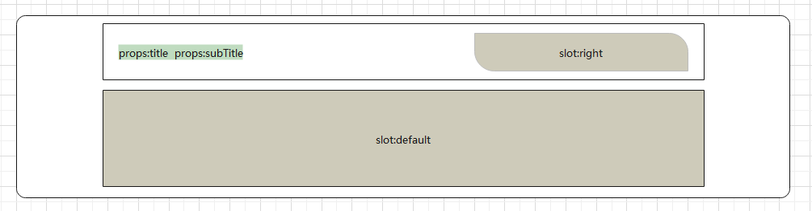

# rabbit-client_pc

小兔鲜项目


### :point_right: 实现左侧分类列表商品推荐

> 目标: 完成左侧分类弹层中的分类商品推荐基础布局及数据渲染
>
> ------

- [ ] 在 `HomeCategory` 组件中添加弹层基础结构和样式
- [ ] 当鼠标移入分类列表时记录当前移入的分类
- [ ] 根据当前移入的分类渲染对应的推荐商品至模板

-----


### :point_right: 实现左侧分类列表品牌推荐

>  目标: 实现品牌推荐数据的获取和渲染
>

------

- [ ] 在 `HomeCategory` 组件中添加品牌推荐的基础布局
- [ ] 创建用于获取品牌推荐数据的API接口函数
- [ ] 获取品牌推荐数据并渲染至模板
- [ ] 实现移入分类的选中效果

------

`api/home.js` [首页-热门品牌](http://zhoushugang.gitee.io/erabbit-client-pc-document/api.html#u9996u9875-u70edu95e8u54c1u724c0a3ca20id3du9996u9875-u70edu95e8u54c1u724c3e203ca3e)


### :point_right: 实现左侧分类骨架效果

> 目标: 创建一个通用的用于实现骨架效果的组件, 实现左侧分类骨架效果
>
> ------


### :point_right: 首页轮播图布局

> 目标：实现轮播图布局
>
> ------


### :point_right: 首页轮播图渲染结构

>[首页-广告区域(pc-小程序)](http://zhoushugang.gitee.io/erabbit-client-pc-document/api.html#u9996u9875-u5e7fu544au533au57df28pc-u5c0fu7a0bu5e8f290a3ca20id3du9996u9875-u5e7fu544au533au57df28pc-u5c0fu7a0bu5e8f293e203ca3e)
>
>------


### :point_right: 首页轮播图逻辑封装

> 目标: 实现轮播图轮播及自动轮播逻辑

------

- [ ] 实现点击轮播图左右按钮切换轮播图功能
- [ ] 实现点击导航原点轮播
- [ ] 实现轮播图的自动轮播功能

------


### :point_right: 封装面板组件

> 目标: 封装首页公共面板组件, 封装查看更多组件

------




### :point_right: 实现新鲜好物

> 目标: 实现新鲜好物组件数据渲染
------

 


### :point_right:   渲染面包屑导航

> 目标：渲染面包屑导航组件
>
> ----


------

- [ ] 创建用于获取商品详细信息的API接口函数, 渲染面包屑组件需要用到商品详细信息接口中返回的数据
- [ ] 在商品详情页面组件中调用API接口函数获取商品详情信息
- [ ] 根据商品详情信息渲染面包屑组件

------


第一步: 创建用于获取商品详细信息的API方法。

`api/goods.js` [商品详情](http://zhoushugang.gitee.io/erabbit-client-pc-document/api.html#u5546u54c1u8be6u60c50a3ca20id3du5546u54c1u8be6u60c53e203ca3e)

注意: 此接口存在问题, 服务器端要验证 token, 但在实际的业务中获取商品详情数据不需要验证token。


### :point_right:   图片预览组件

> 目标: 实现图片预览组件布局及图片切换效果
>
> ----


------

- [ ] 创建图片预览组件 `GoodsImages`, 实现基础布局
- [ ] 在商品详情组件组件中调用图片预览组件
- [ ] 实现图片预览组件中图片的渲染及切换效果


### :point_right:  实现放大镜效果

> 目标: 实现商品图片的放大镜效果


------

- [ ] 在图片预览组件中添加大图容器
- [ ] 在图片预览组件中添加镜片容器
- [ ] 实现放大镜效果
  1. 声明 `show` 布尔值用于控制镜片容器和大图容器的显示和隐藏
  
  2. 通过 `useMouseInElement` 方法获取元素和鼠标之前的关系 (鼠标是否移入到元素中、鼠标在元素中的位置)
  
  3. 根据鼠标是否在元素中决定大图容器和镜片容器的显示和隐藏
  
  4. 根据鼠标在元素中的位置计算镜片容器位置
  
  5. 根据镜片元素位置计算大图位置
  
     

### :point_right:   商品基本信息展示

> 目标: 创建商品销售信息组件实现基础布局, 创建商品基本信息组件实现基础布局并渲染商品基本信息


------

- [ ] 创建商品销售信息组件 `GoodsSales`, 实现基础布局
- [ ] 在商品详情页面组件中调用商品销售信息组件
- [ ] 创建商品基本信息组件 `GoodsInfo`, 实现基础布局
- [ ] 在商品详情页面组件中调用商品基本信息组件并传递商品信息
- [ ] 在商品基本信息组件中渲染商品的基本信息

------

第一步: 创建商品销售信息组件, 实现基础布局

`views/goods/components/GoodsSales.vue`

```html
<template>
  <ul class="goods-sales">
    <li>
      <p>销量人气</p>
      <p>200+</p>
      <p><i class="iconfont icon-task-filling"></i>销量人气</p>
    </li>
    <li>
      <p>商品评价</p>
      <p>400+</p>
      <p><i class="iconfont icon-comment-filling"></i>查看评价</p>
    </li>
    <li>
      <p>收藏人气</p>
      <p>600+</p>
      <p><i class="iconfont icon-favorite-filling"></i>收藏商品</p>
    </li>
    <li>
      <p>品牌信息</p>
      <p>苏宁电器</p>
      <p><i class="iconfont icon-dynamic-filling"></i>品牌主页</p>
    </li>
  </ul>
</template>

<script>
export default {
  name: "GoodsSales",
};
</script>

<style scoped lang="less">
.goods-sales {
  display: flex;
  width: 400px;
  align-items: center;
  text-align: center;
  height: 140px;
  li {
    flex: 1;
    position: relative;
    ~ li::after {
      position: absolute;
      top: 10px;
      left: 0;
      height: 60px;
      border-left: 1px solid #e4e4e4;
      content: "";
    }
    p {
      &:first-child {
        color: #999;
      }
      &:nth-child(2) {
        color: @priceColor;
        margin-top: 10px;
      }
      &:last-child {
        color: #666;
        margin-top: 10px;
        i {
          color: @xtxColor;
          font-size: 14px;
          margin-right: 2px;
        }
        &:hover {
          color: @xtxColor;
          cursor: pointer;
        }
      }
    }
  }
}
</style>
```

第二步: 在商品详情信息组件中调用商品销售信息组件

`views/goods/GoodsDetailPages`

```html
<div class="media">
   <GoodsSales />
</div>
<script>
import GoodsSales from "@/views/goods/components/GoodsSales";
export default {
  components: { GoodsSales }
}
</script>
```

第三步: 创建商品基本信息组件, 实现基础布局

`views/goods/component/GoodsInfo.vue`

```html
<template>
  <p class="g-name">2件装 粉釉花瓣心意点缀 点心盘*2 碟子盘子</p>
  <p class="g-desc">花瓣造型干净简约 多功能使用堆叠方便</p>
  <p class="g-price">
    <span>108.00</span>
    <span>199.00</span>
  </p>
  <div class="g-service">
    <dl>
      <dt>促销</dt>
      <dd>12月好物放送，App领券购买直降120元</dd>
    </dl>
    <dl>
      <dt>配送</dt>
      <dd>至</dd>
    </dl>
    <dl>
      <dt>服务</dt>
      <dd>
        <span>无忧退货</span>
        <span>快速退款</span>
        <span>免费包邮</span>
        <a href="javascript:">了解详情</a>
      </dd>
    </dl>
  </div>
</template>

<script>
export default {
  name: "GoodsInfo",
  props: {
    goods: {
      type: Object,
      default: () => ({}),
    },
  },
};
</script>

<style lang="less" scoped>
.g-name {
  font-size: 22px;
}
.g-desc {
  color: #999;
  margin-top: 10px;
}
.g-price {
  margin-top: 10px;
  span {
    &::before {
      content: "¥";
      font-size: 14px;
    }
    &:first-child {
      color: @priceColor;
      margin-right: 10px;
      font-size: 22px;
    }
    &:last-child {
      color: #999;
      text-decoration: line-through;
      font-size: 16px;
    }
  }
}
.g-service {
  background: #f5f5f5;
  width: 500px;
  padding: 20px 10px 0 10px;
  margin-top: 10px;
  dl {
    padding-bottom: 20px;
    display: flex;
    align-items: center;
    dt {
      width: 50px;
      color: #999;
    }
    dd {
      color: #666;
      &:last-child {
        span {
          margin-right: 10px;
          &::before {
            content: "•";
            color: @xtxColor;
            margin-right: 2px;
          }
        }
        a {
          color: @xtxColor;
        }
      }
    }
  }
}
</style>
```

第四步: 在商品详情组件 `GoodsDetailPage` 中调用 `GoodsInfo` 组件

`views/goods/GoodsDetailPage.vue`

```html
<div class="spec">
  <GoodsInfo :goods="result" />
</div>
<script>
import GoodsInfo from "@/views/goods/components/GoodsInfo";
export default {
  components: { GoodsInfo }
}
</script>
```

第五步: 在商品基本信息组件 `GoodsInfo` 中展示商品的基本信息

`views/goods/components/GoodsInfo.vue`

```html
<p class="g-name">{{goods.name}}</p>
<p class="g-desc">{{goods.desc}}</p>
<p class="g-price">
  <span>{{goods.price}}</span>
  <span>{{goods.oldPrice}}</span>
</p>
```


### :point_right: 城市选择组件-基础布局

> 目标：创建城市选择组件, 实现基础布局


------

- [ ] 创建城市选择组件 `XtxCity`, 实现基础布局
- [ ] 在商品基本信息组件中调用城市选择组件
- [ ] 实现城市选择组件内部弹框的显示隐藏逻辑

------

第一步: 创建城市选择组件, 实现基础布局

`components/library/XtxCity.vue`

```html
<template>
  <div class="xtx-city">
    <div class="select">
      <span class="placeholder">请选择配送地址</span>
      <span class="value"></span>
      <i class="iconfont icon-angle-down"></i>
    </div>
    <div class="option">
      <span class="ellipsis" v-for="i in 24" :key="i">北京市</span>
    </div>
  </div>
</template>
<script>
export default {
  name: "XtxCity",
};
</script>
<style scoped lang="less">
.xtx-city {
  display: inline-block;
  position: relative;
  z-index: 400;
  .select {
    border: 1px solid #e4e4e4;
    height: 30px;
    padding: 0 5px;
    line-height: 28px;
    cursor: pointer;
    &.active {
      background: #fff;
    }
    .placeholder {
      color: #999;
    }
    .value {
      color: #666;
      font-size: 12px;
    }
    i {
      font-size: 12px;
      margin-left: 5px;
    }
  }
  .option {
    width: 542px;
    border: 1px solid #e4e4e4;
    position: absolute;
    left: 0;
    top: 29px;
    background: #fff;
    min-height: 30px;
    line-height: 30px;
    display: flex;
    flex-wrap: wrap;
    padding: 10px;
    > span {
      width: 130px;
      text-align: center;
      cursor: pointer;
      border-radius: 4px;
      padding: 0 3px;
      &:hover {
        background: #f5f5f5;
      }
    }
  }
}
</style>
```

第二步: 在 `GoodsInfo` 组件中调用 `XtxCity` 组件

```html
<dl>
  <dt>配送</dt>
  <dd>至 <XtxCity /></dd>
</dl>
```

第三步: 实现组件内部弹框的显示隐藏逻辑

```html
<template>
  <div class="xtx-city" ref="target">
    <div class="select" @click="toggle" :class="{ active: visible }"></div>
    <div class="option" v-if="visible"></div>
  </div>
</template>
<script>
import { ref } from "vue";
import { onClickOutside } from "@vueuse/core";

export default {
  name: "XtxCity",
  setup() {
    // 控制下拉菜单是否显示
    const visible = ref(false);
    // 用于获取下拉框元素
    const target = ref(null);
    // 显示下拉菜单
    const show = () => {
      visible.value = true;
    };
    // 隐藏下拉菜单
    const hide = () => {
      visible.value = false;
    };
    // 切换下拉菜单的显示和隐藏
    const toggle = () => {
      visible.value ? hide() : show();
    };
    // 在下拉框元素外面点击时
    onClickOutside(target, () => {
      // 隐藏下拉框
      hide();
    });
    return { visible, toggle, target };
  },
};
</script>
```


### :point_right:  城市选择组件-获取数据

> 目标：实现城市选择组件中城市数据的获取, 加载过程的提示效果


------

- [ ] 获取并缓存城市数据
- [ ] 添加加载等待提示的结构和样式
- [ ] 优化 loading 图片展示效果

------

数据获取地址: https://yjy-oss-files.oss-cn-zhangjiakou.aliyuncs.com/tuxian/area.json

虽然以上代码实现了加载过程的 loading 提示,  但是 loading 图片也是在调用 show 方法时动态请求的, 所以 loading 图片并不能立即显示. (演示时清空浏览器缓存)

第三步: 优化 loading 图片展示效果

将应用中小于 10kb 的图片打包为 base64 编码格式, 这样 loading 图片就可以随样式一起加载, 当调用 show 方法时, 它就可以立即显示了.

在 img 标签的 src 属性中如果填写的是图片的外链地址, 那么当代码执行到 img 标签的时候, 浏览器会动态向服务器端发送请求获取图片资源本身, 图片资源获取完成之后才能显示。

如果在 img 标签的 src 属性中填写的是图片的 base64 编码, 那么相当于将图片资源本身嵌入了 html 文件中, 当浏览器解析到 img 标签时, 图片会立即显示, 因为图片资源本身已经存在了.

```json
// vue.config.json
chainWebpack: (config) => {
  config.module
  .rule("images")
  .use("url-loader")
  .loader("url-loader")
  .tap((options) => Object.assign(options, { limit: 10000 }));
},
```

配置修改完成后重启应用.


### :point_right: 城市选择组件-交互逻辑

> 目标: 实现城市组件的交互逻辑: 渲染城市数据信息, 收集用户选择的城市信息

------

- [ ] 声明 `selectedCityData` 用于存储用户选择的城市信息
- [ ] 声明 `selectCityData` 方法, 用于供用户选择城市数据的方法
- [ ] 声明计算属性, 当用户选择城市数据以后, 更新组件中要显示的城市数据, 用户选择完城市数据以后, 重置组件显示数据, 将用户选择的城市信息传递到父组件
- [ ] 在组件中渲染城市数据并为数据添加点击事件, 实现城市数据的选择
- [ ] 在调用 `XtxCity` 组件时传递 `location` 属性, 值为用户已经选择城市信息名称
- [ ] 在城市信息组件 `XtxCity` 中接收并渲染用户选择的城市信息名称集合

